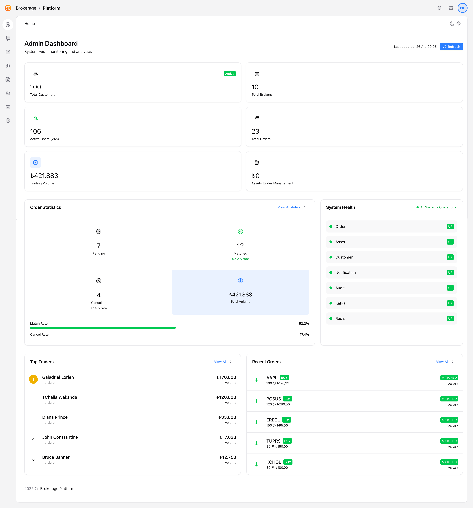
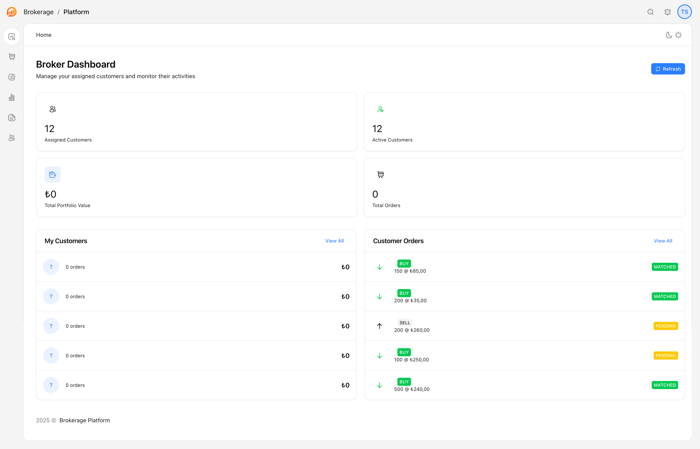
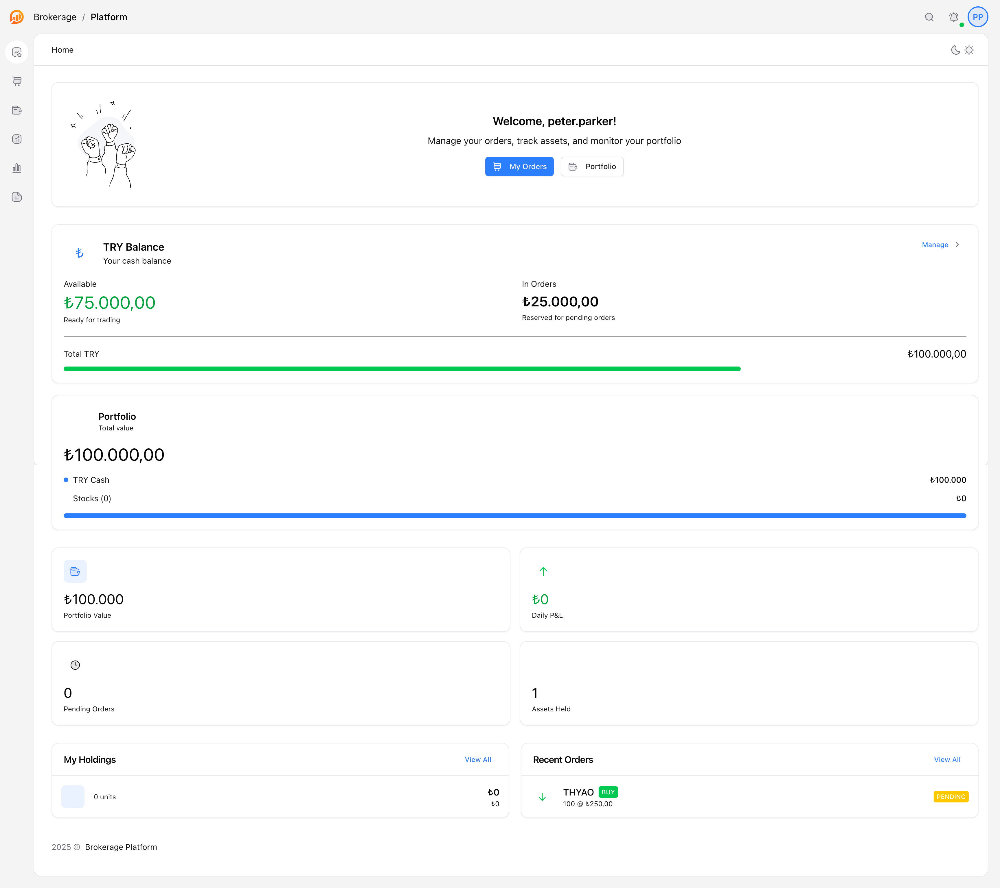
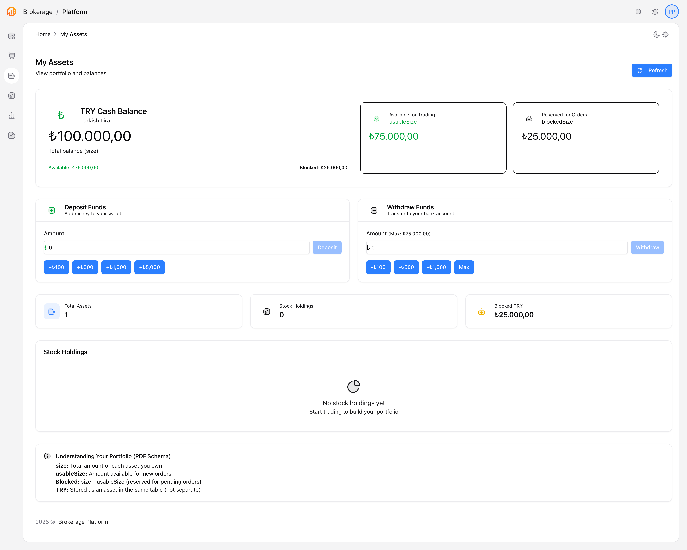
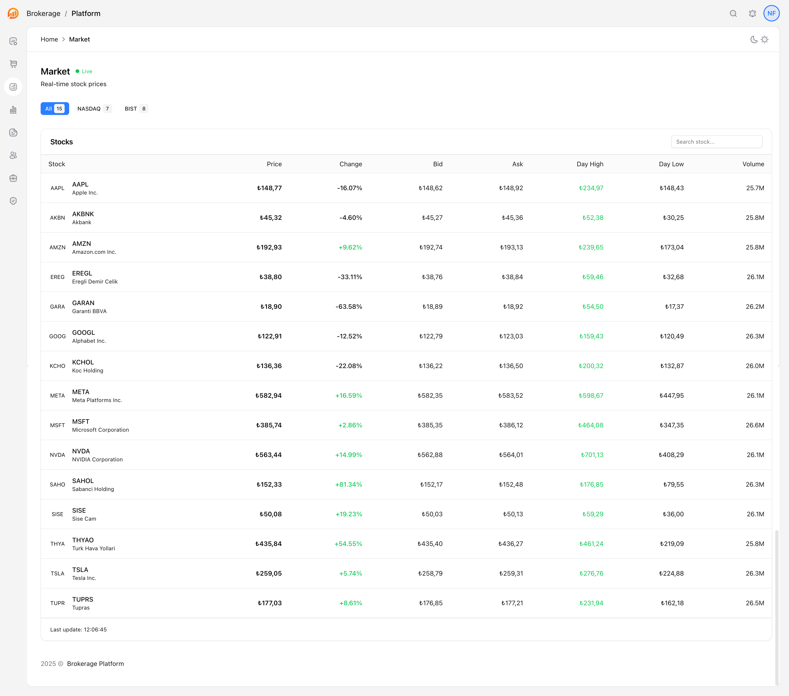
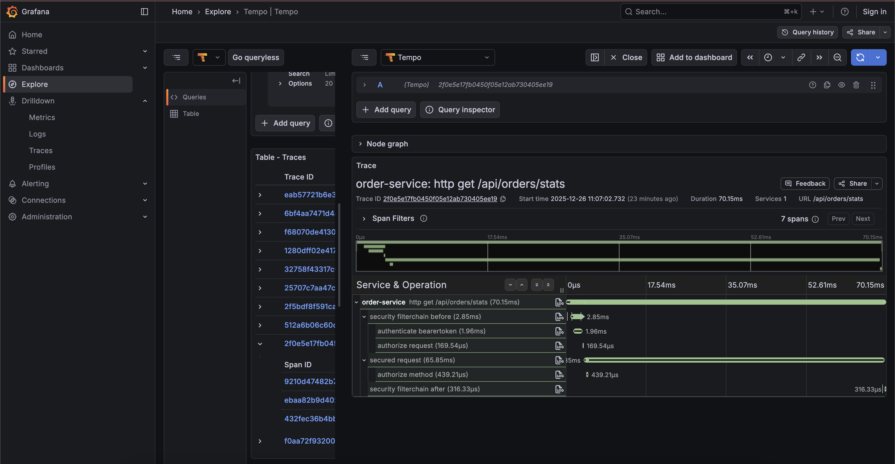
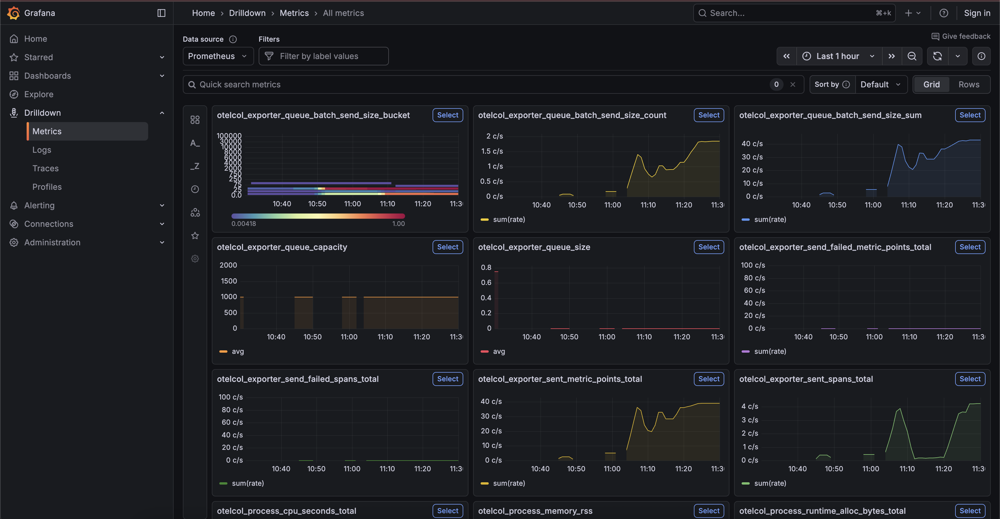
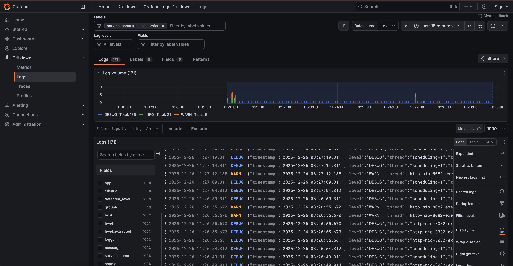
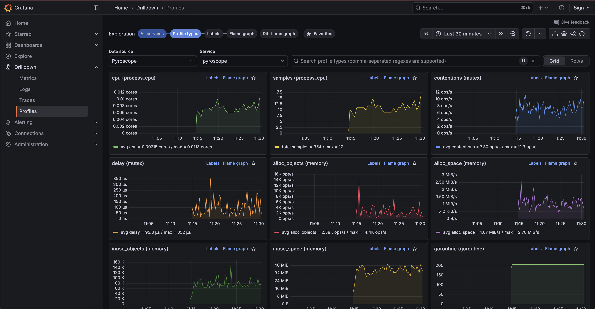
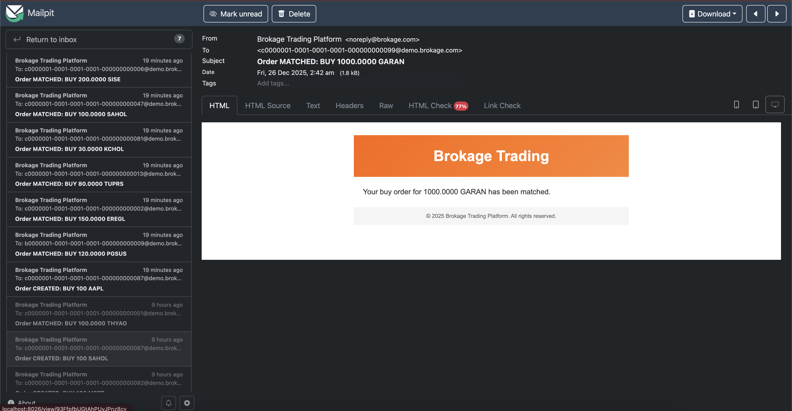

# Brokage Trading Platform

<div align="center">

```
██████╗ ██████╗  ██████╗ ██╗  ██╗ █████╗  ██████╗ ███████╗
██╔══██╗██╔══██╗██╔═══██╗██║ ██╔╝██╔══██╗██╔════╝ ██╔════╝
██████╔╝██████╔╝██║   ██║█████╔╝ ███████║██║  ███╗█████╗
██╔══██╗██╔══██╗██║   ██║██╔═██╗ ██╔══██║██║   ██║██╔══╝
██████╔╝██║  ██║╚██████╔╝██║  ██╗██║  ██║╚██████╔╝███████╗
╚═════╝ ╚═╝  ╚═╝ ╚═════╝ ╚═╝  ╚═╝╚═╝  ╚═╝ ╚═════╝ ╚══════╝
```

**Event-Driven Microservices ile Gelistirilmis Borsa Trading Platformu**

[](https://openjdk.org/)
[](https://spring.io/projects/spring-boot)
[](https://vuejs.org/)
[](https://kafka.apache.org/)
[](https://www.postgresql.org/)
[](https://www.docker.com/)

[English](README.md) | **Turkce**

</div>

---

## Degerli Reviewer

> **Bu bolum sizin icindir. Projeyi degerlendirirken dikkate almanizi istedigim notlar:**

<!-- REVIEWER NOTLARI BASLANGIC -->

### Oncelikle

Merhaba! Bu projeyi incelediginiz icin tesekkur ederim. Asagida projeyi degerlendirirken dikkat etmenizi istedigim bazi noktalar var:

### Zaman ve Kapsam

- Bu proje **5 gun** icerisinde gelistirilmistir
- Amac, production-ready bir sistem degil, **mimari yetenekleri gostermektir**

### AI Araclari Kullanimi

Bu projede **Claude Code** ve benzeri AI araclari **productivity tool** olarak kullanilmistir:

| Kullanim Alani | Aciklama |
|----------------|----------|
| **Code Quality** | Kod kalitesi iyilestirme ve refactoring onerileri |
| **Clarification** | Kavram ve pattern aciklamalari |
| **Documentation** | Dokumantasyon yazimi ve duzenleme |
| **Security Check** | Guvenlik acigi taramasi ve onerileri |
| **Review Helper** | Kod inceleme ve best practice kontrolu |
| **Quick Research** | Google Search yerine hizli bilgiye erisim |

> **Not**: AI araclari **kod yazmak** icin degil, **uretkenlik artirmak** icin kullanilmistir. Mimari kararlar, tasarim tercihleri ve implementasyon tamamen bana aittir.

### Ozellikle Dikkat Etmenizi Istedigim Noktalar

1. **Event-Driven Mimari**: Kafka ile asenkron iletisim, Outbox pattern, Saga orchestration
2. **Yetkilendirme Modeli**: 3 seviyeli rol sistemi (Admin/Broker/Customer)
3. **Kod Kalitesi**: Clean code prensipleri, SOLID, test coverage
4. **DevOps**: Tek komutla calisma (`make start`), Docker Compose, CI/CD ready

### Bilinen Eksiklikler / TODO

> **Not**: Asagidaki maddeler `docs/` klasorunde **planlanmis** ancak zaman kisiti nedeniyle **implement edilmemis** ozelliklerdir.

| Ozellik | Docs'ta | Implementasyon | Aciklama |
|---------|---------|----------------|----------|
| **Redis Cache** | ✅ Planlandi | ❌ Yok | Order/Asset service'lerde cache katmani eksik |
| **Avro Schemas** | ✅ Planlandi | ❌ JSON | Kafka mesajlari JSON, Avro + Schema Registry entegre edilmedi |
| **Schema Registry** | ✅ Planlandi | ❌ Yok | Sema versiyonlama ve uyumluluk kontrolu yok |
| **SMS Bildirimi** | ✅ Planlandi | ❌ Yok | Sadece email mevcut |
| **Push Bildirimi** | ✅ Planlandi | ❌ Yok | Mobile push notification yok |
| **WebSocket** | ✅ Planlandi | ❌ Yok | Real-time updates yok |
| **mTLS** | ✅ Planlandi | ❌ Yok | Service-to-service TLS yok |
| **Async Saga** | ✅ Planlandi | ⚠️ Sync | Asset rezervasyonu senkron yapildi (basitlik icin) |
| **Partial Fills** | ✅ Planlandi | ❌ Yok | Kismi emir eslestirme yok |
| **Circuit Breaker** | ✅ Planlandi | ⚠️ Config | Traefik'te tanimli ama test edilmedi |
| **Grafana Dashboards** | ✅ Planlandi | ❌ Yok | Custom dashboard'lar dusunuldu ama implemente edilmedi |

**Oncelik Sirasi (Implement edilecek olsa):**
1. Redis Cache (performans)
2. Avro + Schema Registry (veri butunlugu)
3. WebSocket (kullanici deneyimi)
4. Async Saga (resilience)

### Sorulariniz Icin

Herhangi bir sorunuz varsa benimle iletisime gecmekten cekinmeyin.

**Email**: [email@example.com]
**LinkedIn**: [linkedin.com/in/...]

<!-- REVIEWER NOTLARI BITIS -->

---

## Icindekiler

- [Degerli Reviewer](#degerli-reviewer)
- [Hizli Baslangic](#hizli-baslangic)
- [Ekran Goruntuleri](#ekran-goruntuleri)
- [Sunum Modu](#sunum-modu-presentation)
- [Proje Hakkinda](#proje-hakkinda)
- [Over-Engineering Notu](#over-engineering-notu)
- [PDF Gereksinimleri](#pdf-gereksinimleri-uyumluluk)
- [Mimari](#mimari)
- [Ozellikler](#ozellikler)
- [Servisler](#servisler)
- [Teknolojiler](#teknolojiler)
- [Make Komutlari](#make-komutlari)
- [API Dokumantasyonu](#api-dokumantasyonu)
- [Demo Kullanicilari](#demo-kullanicilari)
- [Izleme ve Monitoring](#izleme-ve-monitoring)
- [Test](#test)
- [Tasarim Kararlari](#tasarim-kararlari)
- [Detayli Dokumantasyon](#detayli-dokumantasyon)

---

## Hizli Baslangic

### Gereksinimler

- **Docker Desktop** (Docker Compose V2 dahil)
- **Java 17+** (opsiyonel - Docker ile build yapilabilir)

### Tek Komutla Baslat

```bash
# Projeyi klonlayin
git clone <repo-url>
cd interview-20251222

# Sistemi baslatin (tek komut!)
make start
```

> **Not:** Ilk calistirmada Docker image'lari indirilecegi icin 3-5 dakika surebilir.

### Sistem Hazir!

| Servis | URL | Aciklama |
|--------|-----|----------|
| **Frontend** | http://localhost:4000 | Vue.js Web Uygulamasi |
| **API Gateway** | http://localhost:4500 | Traefik API Gateway |
| **Keycloak** | http://localhost:8180 | Kimlik Yonetimi (admin/admin123) |
| **Grafana** | http://localhost:3001 | Monitoring Dashboard (admin/admin123) |
| **Kafka UI** | http://localhost:8089 | Kafka Yonetim Paneli |
| **Mailpit** | http://localhost:8026 | Email Test Araci |
| **pgAdmin** | http://localhost:5050 | PostgreSQL Yonetimi |
| **Mongo Express** | http://localhost:8027 | MongoDB Yonetimi |

---

## Ekran Goruntuleri

### Admin Dashboard
Sistem genelinde izleme, musteri/broker sayilari, order istatistikleri, sistem sagligi ve top traders.



### Broker Dashboard
Broker'a atanmis musteriler ve emirleri yonetme.



### Customer Dashboard
Musteri portfoyu, bakiye durumu, bekleyen emirler ve son islemler.



### Customer - My Assets
TRY bakiyesi (size/usableSize), para yatirma/cekme, PDF schema aciklamasi.



### Market Simulator (SSE)
**Server-Sent Events** ile gercek zamanli borsa simulasyonu. BIST ve NASDAQ hisseleri.

> **Teknik Not**: Bu sayfa SSE (Server-Sent Events) teknolojisini denemek icin gelistirilmistir. Backend'den gelen fiyat guncellemeleri anlık olarak arayuze yansir.



---

## Sunum Modu (Presentation)

Projeyi **canli demo** olarak gostermek icin ozel bir sunum modu hazirlanmistir. Bu mod:

- Tum servisleri otomatik baslatir (kapaliysa)
- PDF senaryolarini adim adim gosterir
- Tarayici otomatik acilir ve islemleri canli yapar
- Video kaydi olusturur

### Calistirma

```bash
make present
```

### Ne Yapar?

```
Phase 1: Docker kontrolu
Phase 2: Servislerin hazir olmasini bekler
Phase 3: Playwright E2E testlerini hazirlar
Phase 4: PDF senaryolarini gosterir
Phase 5: Canli demo baslar (tarayici acilir)
Phase 6: Sonuclari raporlar
```

### Sunum Icerigi

Demo sirasinda asagidaki senaryolar canli olarak gosterilir:

| Senaryo | Aciklama |
|---------|----------|
| **Login Flow** | Farkli roller ile giris |
| **Order Creation** | BUY/SELL emir olusturma |
| **Order Listing** | Filtreleme ve listeleme |
| **Order Cancellation** | PENDING emir iptali |
| **Asset Management** | Varlik goruntuleme |
| **Admin Match** | Emir eslestirme (Admin) |
| **Email Notification** | Mailpit'te email kontrolu |

### Ciktilar

- **Video Kaydi**: `frontend/web-client/test-results/`
- **HTML Rapor**: `frontend/web-client/presentation-report/index.html`

> **Tip**: Sunum bittiginde HTML raporu otomatik olarak acilir.

---

## Proje Hakkinda

<picture>
  <source media="(prefers-color-scheme: dark)" srcset="docs/images/logo/logo_ob_white.png">
  <source media="(prefers-color-scheme: light)" srcset="docs/images/logo/logo_ob_colored.png">
  
</picture>

Bu proje, bir **aracı kurum (brokerage firm)** icin gelistirilmis backend API sistemidir. Sistem, kurum calisanlarinin musteriler adina hisse senedi alim/satim emirleri olusturmasini ve yonetmesini saglar.

### Neden Microservices?

PDF'de H2 ve basit bir monolith yeterli olsa da, bu implementasyon microservices mimarisini tercih ederek:

- **Gercek dunya dagilimli sistem kaliplarini** gosterir (Saga, Outbox, Event Sourcing)
- **Production-grade altyapiyi** kullanir (Kafka, PostgreSQL, Keycloak)
- **Olceklenebilir bir trading platformunun** nasil mimarlanacagini ortaya koyar

### Temel Yetenekler

- **Event-Driven Architecture** - Kafka ile asenkron mesajlasma
- **Saga Pattern** - Dagitik transaction yonetimi
- **Outbox Pattern** - Atomik event yayinlama garantisi
- **CQRS** - Emir islemede command/query ayirimi
- **Role-Based Access Control** - Keycloak ile 3 seviyeli yetkilendirme

---

## Over-Engineering Notu

> **Onemli**: Bu bolum, projenin neden bu sekilde tasarlandigini aciklamaktadir.

### Bilinçli Tercihler

Bu proje, PDF'deki gereksinimlerin **cok otesine** gecmektedir. Bu bilinçli bir tercihdir:

| PDF Gereksinimleri | Bu Projede |
|-------------------|------------|
| H2 in-memory database | PostgreSQL + MongoDB |
| Basic Auth | Keycloak OAuth2/OIDC |
| Monolith | 6+ Microservice |
| Senkron islemler | Event-Driven + Kafka |
| Basit CRUD | Saga, Outbox, CQRS patterns |

### Neden?

1. **Yetenek Gosterimi**: Bir mulakat projesi olarak, sadece "calisir" degil, "nasil dusunurum" gostermek istedim.

2. **Production-Ready Mindset**: Gercek dunyada bu tip bir trading sistemi nasil tasarlanir sorusuna cevap.

3. **Genisletilebilirlik**: Yeni ozellikler eklemek (partial fills, market orders, real-time updates) icin sagalm bir temel.

### Alternatif: Minimal Cozum

Eger sadece PDF gereksinimlerini karsilamak istenseydim:

```java
// Tek bir Spring Boot uygulamasi
@RestController
public class OrderController {
    @Autowired private OrderRepository orderRepo;
    @Autowired private AssetRepository assetRepo;

    @PostMapping("/orders")
    public Order createOrder(@RequestBody OrderRequest req) {
        // Direkt senkron bakiye kontrolu
        // H2 database
        // Basic auth
    }
}
```

Bu ~500 satir kodla cozulebilirdi. Ancak bu, **mimari dusunme yetenegimi** gostermezdi.

### Trade-off'larin Farkindayim

| Avantaj | Dezavantaj |
|---------|------------|
| Olceklenebilir | Operasyonel karmasiklik |
| Hata izolasyonu | Network latency |
| Bagimsiz deploy | Dagitik debugging |
| Polyglot persistence | Daha fazla altyapi |

### Sonuc

Bu proje, **"basit bir CRUD uygulamasi yazabilir miyim?"** sorusuna degil, **"karmasik bir distributed system tasarlayabilir miyim?"** sorusuna cevap vermektedir.

> Basit gereksinimler icin basit cozumler, karmasik gereksinimler icin olceklenebilir cozumler uretebilirim.

Sonuc olarak bu bir **sandbox proje**. Hem yeteneklerimi gostermek, hem de uzun suredir kullanmadigim **Java/Spring Boot ekosistemini hatirlamak** icin guzel bir firsatti. Zamanim da olunca bu firsati degerlendiridim ve elimden gelenin en iyisini yapmaya calistim.

---

## PDF Gereksinimleri Uyumluluk

### Temel Gereksinimler

| Gereksinim | Durum | Implementasyon |
|------------|-------|----------------|
| `POST /api/orders` (Olustur) | ✅ | `OrderController.createOrder()` |
| `GET /api/orders` (Listele) | ✅ | `OrderController.listOrders()` + filtreler |
| `DELETE /api/orders/{id}` (Iptal) | ✅ | `OrderController.cancelOrder()` |
| `GET /api/assets` (Varliklar) | ✅ | `AssetController.getCustomerAssets()` |
| Admin Yetkilendirmesi | ✅ | JWT/Keycloak (Basic Auth'dan gelistirildi) |
| TRY varlik olarak (ayri tablo degil) | ✅ | `CustomerAsset` ile `assetName="TRY"` |
| size/usableSize bakiye mantigi | ✅ | `blockAmount()`, `releaseBlockedAmount()`, `deductBlockedAmount()` |
| Unit Testler | ✅ | 28+ test dosyasi |

### Bonus Ozellikler

| Ozellik | Durum | Aciklama |
|---------|-------|----------|
| Musteri Yetkilendirmesi | ✅ | Keycloak ile rol-tabanli erisim |
| Match Endpoint | ✅ | `POST /api/orders/{id}/match` (Admin/Broker) |
| Broker Rolu | ✅ | Alt musteriler icin emir yonetimi |
| Customer Tier Sistemi | ✅ | VIP/Premium/Standard - Rate limiting |
| Email Bildirimleri | ✅ | Emir durumu degisikliklerinde |

### Veritabani Semasi (PDF Uyumlu)

```sql
-- Asset Tablosu (PDF'deki gibi)
CREATE TABLE customer_assets (
    id UUID PRIMARY KEY,
    customer_id UUID NOT NULL,
    asset_name VARCHAR(20) NOT NULL,      -- TRY, AAPL, GOOGL, etc.
    size DECIMAL(19,4) DEFAULT 0,          -- Toplam miktar
    usable_size DECIMAL(19,4) DEFAULT 0,   -- Kullanilabilir miktar
    -- blocked = size - usable_size (hesaplanan)
    UNIQUE(customer_id, asset_name)
);

-- Order Tablosu
CREATE TABLE orders (
    id UUID PRIMARY KEY,
    customer_id UUID NOT NULL,
    asset_name VARCHAR(20) NOT NULL,
    order_side VARCHAR(10) NOT NULL,       -- BUY, SELL
    size DECIMAL(19,4) NOT NULL,
    price DECIMAL(19,4) NOT NULL,
    status VARCHAR(20) NOT NULL,           -- PENDING, MATCHED, CANCELED
    created_at TIMESTAMP NOT NULL
);
```

---

## Mimari

### Sistem Genel Gorunumu

```
┌─────────────────────────────────────────────────────────────────────────────┐
│                              CLIENTS                                         │
│                    Web Browser / Mobile App / API                            │
└─────────────────────────────────────────────────────────────────────────────┘
                                    │
                                    ▼
┌─────────────────────────────────────────────────────────────────────────────┐
│                         TRAEFIK API GATEWAY                                  │
│              Rate Limiting │ JWT Validation │ Circuit Breaker                │
└─────────────────────────────────────────────────────────────────────────────┘
                                    │
        ┌───────────────────────────┼───────────────────────────┐
        │                           │                           │
        ▼                           ▼                           ▼
┌───────────────┐         ┌───────────────┐         ┌───────────────┐
│ Order Service │         │ Asset Service │         │Customer Service│
│    :8081      │         │    :8082      │         │    :8083      │
└───────────────┘         └───────────────┘         └───────────────┘
        │                           │                           │
        └───────────────────────────┼───────────────────────────┘
                                    │
                                    ▼
┌─────────────────────────────────────────────────────────────────────────────┐
│                            APACHE KAFKA                                      │
│                     order-events │ asset-events                              │
└─────────────────────────────────────────────────────────────────────────────┘
                                    │
        ┌───────────────────────────┼───────────────────────────┐
        │                           │                           │
        ▼                           ▼                           ▼
┌───────────────┐         ┌───────────────┐         ┌───────────────┐
│Order Processor│         │ Notification  │         │ Audit Service │
│    :8084      │         │    :8085      │         │    :8086      │
└───────────────┘         └───────────────┘         └───────────────┘
        │                           │                           │
        ▼                           ▼                           ▼
┌───────────────┐         ┌───────────────┐         ┌───────────────┐
│  PostgreSQL   │         │    MongoDB    │         │    MongoDB    │
└───────────────┘         └───────────────┘         └───────────────┘
```

### Emir Akisi (Order Flow)

#### BUY Emri
```
1. Musteri AAPL icin $150'dan 10 adet BUY emri olusturur
2. Sistem TRY bakiyesini rezerve eder: usable_size -= 1500
3. Emir eslestirme kuyuguna girer
4. Eslestirme: TRY size -= 1500, AAPL size += 10, usable_size += 10
```

#### SELL Emri
```
1. Musteri AAPL icin $150'dan 10 adet SELL emri olusturur
2. Sistem AAPL'i rezerve eder: usable_size -= 10
3. Emir eslestirme kuyuguna girer
4. Eslestirme: AAPL size -= 10, TRY size += 1500, usable_size += 1500
```

#### Emir Iptali
```
1. Musteri PENDING durumundaki emri iptal eder
2. Sistem rezervasyonu serbest birakir: usable_size += rezerve_miktar
```

---

## Ozellikler

### 1. Event-Driven Mimari

- **Outbox Pattern**: Her servis, veritabani transaction'i ile atomik olarak event kaydeder
- **Kafka Topics**: `order-events`, `asset-events` ile asenkron iletisim
- **At-Least-Once Delivery**: Event kaybi olmadan garanti

### 2. Yetkilendirme Sistemi

```
┌─────────────────────────────────────────────────────────────────┐
│                     YETKILENDIRME MATRISI                       │
├─────────────────────┬───────────┬───────────┬───────────────────┤
│ Islem               │   ADMIN   │   BROKER  │     CUSTOMER      │
├─────────────────────┼───────────┼───────────┼───────────────────┤
│ Emir Olustur        │ Tum must. │ Alt must. │ Sadece kendisi    │
│ Emirleri Listele    │ Tum must. │ Alt must. │ Sadece kendisi    │
│ Emir Iptal          │ Tum must. │ Alt must. │ Kendi + PENDING   │
│ Emir Eslestir       │ Tum must. │ Alt must. │ Erisim Yok        │
│ Varliklari Gor      │ Tum must. │ Alt must. │ Sadece kendisi    │
│ Para Yatir          │ Tum must. │ Alt must. │ Erisim Yok        │
│ Para Cek            │ Tum must. │ Erisim Yok│ Kendi hesabindan  │
└─────────────────────┴───────────┴───────────┴───────────────────┘
```

### 3. Customer Tier Sistemi

| Tier | Oncelik | Rate Limit | Aciklama |
|------|---------|------------|----------|
| **VIP** | 1 (En yuksek) | 1000 req/dk | Premium musteriler |
| **Premium** | 2 | 500 req/dk | Orta segment |
| **Standard** | 3 | 100 req/dk | Varsayilan |

- Eslestirme onceligi: Tier > Fiyat > Zaman
- Gateway + Application katmaninda rate limiting

### 4. Izleme ve Observability

- **LGTM Stack**: Loki (logs), Grafana (dashboards), Tempo (traces), Mimir (metrics)
- **OpenTelemetry**: Distributed tracing
- **Health Checks**: Tum servisler icin `/actuator/health`

---

## Servisler

| Servis | Port | Veritabani | Aciklama |
|--------|------|------------|----------|
| **order-service** | 8081 | PostgreSQL | Emir CRUD, saga baslatma, iptal |
| **asset-service** | 8082 | PostgreSQL | Portfoy yonetimi, bakiye bloklama |
| **customer-service** | 8083 | PostgreSQL | Musteri CRUD, tier yonetimi |
| **order-processor** | 8084 | PostgreSQL | Eslestirme motoru, saga orkestrator |
| **notification-service** | 8085 | MongoDB | Cok kanalli bildirimler |
| **audit-service** | 8086 | MongoDB | Denetim loglari ve uyumluluk |
| **web-api** | 8087 | - | Frontend BFF (aggregation) |

---

## Teknolojiler

### Backend
- **Java 17** + **Spring Boot 3.2**
- **Spring Security** + OAuth2 Resource Server
- **Spring Data JPA** + Hibernate
- **Apache Kafka** 3.6
- **PostgreSQL 15** + **MongoDB 7**
- **Redis** (cache)

### Frontend
- **Vue.js 3.4** + Composition API
- **Vite** + TypeScript
- **Tailwind CSS** + shadcn/vue
- **Pinia** (state management)
- **Playwright** (E2E testing)

### Altyapi
- **Traefik** - API Gateway
- **Keycloak** - Identity Provider
- **Docker Compose** - Konteyner orkestrasyonu
- **LGTM Stack** - Observability

---

## Make Komutlari

Proje, tek komutla calisma icin kapsamli bir `Makefile` icermektedir:

### Temel Komutlar

```bash
make              # Yardim menusunu goster
make start        # Tum sistemi baslat (tek tikla demo)
make stop         # Tum servisleri durdur
make restart      # Servisleri yeniden baslat
make status       # Servis durumlarini goster
make logs         # Tum loglari goster
make clean        # Tum container ve verileri sil
```

### Gelistirme Komutlari

```bash
make start-backend    # Sadece backend'i baslat (frontend olmadan)
make dev              # Gelistirme modu (frontend lokal)
make build            # Backend servislerini derle
make test             # Unit testleri calistir
```

### Sunum Komutlari

```bash
make present      # Canli E2E demo (otomatik tarayici)
make check        # On-kosullari kontrol et
```

### Komut Detaylari

#### `make start`
- On-kosullari kontrol eder (Docker, Java, portlar)
- Altyapi servislerini baslatir (Kafka, PostgreSQL, MongoDB, Redis)
- Backend servislerini derler ve baslatir
- Frontend'i baslatir
- Tum servislerin hazir oldugunu dogrular
- Erisim URL'lerini gosterir

#### `make present`
- Otomatik E2E demo modu
- PDF senaryolarini canli gosterir
- Tarayici otomatik acilir
- Video kaydi olusturur

#### `make check`
```
Checking prerequisites...

  Docker............. OK (24.0.7)
  Docker Compose..... OK (v2.23.3)
  Docker Running..... OK
  Java 17+........... OK (17.0.9)
  Port 4000.......... FREE
  Port 4500.......... FREE
  Port 8180.......... FREE

All checks passed!
```

---

## API Dokumantasyonu

### Swagger UI Erisimleri

| Servis | URL |
|--------|-----|
| Order Service | http://localhost:7081/swagger-ui.html |
| Asset Service | http://localhost:7082/swagger-ui.html |
| Customer Service | http://localhost:7083/swagger-ui.html |
| Notification Service | http://localhost:7085/swagger-ui.html |
| Audit Service | http://localhost:7086/swagger-ui.html |

### Order Service API

```http
# Emir olustur
POST /api/orders
Authorization: Bearer {token}
Content-Type: application/json

{
  "customerId": "uuid",
  "assetName": "AAPL",
  "orderSide": "BUY",
  "orderType": "LIMIT",
  "price": "150.00",
  "size": "10"
}

# Emirleri listele (filtreli)
GET /api/orders?customerId={uuid}&status=PENDING&startDate=2025-01-01&endDate=2025-12-31

# Emir detayi
GET /api/orders/{orderId}

# Emir iptal
DELETE /api/orders/{orderId}

# Emir eslestir (Admin/Broker)
POST /api/orders/{orderId}/match
```

### Asset Service API

```http
# Musteri varliklarini listele
GET /api/assets?customerId={uuid}

# Belirli varligi getir
GET /api/assets/{customerId}/{assetName}

# Para yatir (Admin/Broker)
POST /api/assets/deposit
{
  "customerId": "uuid",
  "assetName": "TRY",
  "amount": "10000.00"
}

# Para cek (Admin/Customer-kendi)
POST /api/assets/withdraw
{
  "customerId": "uuid",
  "assetName": "TRY",
  "amount": "500.00"
}
```

---

## Demo Kullanicilari

Sistem onceden yapilandirilmis demo kullanicilarla gelir:

| Kullanici | Email | Sifre | Rol |
|-----------|-------|-------|-----|
| Nick Fury | nick.fury@brokage.com | admin123 | ADMIN |
| Tony Stark | tony.stark@brokage.com | broker123 | BROKER |
| Peter Parker | peter.parker@brokage.com | customer123 | CUSTOMER |

### Keycloak'tan Token Alma

```bash
# Admin token
curl -X POST "http://localhost:8180/realms/brokage/protocol/openid-connect/token" \
  -H "Content-Type: application/x-www-form-urlencoded" \
  -d "client_id=brokage-api" \
  -d "client_secret=brokage-api-secret" \
  -d "username=nick.fury" \
  -d "password=admin123" \
  -d "grant_type=password"
```

---

## Izleme ve Monitoring

### Grafana - LGTM Stack

- **URL**: http://localhost:3001
- **Kullanici**: admin / admin123

Sistem **LGTM Stack** (Loki, Grafana, Tempo, Mimir) ile izlenmektedir:

#### Tempo - Distributed Tracing

Servisler arasi istek takibi ve performans analizi:



#### Metrics - OpenTelemetry

OTel exporter ile toplanan metrikler:



#### Loki - Centralized Logs

Tum servislerin loglari tek yerden izlenebilir:



#### Pyroscope - Continuous Profiling

CPU, memory ve allocation profiling:



### Kafka UI

- **URL**: http://localhost:8089
- Topic'leri, consumer group'lari ve mesajlari izleyin

### Mailpit (Email Test)

- **URL**: http://localhost:8026
- Emir durumu degisikliklerinde gonderilen emailleri gorun



### Database Araclari

| Arac | URL | Kullanici |
|------|-----|-----------|
| pgAdmin | http://localhost:5050 | admin@brokage.com / admin123 |
| Mongo Express | http://localhost:8027 | admin / admin123 |

---

## Test

### Unit Testler

```bash
cd backend
./gradlew test
```

### Integration Testler

```bash
# Servisler calisiyor olmali
cd backend
./gradlew :integration-tests:test
```

### E2E Testler (Playwright)

```bash
cd frontend/web-client
npm install
npx playwright install
npx playwright test
```

### Stress Testler (k6)

```bash
cd stress-tests/k6
./run.sh order-flow
```

---

## Tasarim Kararlari

### 1. Neden Microservices?

**Avantajlar:**
- Bagimsiz deploy ve olcekleme
- Polyglot persistence (PostgreSQL + MongoDB)
- Hata izolasyonu
- Takim bazli gelistirme

**Trade-off'lar:**
- Artan operasyonel karmasiklik
- Network latency
- Dagitik transaction yonetimi

### 2. Neden Saga Pattern?

Dagitik sistemlerde ACID garantisi olmadigi icin:
- Choreography-based saga kullanildi
- Her adim icin compensation islemi tanimlandi
- Event sourcing ile audit trail

### 3. Neden Outbox Pattern?

Dual-write problemini cozmek icin:
- Event'ler ayni transaction'da veritabanina yazilir
- Background worker Kafka'ya yayinlar
- At-least-once delivery garantisi

### 4. Asset vs CustomerAsset Ayirimi

PDF tek `Asset` tablosu belirtse de:
- `CustomerAsset`: Musteri portfoyu (size, usableSize)
- `Asset`: Master varlik verisi (min lot, aktiflik durumu)
- 3NF normalizasyon - veri tekrarini onler

---

## Detayli Dokumantasyon

> **Not**: Asagidaki dokumanlar daha derin teknik detaylar icermektedir. README'deki bilgiler yeterli degilse inceleyebilirsiniz.

Detayli teknik dokumantasyon `docs/tr/` klasorunde mevcuttur:

| Dokuman | Aciklama |
|---------|----------|
| [Sistem Genel Bakis](docs/tr/01-sistem-genel-bakis.md) | Mimari ve konseptler |
| [Microservices Mimarisi](docs/tr/02-mikroservis-mimarisi.md) | Servis detaylari |
| [Event-Driven Akislar](docs/tr/03-event-driven-akislar.md) | Kafka ve Saga |
| [Veritabani Tasarimi](docs/tr/04-veritabani-tasarimi.md) | Schema ve iliskiler |
| [API Gateway ve Guvenlik](docs/tr/05-api-gateway-guvenlik.md) | Auth ve rate limiting |
| [Monitoring ve Observability](docs/tr/06-monitoring-observability.md) | LGTM stack |

---

## Proje Yapisi

```
interview-20251222/
├── backend/
│   ├── common/                 # Paylasilan DTO, exception, utility
│   ├── order-service/          # Emir yonetimi
│   ├── asset-service/          # Portfoy ve bakiye yonetimi
│   ├── customer-service/       # Musteri yonetimi
│   ├── order-processor/        # Eslestirme motoru
│   ├── notification-service/   # Bildirimler (MongoDB)
│   ├── audit-service/          # Denetim loglari (MongoDB)
│   ├── web-api/                # Frontend BFF
│   └── integration-tests/      # E2E testler
├── frontend/
│   └── web-client/             # Vue.js uygulamasi
├── deployment/
│   ├── docker-compose.yml      # Ana compose dosyasi
│   └── config/                 # Yapilandirma dosyalari
├── docs/
│   ├── en/                     # Ingilizce dokumantasyon
│   └── tr/                     # Turkce dokumantasyon
├── postman/                    # Postman collection
├── stress-tests/               # k6 stress testleri
├── scripts/                    # Yardimci scriptler
└── Makefile                    # Tek tikla baslat
```

---

## Postman Collection

Proje icinde hazir Postman collection bulunmaktadir:

```
postman/
├── Brokage-API.postman_collection.json
├── Brokage-Environment.postman_environment.json
└── README.md
```

### Import ve Kullanim

1. Postman'da **Import** butonuna tiklayin
2. Her iki JSON dosyasini import edin
3. Environment olarak "Brokage Local Environment" secin
4. **Authentication** klasorunden token alin
5. Diger request'leri kullanin

---

## Lisans

Bu proje mulakat/degerlendirme amaclidir.

---

<div align="center">


**Orange Broker HUB** - Event-Driven Microservices ile Gelistirildi

Made with ❤️ for the interview

</div>
