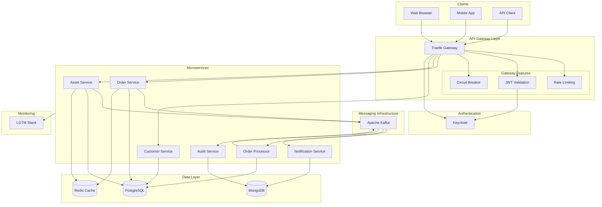
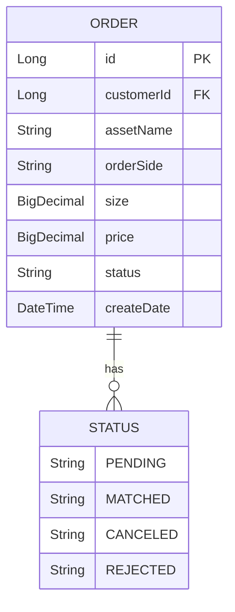
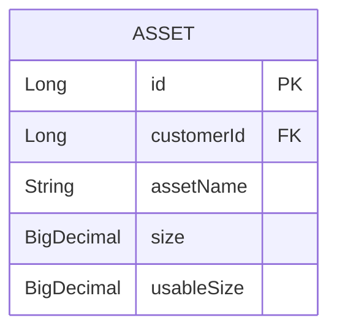
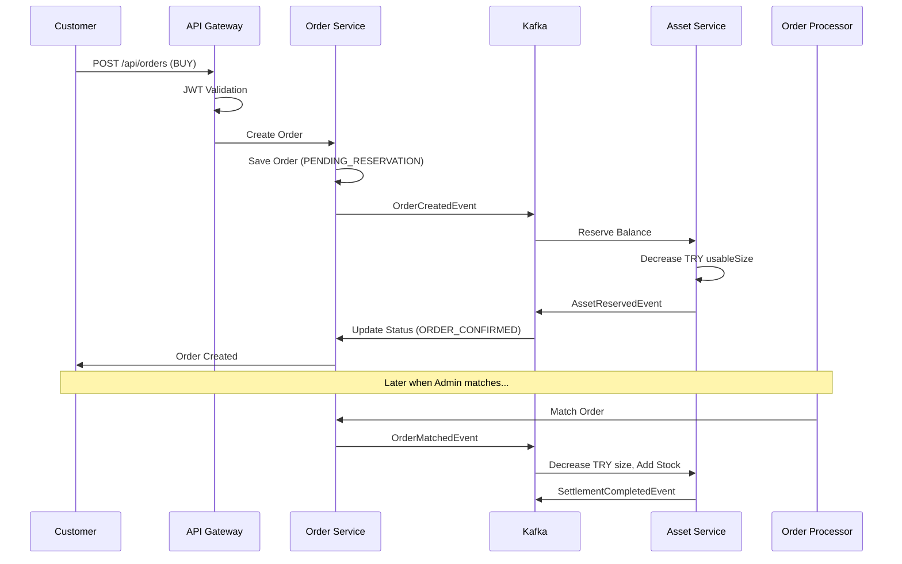
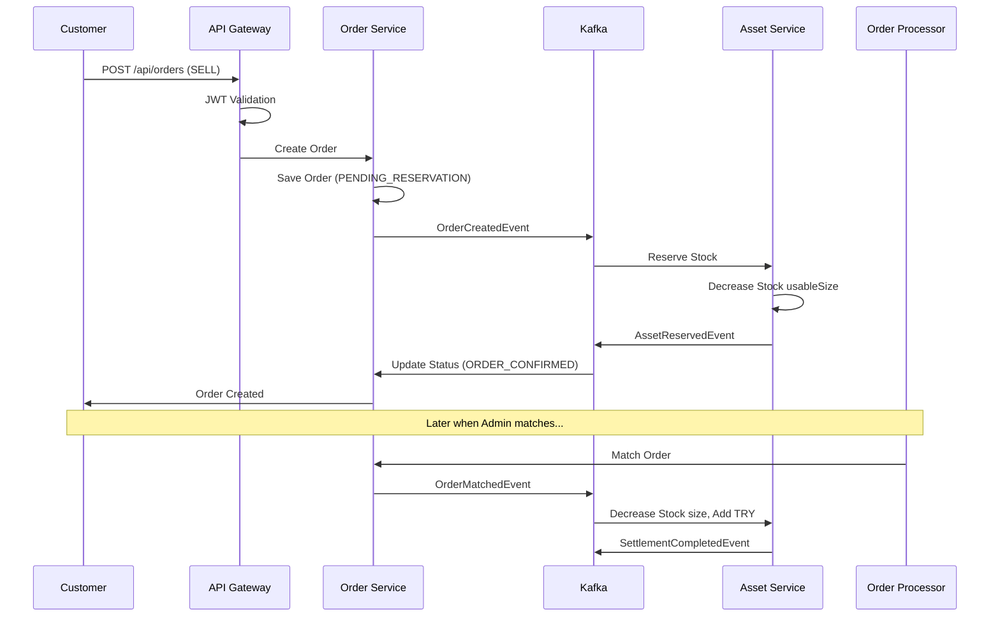
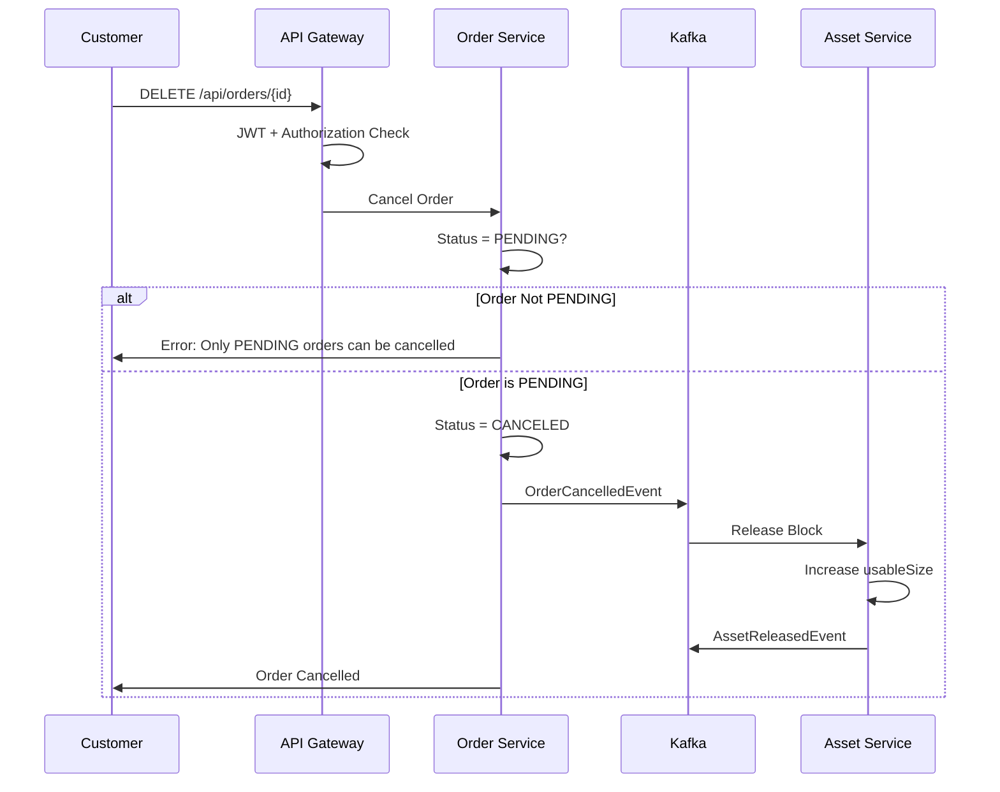
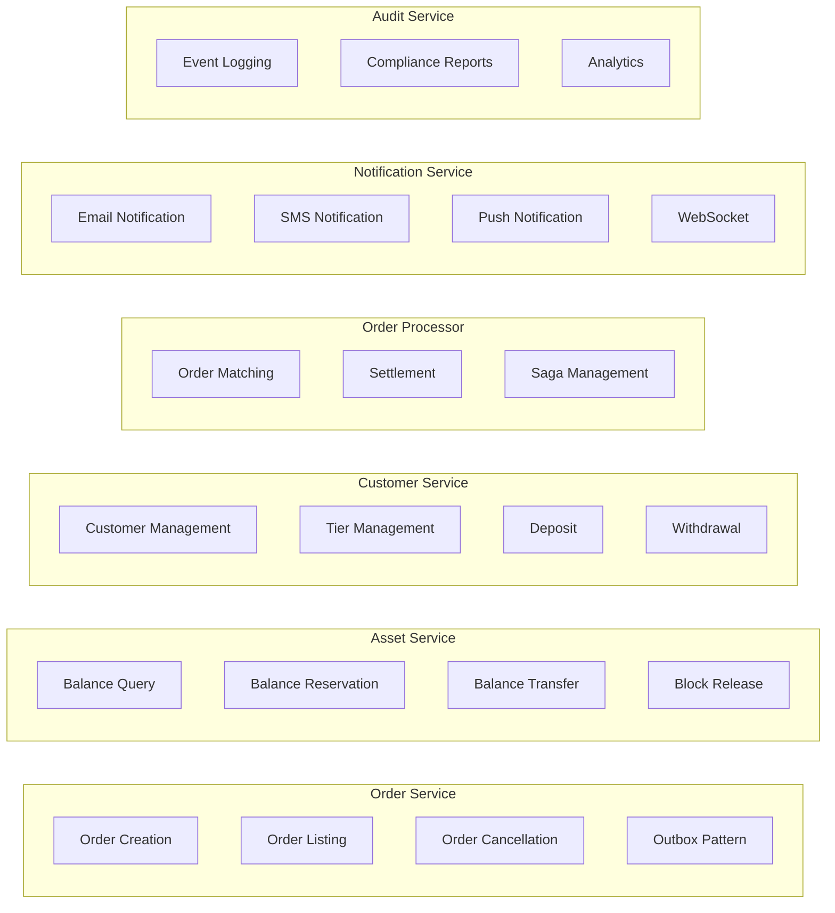
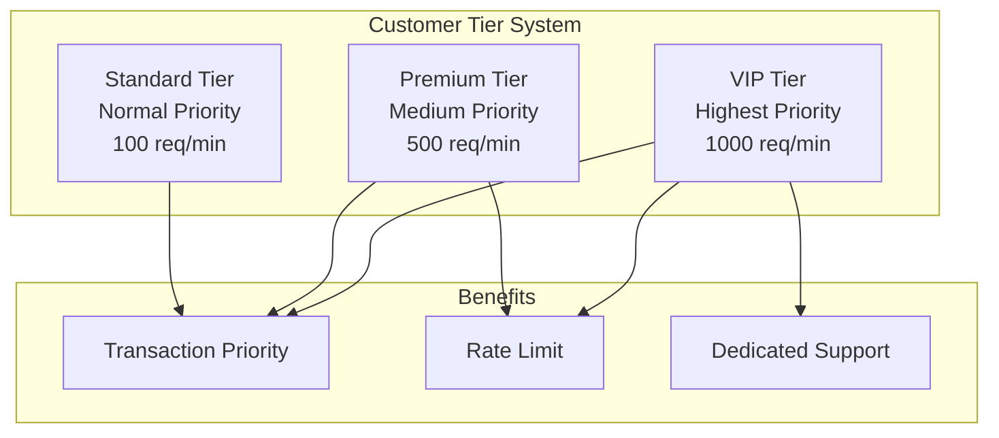
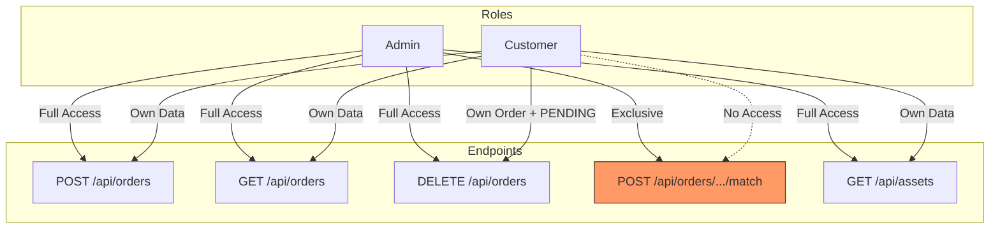
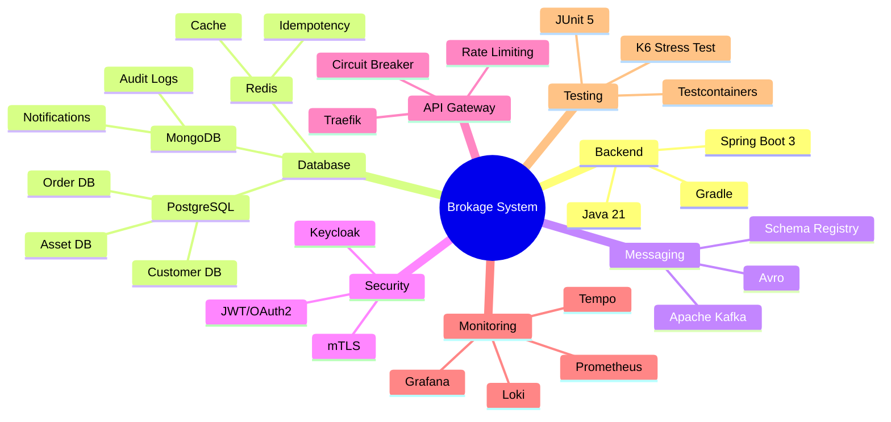

# System Overview

## Project Purpose

This project develops a backend API for a **brokerage firm**. The system enables firm employees to place and manage stock buy/sell orders on behalf of customers.

---

## General Architecture

---

## Core Concepts

### What is an Order?

When a customer wants to buy or sell stocks, they create an **order**. An order contains the following information:

### What is an Asset?

Values owned by a customer are stored as **assets**. TRY (Turkish Lira) is also an asset.

**Important:** `size` represents the total amount, `usableSize` represents the available (non-blocked) amount.

---

## Business Flow Summary

### BUY Order Flow

### SELL Order Flow

### Order Cancellation Flow

---

## Service Responsibilities

---

## Customer Tier System (Not in task requirements, added as a product feature)

The system segments customers into tiers offering different service levels:

**Business Logic:** When matching orders, sorting is done first by tier, then by price, finally by time.

---

## Authorization Matrix

---

## Technology Stack

---

## Next Steps

For more detailed architecture information, refer to the following documents:

1. **[Microservices Architecture](02-microservices-architecture.md)** - Detailed service structure
2. **[Event-Driven Flows](03-event-driven-flows.md)** - Kafka and Saga pattern
3. **[Database Design](04-database-design.md)** - Polyglot persistence
4. **[API Gateway and Security](05-api-gateway-security.md)** - Traefik and Keycloak
5. **[Monitoring and Observability](06-monitoring-observability.md)** - LGTM Stack
