# Microservices Architecture

## Overview

The system is built on an event-driven microservices architecture. Each service has its own database and inter-service communication is handled through asynchronous messaging via Kafka.

---

## Service Boundaries

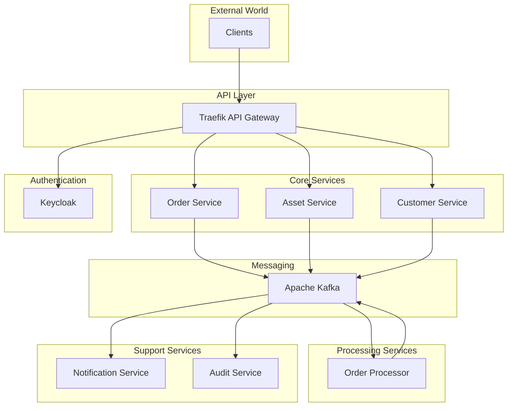

---

## Service Details

### Order Service

The main service responsible for order management.

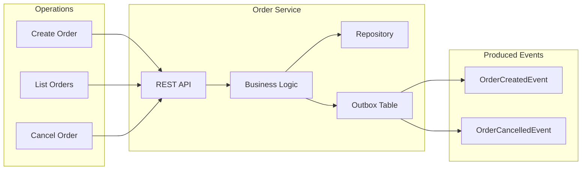

### Asset Service

Responsible for asset and balance management.

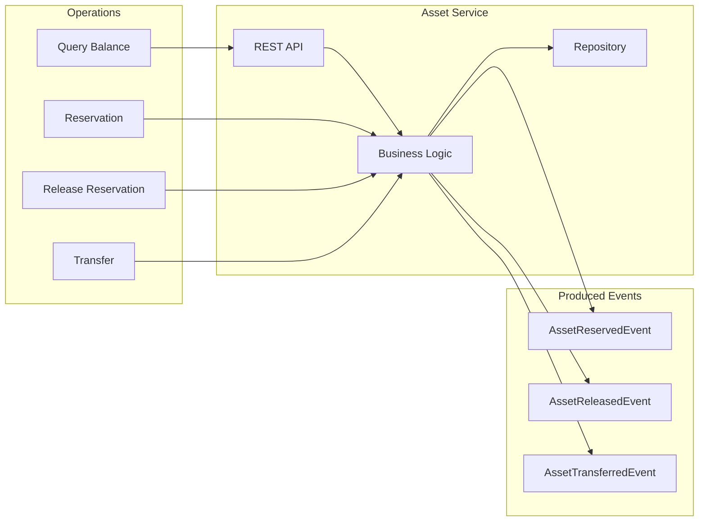

### Order Processor

Responsible for order matching and saga management.

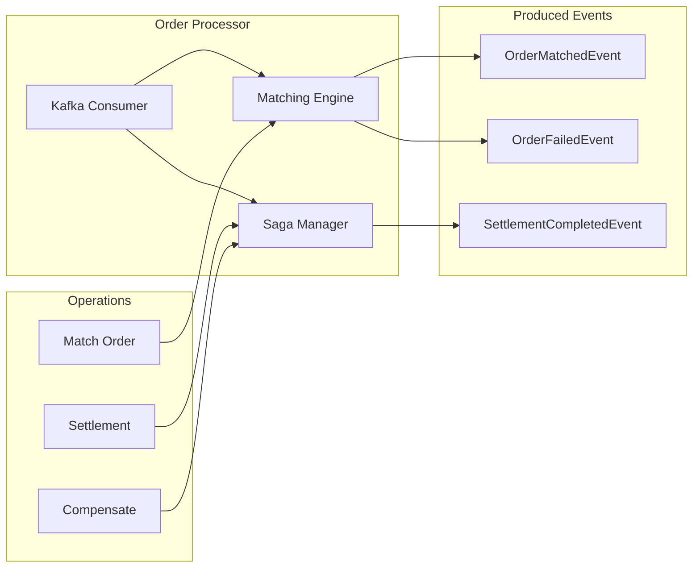

### Notification Service

Handles notification management and delivery.

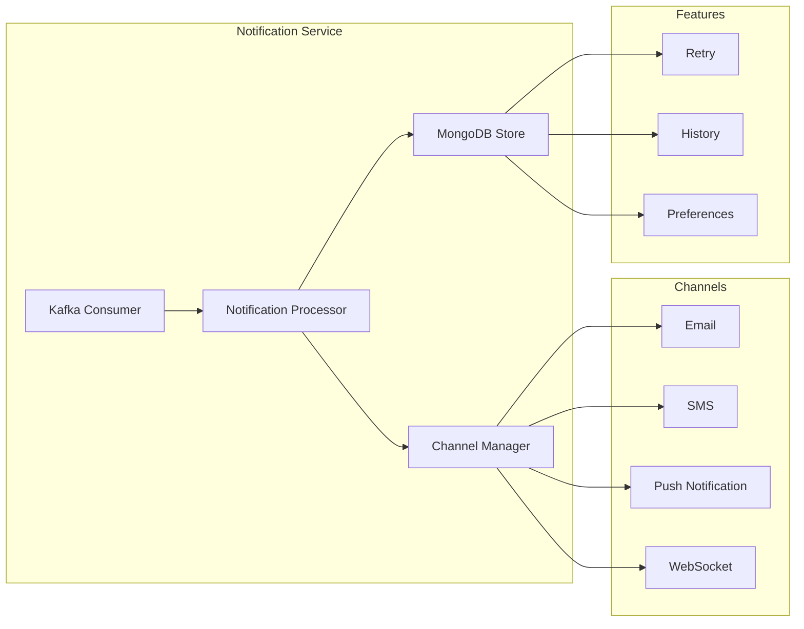

### Customer Service

Manages customers and tiers.

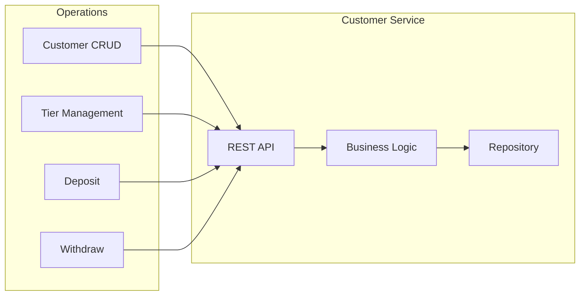

### Audit Service

Handles event logging and compliance reporting.

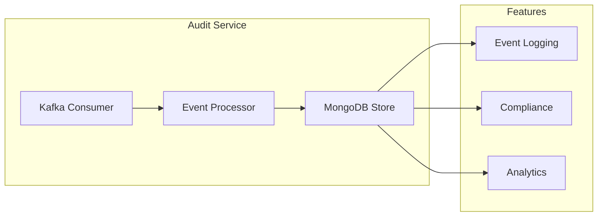

---

## Database Isolation

Each service has its own database (Database per Service pattern).

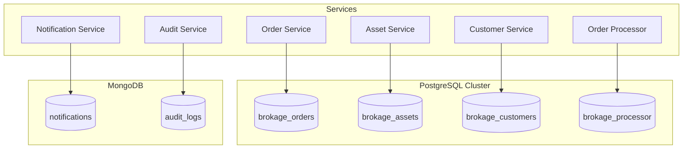

**Important Rule:** Services do not directly access each other's databases. All communication is done through events via Kafka.

---

## Inter-Service Communication

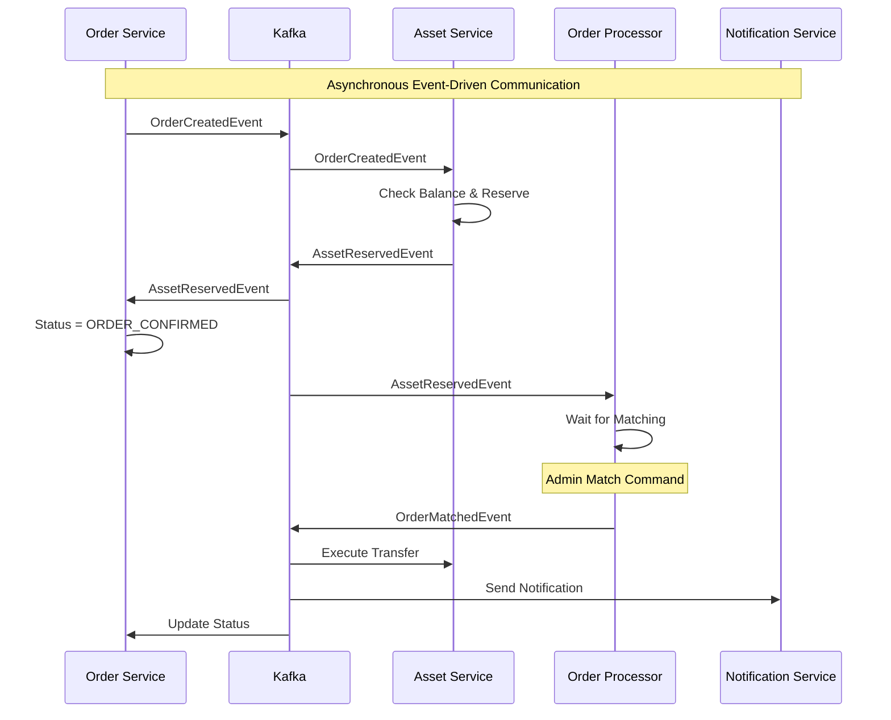

---

## Service Dependencies

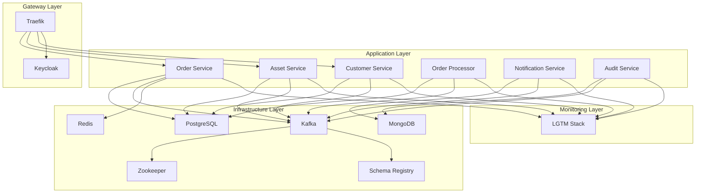

---

## Startup Order

The startup order of services is critically important:

```mermaid
flowchart LR
    subgraph Phase1["Phase 1: Infrastructure"]
        PG[PostgreSQL]
        MG[MongoDB]
        RD[Redis]
        ZK[Zookeeper]
    end

    subgraph Phase2["Phase 2: Messaging"]
        KF[Kafka]
        SR[Schema Registry]
    end

    subgraph Phase3["Phase 3: Identity"]
        KC[Keycloak]
    end

    subgraph Phase4["Phase 4: Core Services"]
        AS[Asset Service]
        CS[Customer Service]
        OS[Order Service]
    end

    subgraph Phase5["Phase 5: Processing Services"]
        OP[Order Processor]
    end

    subgraph Phase6["Phase 6: Support Services"]
        NS[Notification Service]
        AU[Audit Service]
    end

    subgraph Phase7["Phase 7: Gateway"]
        TR[Traefik]
        LGTM[LGTM]
    end

    Phase1 --> Phase2
    Phase2 --> Phase3
    Phase3 --> Phase4
    Phase4 --> Phase5
    Phase5 --> Phase6
    Phase6 --> Phase7
```

---

## Scaling Strategy

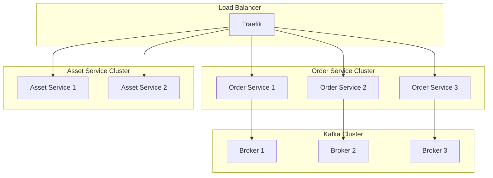

**Scaling Rules:**
- Kafka partition count = maximum consumer count
- Each consumer in a consumer group consumes from one partition
- Same customerId always goes to the same partition (ordering guarantee)

---

## Next Steps

For more detailed information:
- **[Event-Driven Flows](03-event-driven-flows.md)** - Kafka, Outbox, Saga
- **[Database Design](04-database-design.md)** - Polyglot persistence
