# Event-Driven Flows

## Overview

The system is built on an event-driven architecture. This approach provides loose coupling between services and offers significant advantages in terms of scalability and fault tolerance.

---

## Kafka Topic Architecture

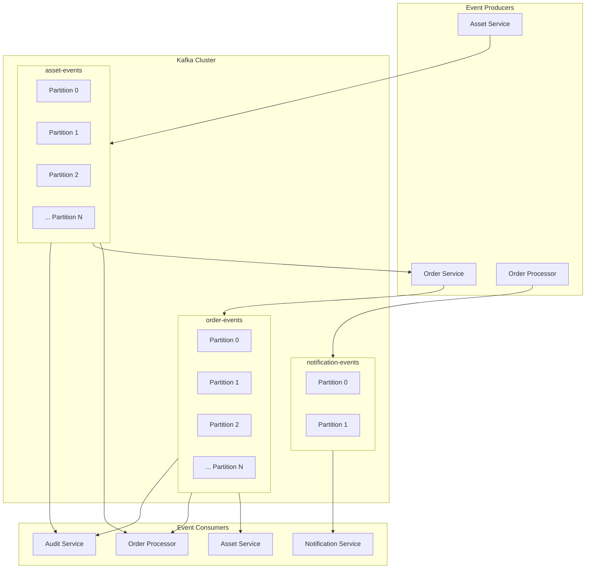
```mermaid
flowchart TB
    subgraph Producers["Event Producers"]
        OS[Order Service]
        AS[Asset Service]
        OP[Order Processor]
    end

    subgraph Kafka["Kafka Cluster"]
        subgraph OrderEvents["order-events"]
            OP1[Partition 0]
            OP2[Partition 1]
            OP3[Partition 2]
            OPN[... Partition N]
        end

        subgraph AssetEvents["asset-events"]
            AP1[Partition 0]
            AP2[Partition 1]
            AP3[Partition 2]
            APN[... Partition N]
        end

        subgraph NotificationEvents["notification-events"]
            NP1[Partition 0]
            NP2[Partition 1]
        end
    end

    subgraph Consumers["Event Consumers"]
        ASC[Asset Service]
        OPC[Order Processor]
        NSC[Notification Service]
        AUC[Audit Service]
    end

    OS --> OrderEvents
    AS --> AssetEvents
    OP --> NotificationEvents

    OrderEvents --> ASC
    OrderEvents --> OPC
    AssetEvents --> OPC
    AssetEvents --> OS
    NotificationEvents --> NSC
    OrderEvents --> AUC
    AssetEvents --> AUC
```

---

## Partition Strategy

To ensure orders from the same customer are processed sequentially, `customerId` is used as the partition key.

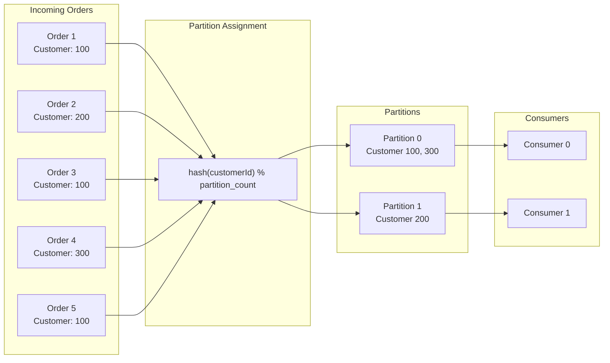
```mermaid
flowchart LR
    subgraph Orders["Incoming Orders"]
        O1["Order 1<br/>Customer: 100"]
        O2["Order 2<br/>Customer: 200"]
        O3["Order 3<br/>Customer: 100"]
        O4["Order 4<br/>Customer: 300"]
        O5["Order 5<br/>Customer: 100"]
    end

    subgraph Partitioner["Partition Assignment"]
        HASH["hash(customerId) % partition_count"]
    end

    subgraph Partitions["Partitions"]
        P0["Partition 0<br/>Customer 100, 300"]
        P1["Partition 1<br/>Customer 200"]
    end

    subgraph Consumers["Consumers"]
        C0["Consumer 0"]
        C1["Consumer 1"]
    end

    O1 --> HASH
    O2 --> HASH
    O3 --> HASH
    O4 --> HASH
    O5 --> HASH

    HASH --> P0
    HASH --> P1

    P0 --> C0
    P1 --> C1
```

**Advantages:**
- Orders from the same customer are processed sequentially (FIFO guarantee)
- Prevents race conditions
- Enables horizontal scaling

---

## Outbox Pattern

Makes database operations and event publishing atomic.

### Problem

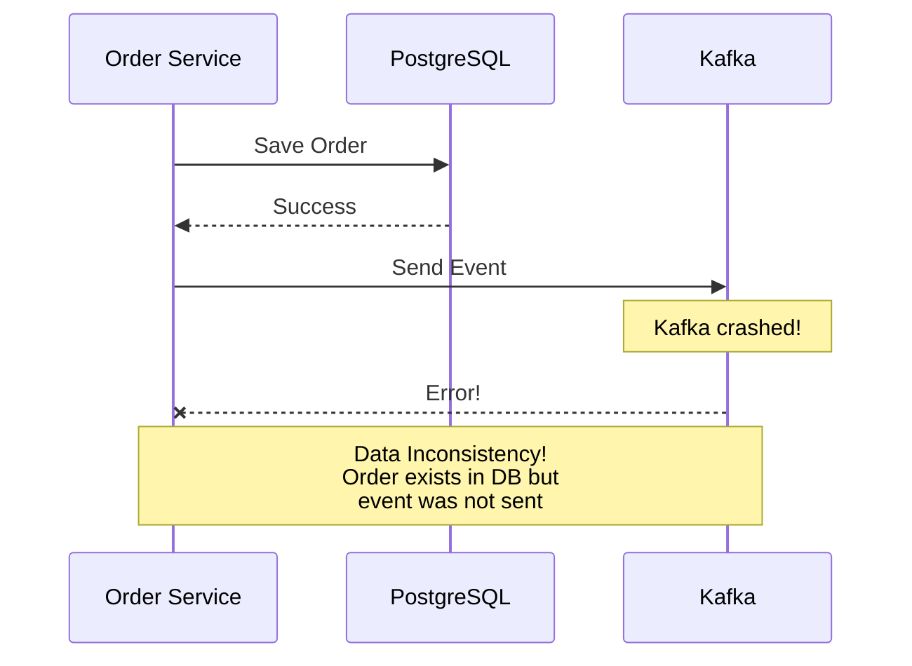
```mermaid
sequenceDiagram
    participant S as Order Service
    participant DB as PostgreSQL
    participant K as Kafka

    S->>DB: Save Order
    DB-->>S: Success

    S->>K: Send Event
    Note over K: Kafka crashed!
    K--xS: Error!

    Note over S,K: Data Inconsistency!<br/>Order exists in DB but<br/>event was not sent
```

### Solution: Outbox Pattern

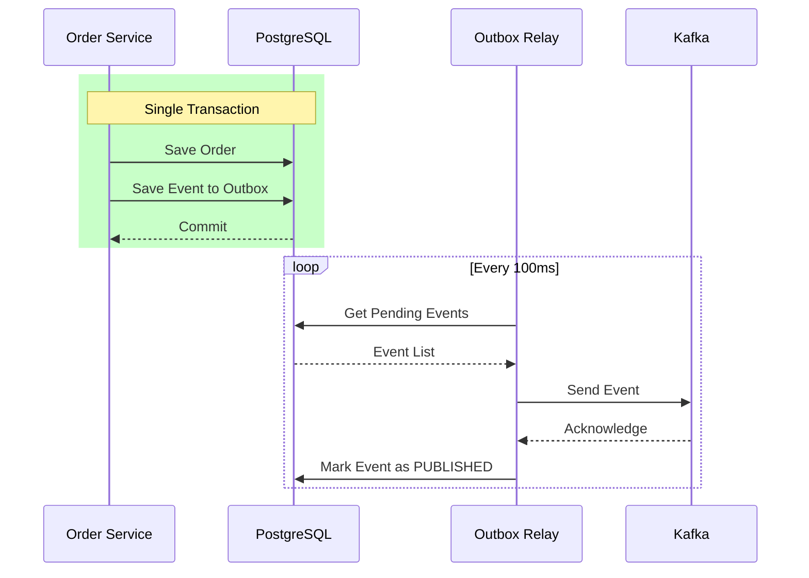
```mermaid
sequenceDiagram
    participant S as Order Service
    participant DB as PostgreSQL
    participant R as Outbox Relay
    participant K as Kafka

    rect rgb(200, 255, 200)
        Note over S,DB: Single Transaction
        S->>DB: Save Order
        S->>DB: Save Event to Outbox
        DB-->>S: Commit
    end

    loop Every 100ms
        R->>DB: Get Pending Events
        DB-->>R: Event List
        R->>K: Send Event
        K-->>R: Acknowledge
        R->>DB: Mark Event as PUBLISHED
    end
```

### Outbox Flow Details

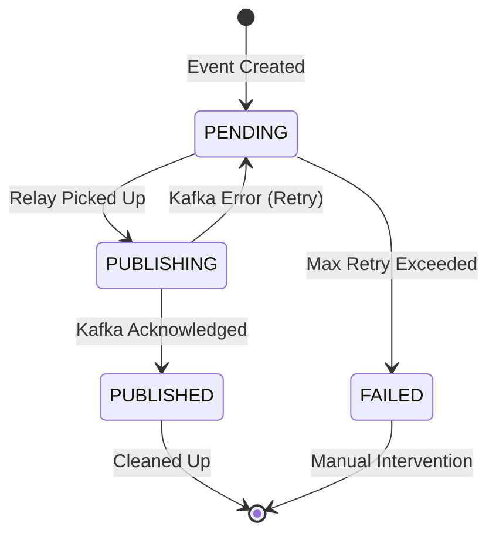
```mermaid
stateDiagram-v2
    [*] --> PENDING: Event Created

    PENDING --> PUBLISHING: Relay Picked Up
    PUBLISHING --> PUBLISHED: Kafka Acknowledged
    PUBLISHING --> PENDING: Kafka Error (Retry)

    PENDING --> FAILED: Max Retry Exceeded

    PUBLISHED --> [*]: Cleaned Up
    FAILED --> [*]: Manual Intervention
```

---

## Saga Pattern

Choreography-based saga pattern is used for distributed transactions.

### Order Creation Saga

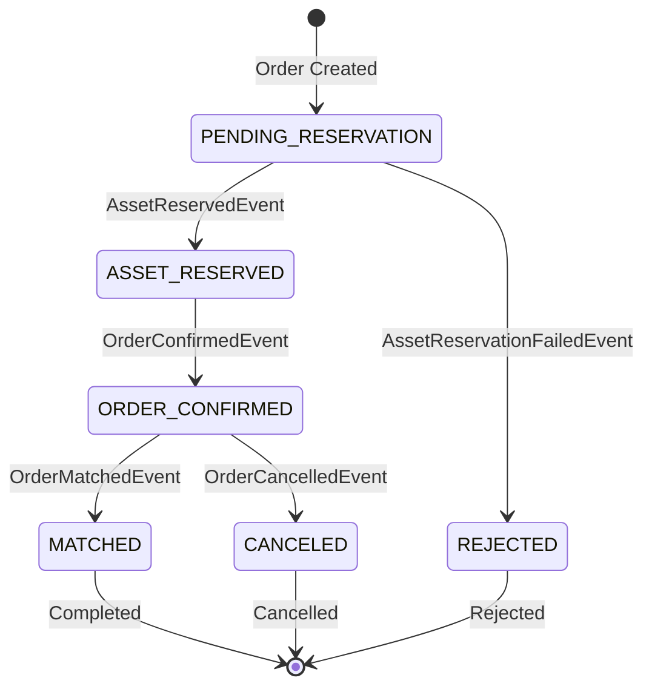
```mermaid
stateDiagram-v2
    [*] --> PENDING_RESERVATION: Order Created

    PENDING_RESERVATION --> ASSET_RESERVED: AssetReservedEvent
    PENDING_RESERVATION --> REJECTED: AssetReservationFailedEvent

    ASSET_RESERVED --> ORDER_CONFIRMED: OrderConfirmedEvent

    ORDER_CONFIRMED --> MATCHED: OrderMatchedEvent
    ORDER_CONFIRMED --> CANCELED: OrderCancelledEvent

    MATCHED --> [*]: Completed
    CANCELED --> [*]: Cancelled
    REJECTED --> [*]: Rejected
```

### Success Scenario

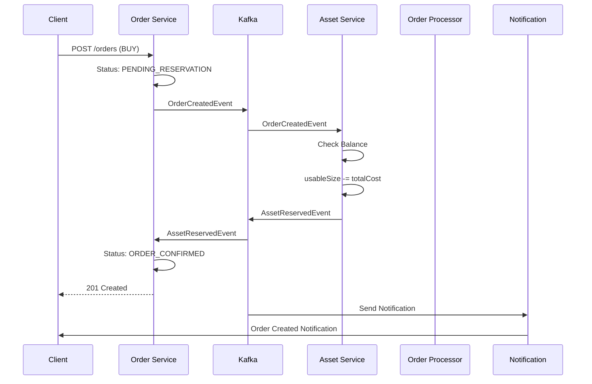
```mermaid
sequenceDiagram
    participant C as Client
    participant OS as Order Service
    participant K as Kafka
    participant AS as Asset Service
    participant OP as Order Processor
    participant NS as Notification

    C->>OS: POST /orders (BUY)
    OS->>OS: Status: PENDING_RESERVATION
    OS->>K: OrderCreatedEvent

    K->>AS: OrderCreatedEvent
    AS->>AS: Check Balance
    AS->>AS: usableSize -= totalCost
    AS->>K: AssetReservedEvent

    K->>OS: AssetReservedEvent
    OS->>OS: Status: ORDER_CONFIRMED
    OS-->>C: 201 Created

    K->>NS: Send Notification
    NS->>C: Order Created Notification
```

### Failure Scenario (Compensation)

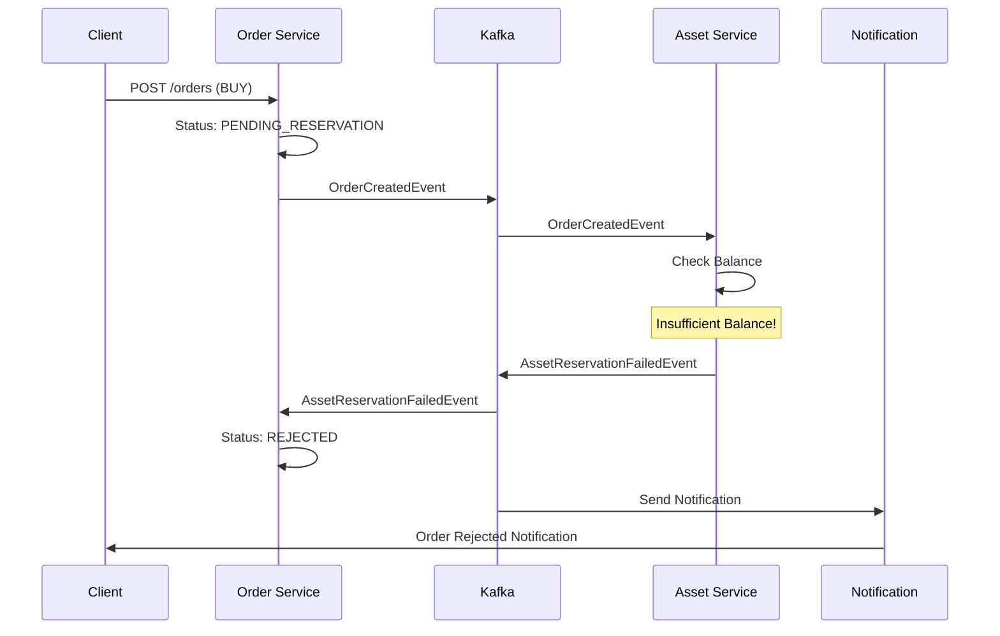
```mermaid
sequenceDiagram
    participant C as Client
    participant OS as Order Service
    participant K as Kafka
    participant AS as Asset Service
    participant NS as Notification

    C->>OS: POST /orders (BUY)
    OS->>OS: Status: PENDING_RESERVATION
    OS->>K: OrderCreatedEvent

    K->>AS: OrderCreatedEvent
    AS->>AS: Check Balance

    Note over AS: Insufficient Balance!

    AS->>K: AssetReservationFailedEvent

    K->>OS: AssetReservationFailedEvent
    OS->>OS: Status: REJECTED

    K->>NS: Send Notification
    NS->>C: Order Rejected Notification
```

---

## Idempotency

Prevents the same operation from being executed multiple times.

### API Level Idempotency

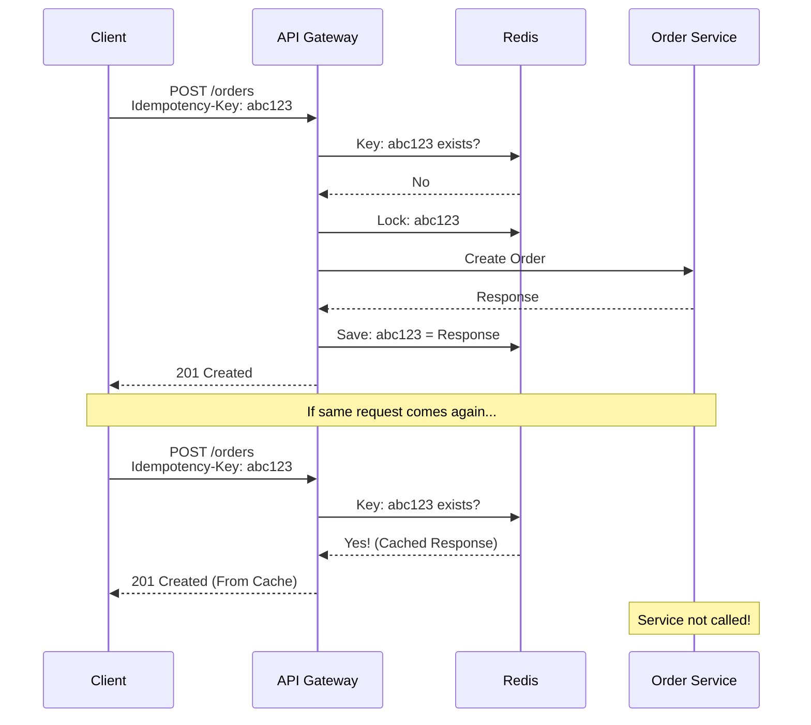
```mermaid
sequenceDiagram
    participant C as Client
    participant GW as API Gateway
    participant R as Redis
    participant S as Order Service

    C->>GW: POST /orders<br/>Idempotency-Key: abc123

    GW->>R: Key: abc123 exists?
    R-->>GW: No

    GW->>R: Lock: abc123
    GW->>S: Create Order
    S-->>GW: Response

    GW->>R: Save: abc123 = Response
    GW-->>C: 201 Created

    Note over C,S: If same request comes again...

    C->>GW: POST /orders<br/>Idempotency-Key: abc123

    GW->>R: Key: abc123 exists?
    R-->>GW: Yes! (Cached Response)

    GW-->>C: 201 Created (From Cache)

    Note over S: Service not called!
```

### Consumer Level Idempotency

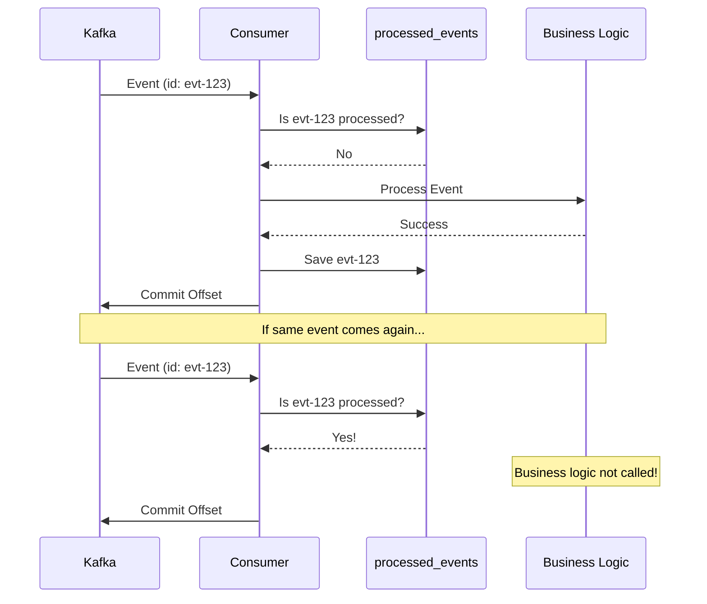
```mermaid
sequenceDiagram
    participant K as Kafka
    participant C as Consumer
    participant PE as processed_events
    participant BL as Business Logic

    K->>C: Event (id: evt-123)

    C->>PE: Is evt-123 processed?
    PE-->>C: No

    C->>BL: Process Event
    BL-->>C: Success

    C->>PE: Save evt-123
    C->>K: Commit Offset

    Note over K,BL: If same event comes again...

    K->>C: Event (id: evt-123)

    C->>PE: Is evt-123 processed?
    PE-->>C: Yes!

    Note over BL: Business logic not called!

    C->>K: Commit Offset
```

### 3-Layer Idempotency

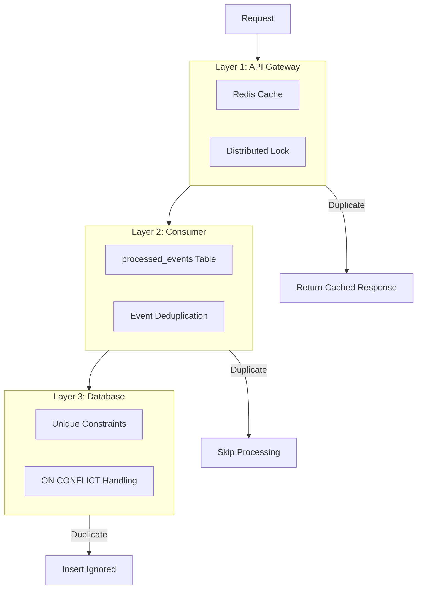
```mermaid
flowchart TB
    subgraph Layer1["Layer 1: API Gateway"]
        R1[Redis Cache]
        L1[Distributed Lock]
    end

    subgraph Layer2["Layer 2: Consumer"]
        PE[processed_events Table]
        DEDUP[Event Deduplication]
    end

    subgraph Layer3["Layer 3: Database"]
        UK[Unique Constraints]
        OC[ON CONFLICT Handling]
    end

    REQ[Request] --> Layer1
    Layer1 --> Layer2
    Layer2 --> Layer3

    Layer1 -->|Duplicate| REJECT1[Return Cached Response]
    Layer2 -->|Duplicate| REJECT2[Skip Processing]
    Layer3 -->|Duplicate| REJECT3[Insert Ignored]
```

---

## Dead Letter Queue (DLQ)

Safety mechanism for unprocessable messages.

### Retry Flow

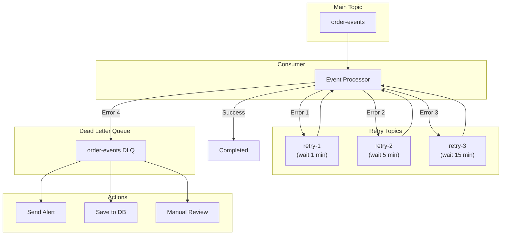
```mermaid
flowchart TB
    subgraph MainTopic["Main Topic"]
        MT[order-events]
    end

    subgraph Consumer["Consumer"]
        C[Event Processor]
    end

    subgraph RetryTopics["Retry Topics"]
        R1["retry-1<br/>(wait 1 min)"]
        R2["retry-2<br/>(wait 5 min)"]
        R3["retry-3<br/>(wait 15 min)"]
    end

    subgraph DLQ["Dead Letter Queue"]
        D[order-events.DLQ]
    end

    subgraph Actions["Actions"]
        ALERT[Send Alert]
        STORE[Save to DB]
        REVIEW[Manual Review]
    end

    MT --> C

    C -->|Success| DONE[Completed]
    C -->|Error 1| R1
    R1 --> C
    C -->|Error 2| R2
    R2 --> C
    C -->|Error 3| R3
    R3 --> C
    C -->|Error 4| D

    D --> ALERT
    D --> STORE
    D --> REVIEW
```

### Exponential Backoff

```mermaid
gantt
    title Retry Scheduling
    dateFormat X
    axisFormat %s

    section Retry
    First Attempt  :0, 1
    Error          :1, 2
    1st Retry (1m) :60, 61
    Error          :61, 62
    2nd Retry (5m) :360, 361
    Error          :361, 362
    3rd Retry (15m):1260, 1261
    Error          :1261, 1262
    DLQ            :1262, 1263
```

---

## Resilience Patterns

### Circuit Breaker

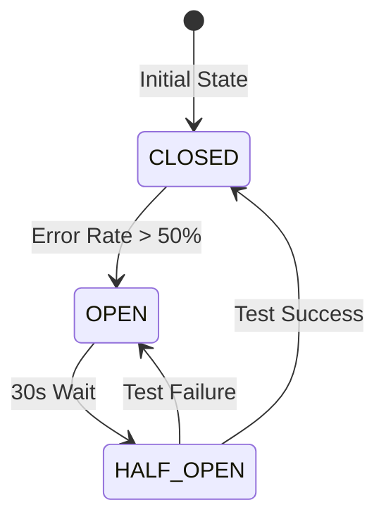
```mermaid
stateDiagram-v2
    [*] --> CLOSED: Initial State

    CLOSED --> OPEN: Error Rate > 50%
    OPEN --> HALF_OPEN: 30s Wait
    HALF_OPEN --> CLOSED: Test Success
    HALF_OPEN --> OPEN: Test Failure
```

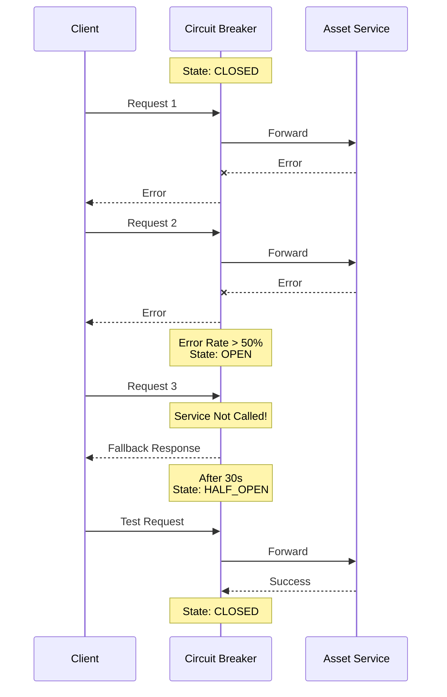
```mermaid
sequenceDiagram
    participant C as Client
    participant CB as Circuit Breaker
    participant S as Asset Service

    Note over CB: State: CLOSED

    C->>CB: Request 1
    CB->>S: Forward
    S--xCB: Error
    CB-->>C: Error

    C->>CB: Request 2
    CB->>S: Forward
    S--xCB: Error
    CB-->>C: Error

    Note over CB: Error Rate > 50%<br/>State: OPEN

    C->>CB: Request 3
    Note over CB: Service Not Called!
    CB-->>C: Fallback Response

    Note over CB: After 30s<br/>State: HALF_OPEN

    C->>CB: Test Request
    CB->>S: Forward
    S-->>CB: Success

    Note over CB: State: CLOSED
```

### Bulkhead

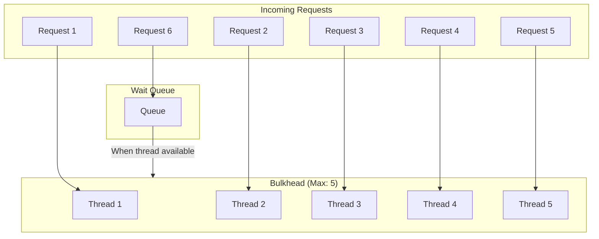
```mermaid
flowchart TB
    subgraph Requests["Incoming Requests"]
        R1[Request 1]
        R2[Request 2]
        R3[Request 3]
        R4[Request 4]
        R5[Request 5]
        R6[Request 6]
    end

    subgraph Bulkhead["Bulkhead (Max: 5)"]
        T1[Thread 1]
        T2[Thread 2]
        T3[Thread 3]
        T4[Thread 4]
        T5[Thread 5]
    end

    subgraph Queue["Wait Queue"]
        Q[Queue]
    end

    R1 --> T1
    R2 --> T2
    R3 --> T3
    R4 --> T4
    R5 --> T5
    R6 --> Q

    Q -->|When thread available| Bulkhead
```

---

## Event Schema (Avro)

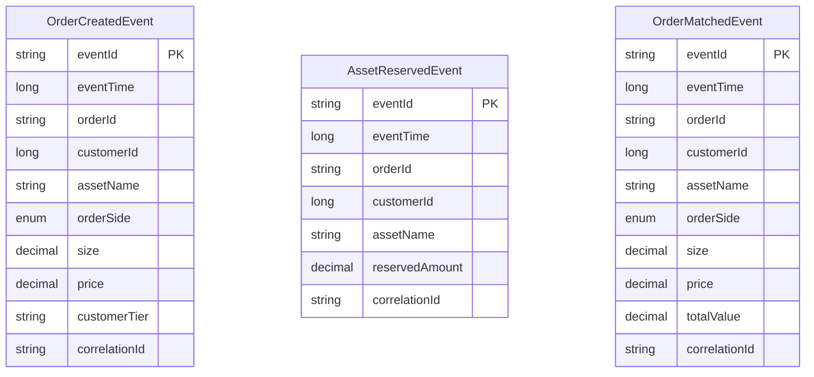
```mermaid
erDiagram
    OrderCreatedEvent {
        string eventId PK
        long eventTime
        string orderId
        long customerId
        string assetName
        enum orderSide
        decimal size
        decimal price
        string customerTier
        string correlationId
    }

    AssetReservedEvent {
        string eventId PK
        long eventTime
        string orderId
        long customerId
        string assetName
        decimal reservedAmount
        string correlationId
    }

    OrderMatchedEvent {
        string eventId PK
        long eventTime
        string orderId
        long customerId
        string assetName
        enum orderSide
        decimal size
        decimal price
        decimal totalValue
        string correlationId
    }
```

### Schema Evolution Rules

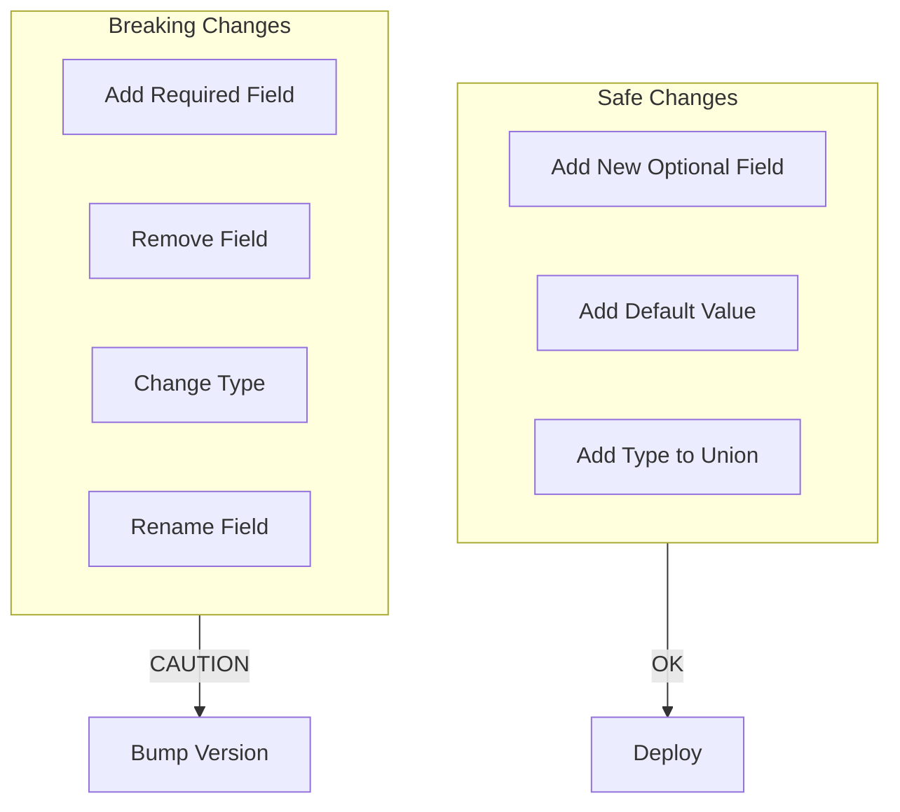
```mermaid
flowchart TB
    subgraph Safe["Safe Changes"]
        S1[Add New Optional Field]
        S2[Add Default Value]
        S3[Add Type to Union]
    end

    subgraph Breaking["Breaking Changes"]
        B1[Add Required Field]
        B2[Remove Field]
        B3[Change Type]
        B4[Rename Field]
    end

    Safe -->|OK| DEPLOY[Deploy]
    Breaking -->|CAUTION| REVIEW[Bump Version]
```

---

## Distributed Tracing

Request tracking across all services.

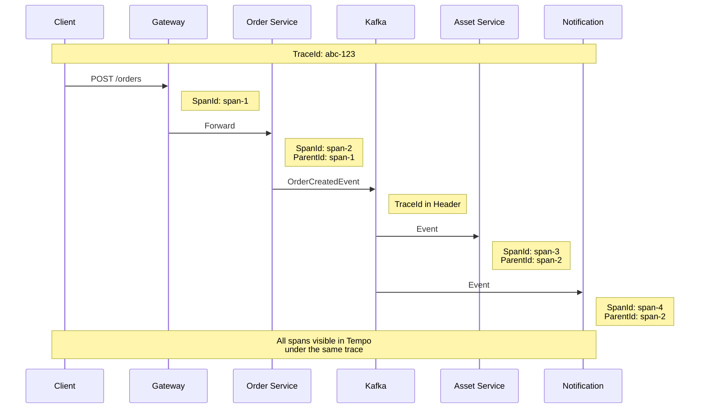
```mermaid
sequenceDiagram
    participant C as Client
    participant GW as Gateway
    participant OS as Order Service
    participant K as Kafka
    participant AS as Asset Service
    participant NS as Notification

    Note over C,NS: TraceId: abc-123

    C->>GW: POST /orders
    Note right of GW: SpanId: span-1

    GW->>OS: Forward
    Note right of OS: SpanId: span-2<br/>ParentId: span-1

    OS->>K: OrderCreatedEvent
    Note right of K: TraceId in Header

    K->>AS: Event
    Note right of AS: SpanId: span-3<br/>ParentId: span-2

    K->>NS: Event
    Note right of NS: SpanId: span-4<br/>ParentId: span-2

    Note over C,NS: All spans visible in Tempo<br/>under the same trace
```

---

## Next Steps

- **[Database Design](04-database-design.md)** - Polyglot persistence details
- **[API Gateway and Security](05-api-gateway-security.md)** - Traefik and Keycloak
