# API Gateway and Security

## Overview

The system uses **Traefik** as the API Gateway. **Keycloak** is integrated for authentication and authorization.

---

## API Gateway Architecture

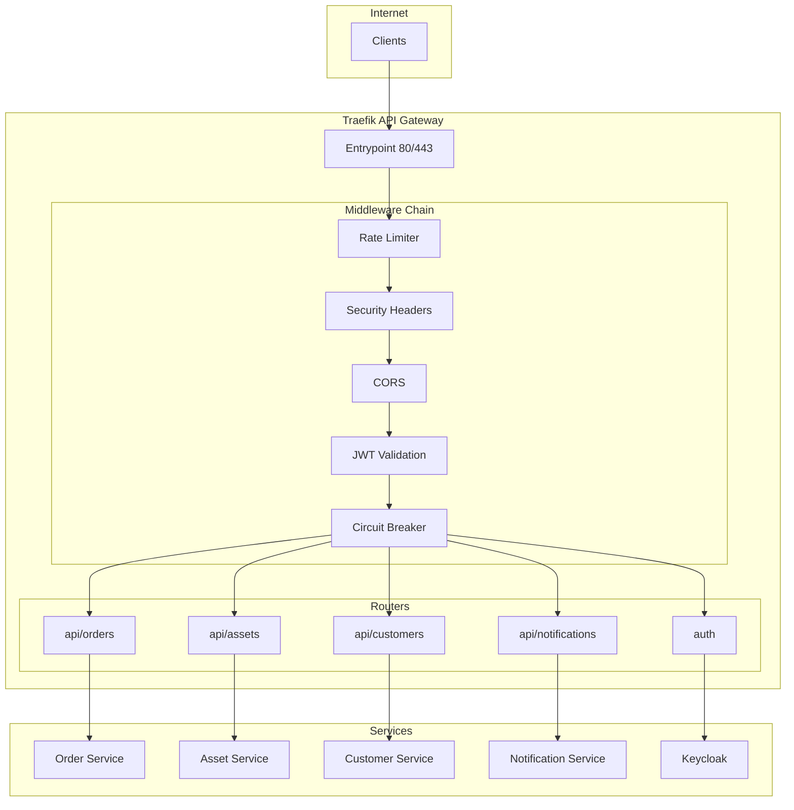
```mermaid
flowchart TB
    subgraph Internet["Internet"]
        CLIENT[Clients]
    end

    subgraph Gateway["Traefik API Gateway"]
        ENTRY["Entrypoint 80/443"]

        subgraph Middlewares["Middleware Chain"]
            RL[Rate Limiter]
            SEC[Security Headers]
            CORS[CORS]
            JWT[JWT Validation]
            CB[Circuit Breaker]
        end

        subgraph Routers["Routers"]
            R1["api/orders"]
            R2["api/assets"]
            R3["api/customers"]
            R4["api/notifications"]
            R5["auth"]
        end
    end

    subgraph Services["Services"]
        OS[Order Service]
        AS[Asset Service]
        CS[Customer Service]
        NS[Notification Service]
        KC[Keycloak]
    end

    CLIENT --> ENTRY
    ENTRY --> RL
    RL --> SEC
    SEC --> CORS
    CORS --> JWT
    JWT --> CB

    CB --> R1
    CB --> R2
    CB --> R3
    CB --> R4
    CB --> R5

    R1 --> OS
    R2 --> AS
    R3 --> CS
    R4 --> NS
    R5 --> KC
```

---

## Security Middlewares

### Rate Limiting

Protects services by preventing excessive requests.

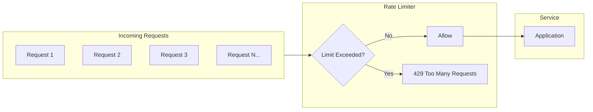
```mermaid
flowchart LR
    subgraph Requests["Incoming Requests"]
        R1[Request 1]
        R2[Request 2]
        R3[Request 3]
        RN[Request N...]
    end

    subgraph RateLimiter["Rate Limiter"]
        CHECK{Limit Exceeded?}
        ALLOW[Allow]
        DENY[429 Too Many Requests]
    end

    subgraph Service["Service"]
        SVC[Application]
    end

    Requests --> CHECK
    CHECK -->|No| ALLOW
    CHECK -->|Yes| DENY
    ALLOW --> SVC
```

**Limit Types:**

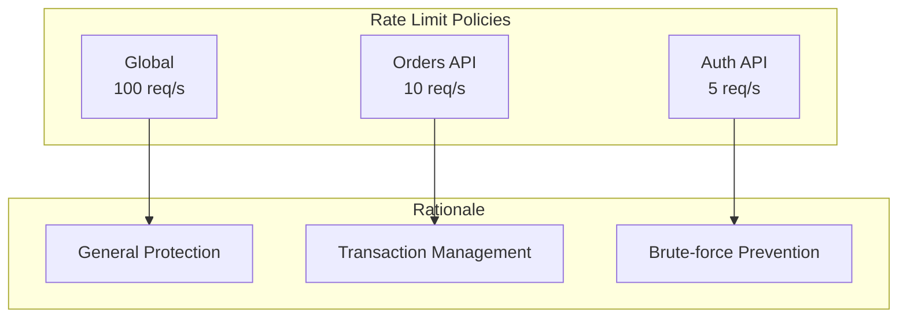
```mermaid
flowchart TB
    subgraph Limits["Rate Limit Policies"]
        GLOBAL["Global<br/>100 req/s"]
        ORDERS["Orders API<br/>10 req/s"]
        AUTH["Auth API<br/>5 req/s"]
    end

    subgraph Reasons["Rationale"]
        G1[General Protection]
        G2[Transaction Management]
        G3[Brute-force Prevention]
    end

    GLOBAL --> G1
    ORDERS --> G2
    AUTH --> G3
```

### Tier-Based Rate Limiting

Customer tiers have different rate limits applied at the application layer:

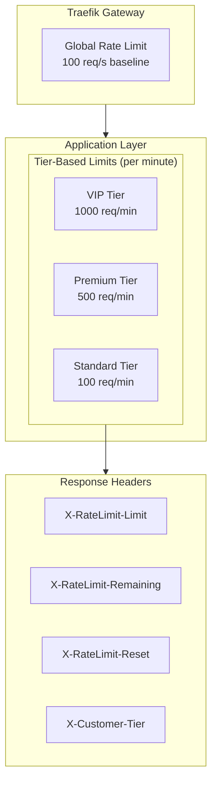
```mermaid
flowchart TB
    subgraph Gateway["Traefik Gateway"]
        GLOBAL_RL["Global Rate Limit<br/>100 req/s baseline"]
    end

    subgraph Application["Application Layer"]
        subgraph TierLimits["Tier-Based Limits (per minute)"]
            VIP["VIP Tier<br/>1000 req/min"]
            PREMIUM["Premium Tier<br/>500 req/min"]
            STANDARD["Standard Tier<br/>100 req/min"]
        end
    end

    subgraph Headers["Response Headers"]
        H1["X-RateLimit-Limit"]
        H2["X-RateLimit-Remaining"]
        H3["X-RateLimit-Reset"]
        H4["X-Customer-Tier"]
    end

    Gateway --> Application
    TierLimits --> Headers
```

**Implementation:**
- Gateway applies baseline rate limiting (100 req/s global)
- Application layer (`TierRateLimitFilter`) applies tier-specific limits
- Tier is extracted from JWT `customer_tier` claim
- Rate limit headers are returned in responses

### Security Headers

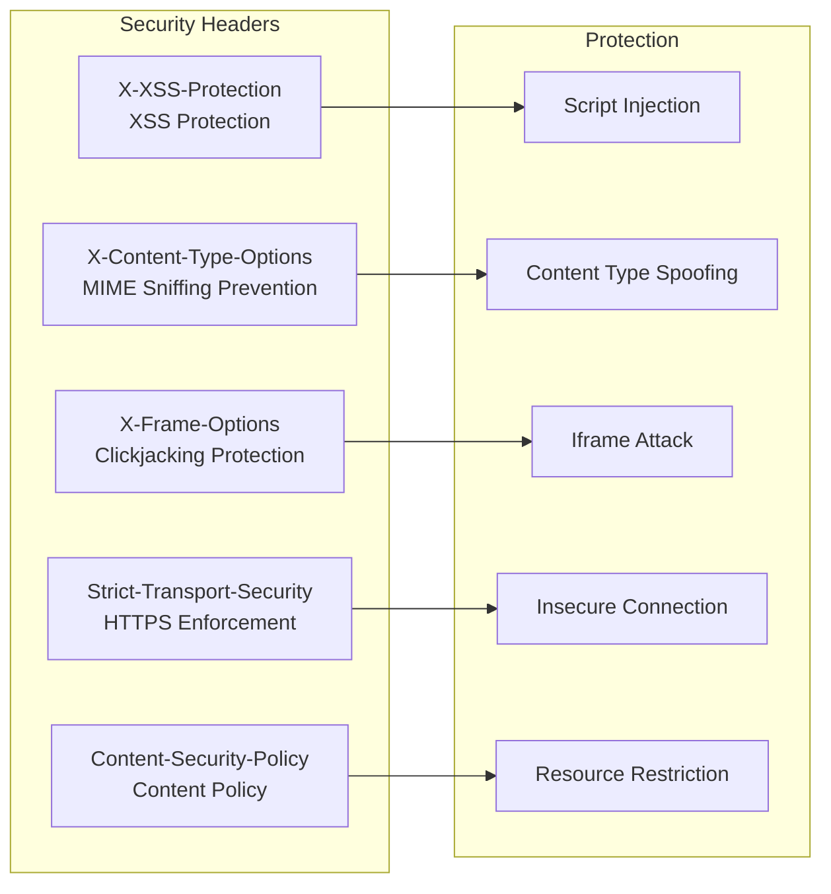
```mermaid
flowchart LR
    subgraph Headers["Security Headers"]
        H1["X-XSS-Protection<br/>XSS Protection"]
        H2["X-Content-Type-Options<br/>MIME Sniffing Prevention"]
        H3["X-Frame-Options<br/>Clickjacking Protection"]
        H4["Strict-Transport-Security<br/>HTTPS Enforcement"]
        H5["Content-Security-Policy<br/>Content Policy"]
    end

    subgraph Protection["Protection"]
        P1[Script Injection]
        P2[Content Type Spoofing]
        P3[Iframe Attack]
        P4[Insecure Connection]
        P5[Resource Restriction]
    end

    H1 --> P1
    H2 --> P2
    H3 --> P3
    H4 --> P4
    H5 --> P5
```

### CORS (Cross-Origin Resource Sharing)

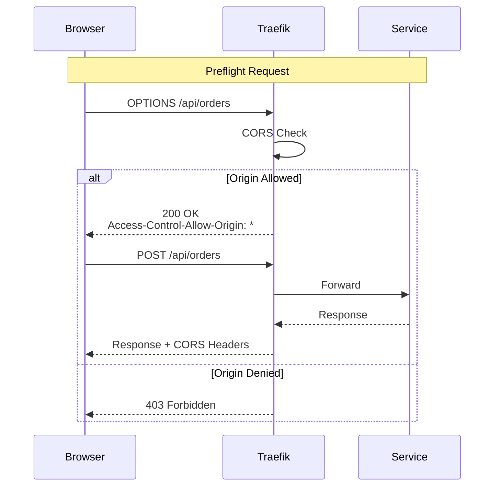
```mermaid
sequenceDiagram
    participant B as Browser
    participant T as Traefik
    participant S as Service

    Note over B,S: Preflight Request

    B->>T: OPTIONS /api/orders
    T->>T: CORS Check

    alt Origin Allowed
        T-->>B: 200 OK<br/>Access-Control-Allow-Origin: *
        B->>T: POST /api/orders
        T->>S: Forward
        S-->>T: Response
        T-->>B: Response + CORS Headers
    else Origin Denied
        T-->>B: 403 Forbidden
    end
```

### Circuit Breaker

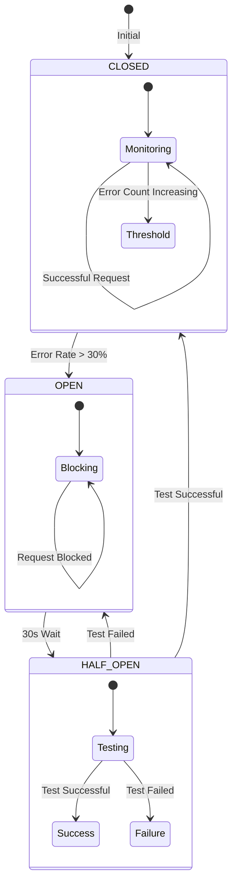
```mermaid
stateDiagram-v2
    [*] --> CLOSED: Initial

    state CLOSED {
        [*] --> Monitoring
        Monitoring --> Monitoring: Successful Request
        Monitoring --> Threshold: Error Count Increasing
    }

    CLOSED --> OPEN: Error Rate > 30%

    state OPEN {
        [*] --> Blocking
        Blocking --> Blocking: Request Blocked
    }

    OPEN --> HALF_OPEN: 30s Wait

    state HALF_OPEN {
        [*] --> Testing
        Testing --> Success: Test Successful
        Testing --> Failure: Test Failed
    }

    HALF_OPEN --> CLOSED: Test Successful
    HALF_OPEN --> OPEN: Test Failed
```

---

## Authentication

### JWT Flow - Login

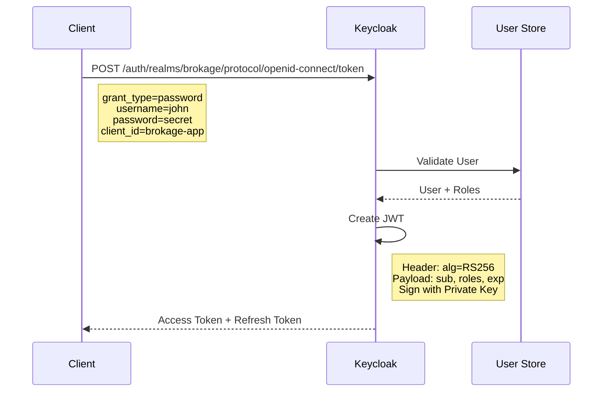
```mermaid
sequenceDiagram
    participant C as Client
    participant K as Keycloak
    participant DB as User Store

    C->>K: POST /auth/realms/brokage/protocol/openid-connect/token
    Note right of C: grant_type=password<br/>username=john<br/>password=secret<br/>client_id=brokage-app

    K->>DB: Validate User
    DB-->>K: User + Roles

    K->>K: Create JWT
    Note right of K: Header: alg=RS256<br/>Payload: sub, roles, exp<br/>Sign with Private Key

    K-->>C: Access Token + Refresh Token
```

### JWT Flow - API Access (Role-Based)

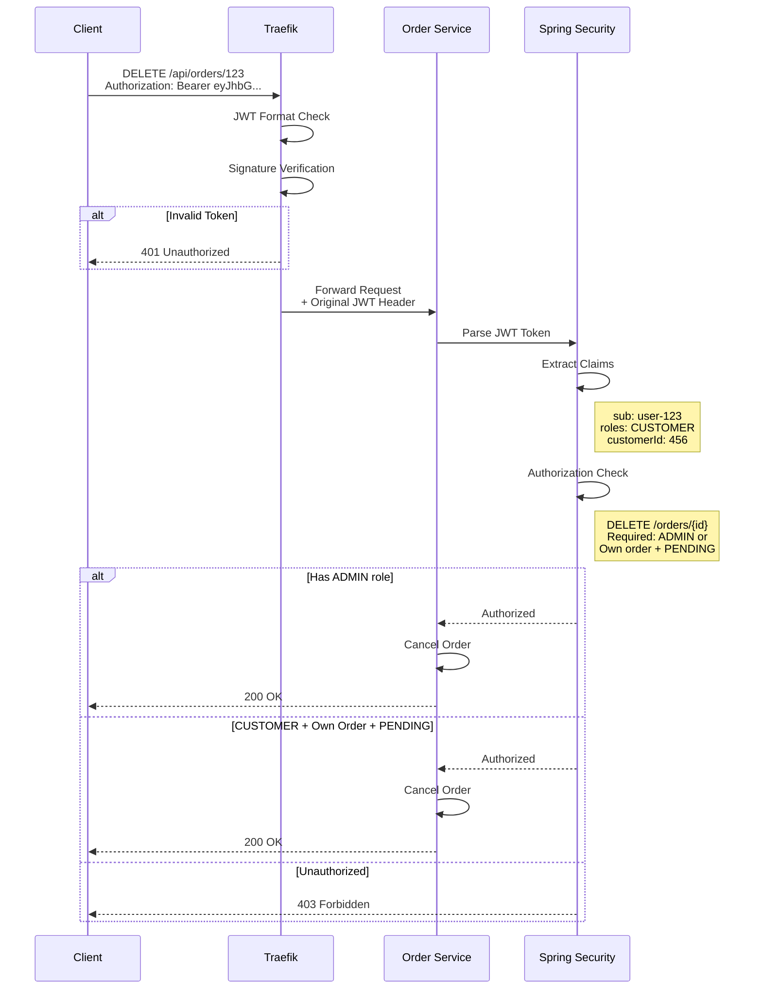
```mermaid
sequenceDiagram
    participant C as Client
    participant T as Traefik
    participant S as Order Service
    participant SEC as Spring Security

    C->>T: DELETE /api/orders/123<br/>Authorization: Bearer eyJhbG...

    T->>T: JWT Format Check
    T->>T: Signature Verification

    alt Invalid Token
        T-->>C: 401 Unauthorized
    end

    T->>S: Forward Request<br/>+ Original JWT Header

    S->>SEC: Parse JWT Token
    SEC->>SEC: Extract Claims
    Note right of SEC: sub: user-123<br/>roles: CUSTOMER<br/>customerId: 456

    SEC->>SEC: Authorization Check
    Note right of SEC: DELETE /orders/{id}<br/>Required: ADMIN or<br/>Own order + PENDING

    alt Has ADMIN role
        SEC-->>S: Authorized
        S->>S: Cancel Order
        S-->>C: 200 OK
    else CUSTOMER + Own Order + PENDING
        SEC-->>S: Authorized
        S->>S: Cancel Order
        S-->>C: 200 OK
    else Unauthorized
        SEC-->>C: 403 Forbidden
    end
```

### Match Operation - ADMIN and BROKER

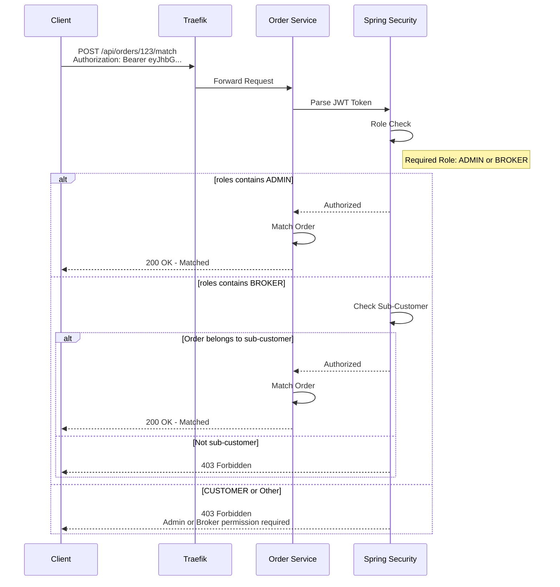
```mermaid
sequenceDiagram
    participant C as Client
    participant T as Traefik
    participant S as Order Service
    participant SEC as Spring Security

    C->>T: POST /api/orders/123/match<br/>Authorization: Bearer eyJhbG...

    T->>S: Forward Request

    S->>SEC: Parse JWT Token
    SEC->>SEC: Role Check
    Note right of SEC: Required Role: ADMIN or BROKER

    alt roles contains ADMIN
        SEC-->>S: Authorized
        S->>S: Match Order
        S-->>C: 200 OK - Matched
    else roles contains BROKER
        SEC->>SEC: Check Sub-Customer
        alt Order belongs to sub-customer
            SEC-->>S: Authorized
            S->>S: Match Order
            S-->>C: 200 OK - Matched
        else Not sub-customer
            SEC-->>C: 403 Forbidden
        end
    else CUSTOMER or Other
        SEC-->>C: 403 Forbidden<br/>Admin or Broker permission required
    end
```

### JWT Token Structure

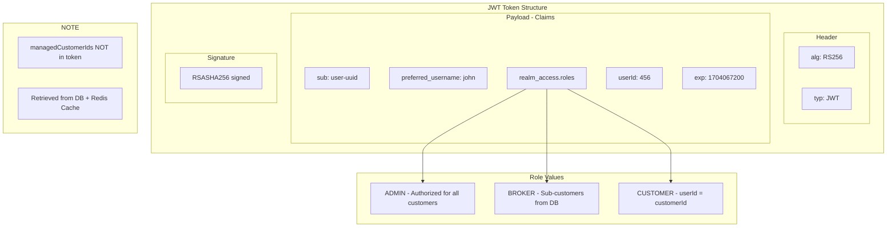
```mermaid
flowchart TB
    subgraph Token["JWT Token Structure"]
        subgraph Header["Header"]
            ALG["alg: RS256"]
            TYP["typ: JWT"]
        end

        subgraph Payload["Payload - Claims"]
            SUB["sub: user-uuid"]
            NAME["preferred_username: john"]
            ROLES["realm_access.roles"]
            USER_ID["userId: 456"]
            EXP["exp: 1704067200"]
        end

        subgraph Signature["Signature"]
            SIG["RSASHA256 signed"]
        end
    end

    subgraph Note["NOTE"]
        N1["managedCustomerIds NOT in token"]
        N2["Retrieved from DB + Redis Cache"]
    end

    subgraph RoleValues["Role Values"]
        R1["ADMIN - Authorized for all customers"]
        R2["BROKER - Sub-customers from DB"]
        R3["CUSTOMER - userId = customerId"]
    end

    ROLES --> R1
    ROLES --> R2
    ROLES --> R3
```

### Authorization Check - DB + Redis Cache

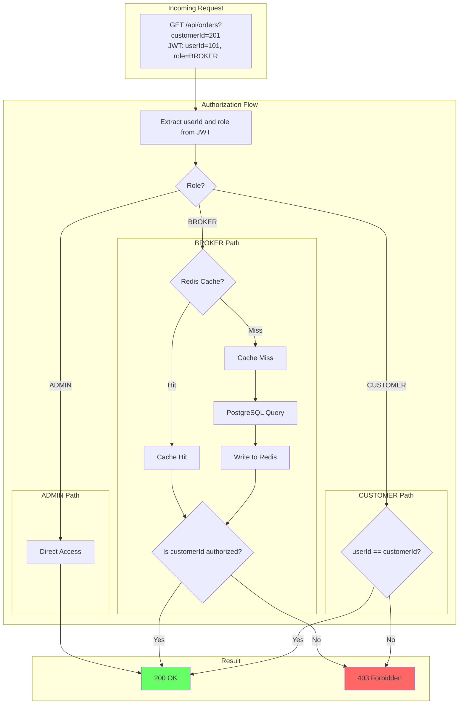
```mermaid
flowchart TB
    subgraph Request["Incoming Request"]
        REQ["GET /api/orders?customerId=201<br/>JWT: userId=101, role=BROKER"]
    end

    subgraph AuthFlow["Authorization Flow"]
        EXTRACT[Extract userId and role from JWT]
        CHECK_ROLE{Role?}

        subgraph AdminPath["ADMIN Path"]
            ADMIN_OK[Direct Access]
        end

        subgraph BrokerPath["BROKER Path"]
            CACHE_CHECK{Redis Cache?}
            CACHE_HIT[Cache Hit]
            CACHE_MISS[Cache Miss]
            DB_QUERY[PostgreSQL Query]
            CACHE_SET[Write to Redis]
            PERM_CHECK{Is customerId authorized?}
        end

        subgraph CustomerPath["CUSTOMER Path"]
            SELF_CHECK{userId == customerId?}
        end
    end

    subgraph Result["Result"]
        OK[200 OK]
        FORBIDDEN[403 Forbidden]
    end

    REQ --> EXTRACT
    EXTRACT --> CHECK_ROLE

    CHECK_ROLE -->|ADMIN| ADMIN_OK
    CHECK_ROLE -->|BROKER| CACHE_CHECK
    CHECK_ROLE -->|CUSTOMER| SELF_CHECK

    ADMIN_OK --> OK

    CACHE_CHECK -->|Hit| CACHE_HIT
    CACHE_CHECK -->|Miss| CACHE_MISS
    CACHE_HIT --> PERM_CHECK
    CACHE_MISS --> DB_QUERY
    DB_QUERY --> CACHE_SET
    CACHE_SET --> PERM_CHECK
    PERM_CHECK -->|Yes| OK
    PERM_CHECK -->|No| FORBIDDEN

    SELF_CHECK -->|Yes| OK
    SELF_CHECK -->|No| FORBIDDEN

    style OK fill:#6f6
    style FORBIDDEN fill:#f66
```

### Redis Cache Structure

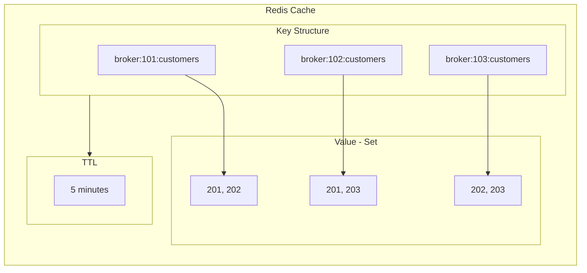
```mermaid
flowchart LR
    subgraph Redis["Redis Cache"]
        subgraph Keys["Key Structure"]
            K1["broker:101:customers"]
            K2["broker:102:customers"]
            K3["broker:103:customers"]
        end

        subgraph Values["Value - Set"]
            V1["201, 202"]
            V2["201, 203"]
            V3["202, 203"]
        end

        subgraph TTL["TTL"]
            T1["5 minutes"]
        end
    end

    K1 --> V1
    K2 --> V2
    K3 --> V3

    Keys --> TTL
```

### Cache Invalidation

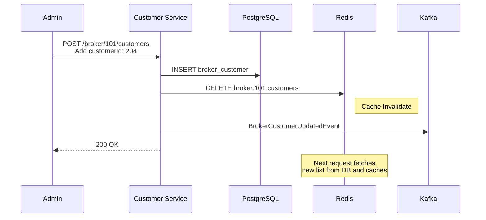
```mermaid
sequenceDiagram
    participant A as Admin
    participant API as Customer Service
    participant DB as PostgreSQL
    participant R as Redis
    participant K as Kafka

    A->>API: POST /broker/101/customers<br/>Add customerId: 204

    API->>DB: INSERT broker_customer

    API->>R: DELETE broker:101:customers
    Note right of R: Cache Invalidate

    API->>K: BrokerCustomerUpdatedEvent

    API-->>A: 200 OK

    Note over R: Next request fetches<br/>new list from DB and caches
```

### 3-Level Authorization Model

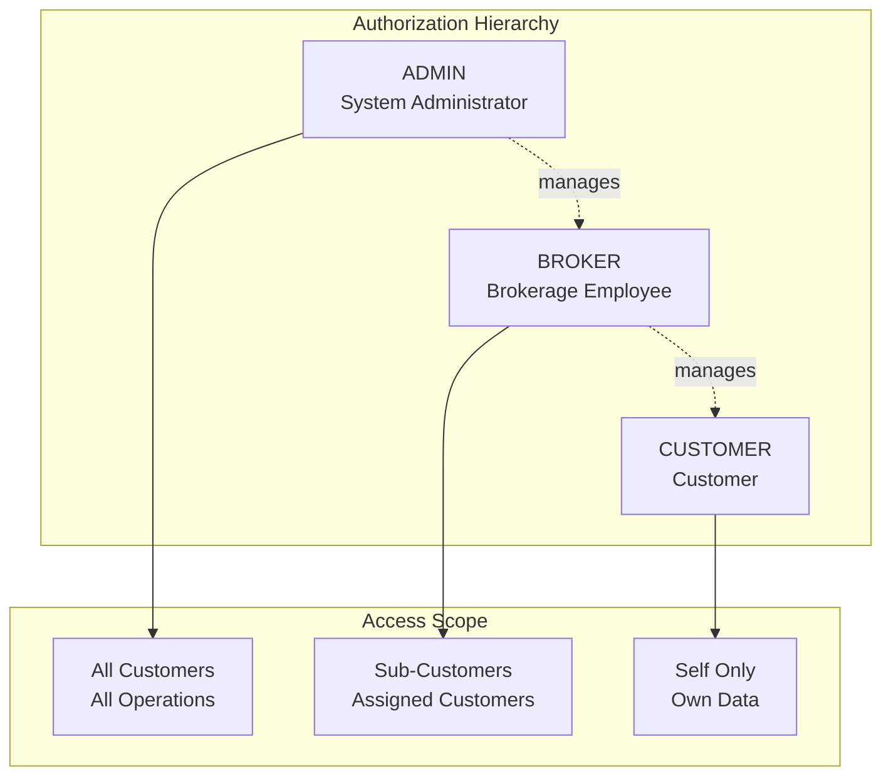
```mermaid
flowchart TB
    subgraph Hierarchy["Authorization Hierarchy"]
        ADMIN["ADMIN<br/>System Administrator"]
        BROKER["BROKER<br/>Brokerage Employee"]
        CUSTOMER["CUSTOMER<br/>Customer"]
    end

    subgraph Scope["Access Scope"]
        S1["All Customers<br/>All Operations"]
        S2["Sub-Customers<br/>Assigned Customers"]
        S3["Self Only<br/>Own Data"]
    end

    ADMIN --> S1
    BROKER --> S2
    CUSTOMER --> S3

    ADMIN -.->|manages| BROKER
    BROKER -.->|manages| CUSTOMER
```

### Broker - Customer Relationship (Many-to-Many)

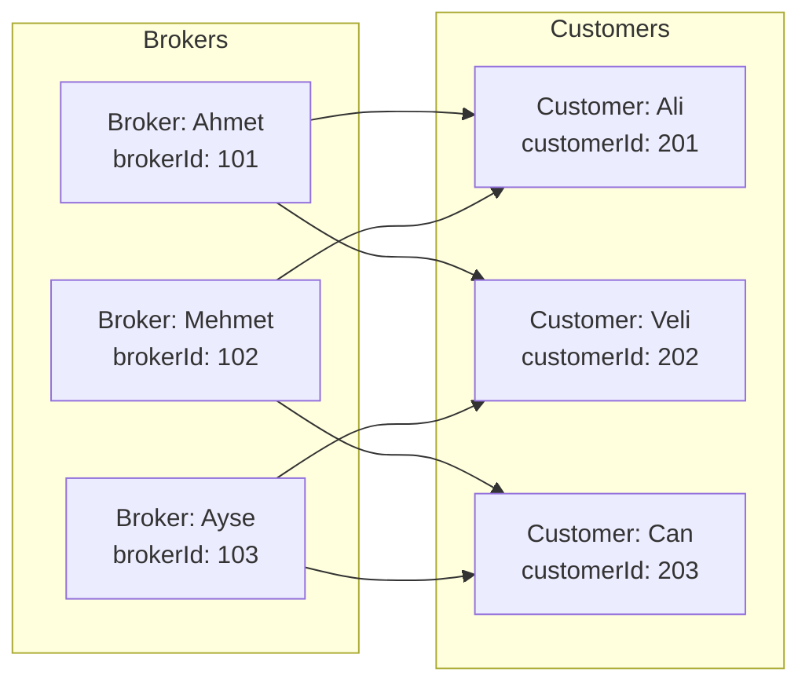
```mermaid
flowchart LR
    subgraph Brokers["Brokers"]
        B1["Broker: Ahmet<br/>brokerId: 101"]
        B2["Broker: Mehmet<br/>brokerId: 102"]
        B3["Broker: Ayse<br/>brokerId: 103"]
    end

    subgraph Customers["Customers"]
        C1["Customer: Ali<br/>customerId: 201"]
        C2["Customer: Veli<br/>customerId: 202"]
        C3["Customer: Can<br/>customerId: 203"]
    end

    B1 --> C1
    B1 --> C2
    B2 --> C1
    B2 --> C3
    B3 --> C2
    B3 --> C3
```

### Shared Customer Scenario

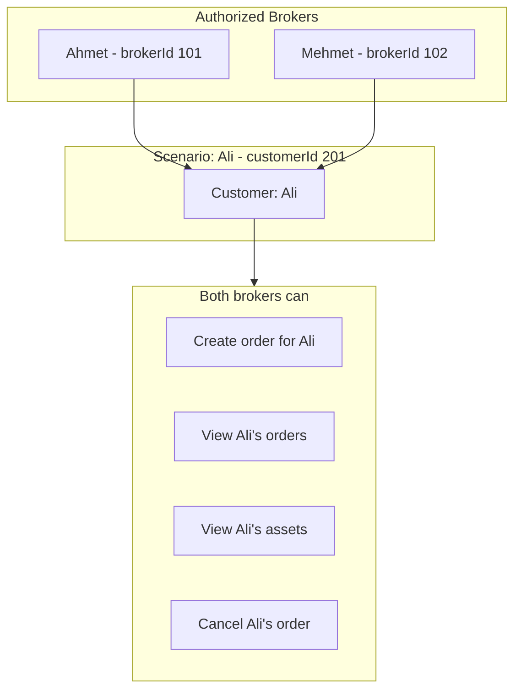
```mermaid
flowchart TB
    subgraph Scenario["Scenario: Ali - customerId 201"]
        C["Customer: Ali"]
    end

    subgraph AuthorizedBrokers["Authorized Brokers"]
        B1["Ahmet - brokerId 101"]
        B2["Mehmet - brokerId 102"]
    end

    subgraph Actions["Both brokers can"]
        A1["Create order for Ali"]
        A2["View Ali's orders"]
        A3["View Ali's assets"]
        A4["Cancel Ali's order"]
    end

    B1 --> C
    B2 --> C
    C --> Actions
```

### Database Relationship

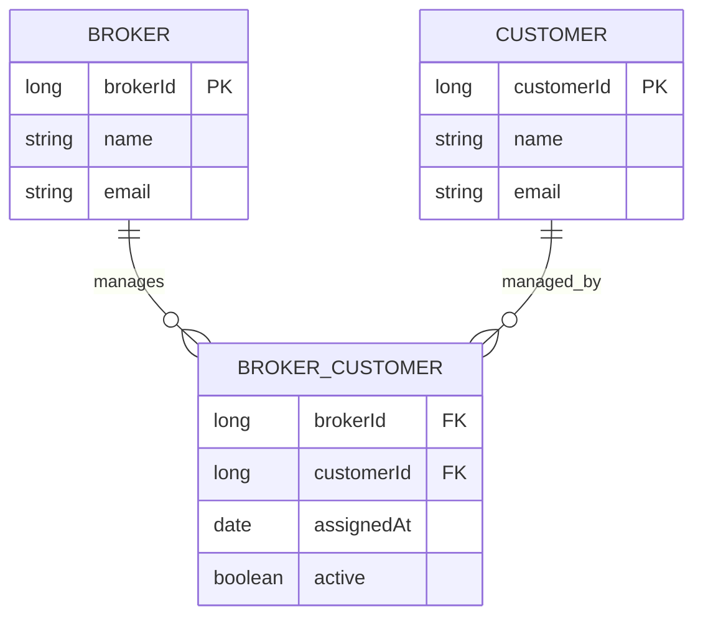
```mermaid
erDiagram
    BROKER ||--o{ BROKER_CUSTOMER : manages
    CUSTOMER ||--o{ BROKER_CUSTOMER : managed_by

    BROKER {
        long brokerId PK
        string name
        string email
    }

    CUSTOMER {
        long customerId PK
        string name
        string email
    }

    BROKER_CUSTOMER {
        long brokerId FK
        long customerId FK
        date assignedAt
        boolean active
    }
```

### Keycloak Role Assignment

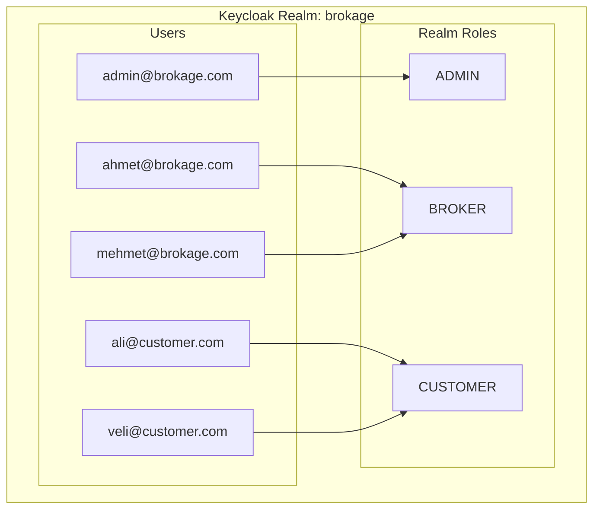
```mermaid
flowchart TB
    subgraph Keycloak["Keycloak Realm: brokage"]
        subgraph RealmRoles["Realm Roles"]
            ADMIN_ROLE[ADMIN]
            BROKER_ROLE[BROKER]
            CUSTOMER_ROLE[CUSTOMER]
        end

        subgraph Users["Users"]
            U1["admin@brokage.com"]
            U2["ahmet@brokage.com"]
            U3["mehmet@brokage.com"]
            U4["ali@customer.com"]
            U5["veli@customer.com"]
        end
    end

    U1 --> ADMIN_ROLE
    U2 --> BROKER_ROLE
    U3 --> BROKER_ROLE
    U4 --> CUSTOMER_ROLE
    U5 --> CUSTOMER_ROLE
```

### Authorization Decision Flow

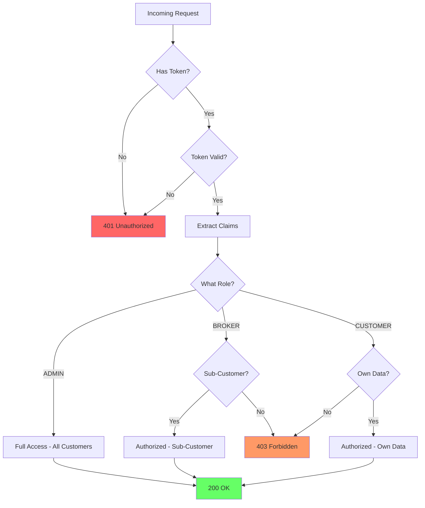
```mermaid
flowchart TB
    REQ[Incoming Request] --> AUTH{Has Token?}

    AUTH -->|No| U401[401 Unauthorized]
    AUTH -->|Yes| VALID{Token Valid?}

    VALID -->|No| U401
    VALID -->|Yes| EXTRACT[Extract Claims]

    EXTRACT --> ROLE{What Role?}

    ROLE -->|ADMIN| ADMIN_OK[Full Access - All Customers]
    ROLE -->|BROKER| BROKER_CHECK{Sub-Customer?}
    ROLE -->|CUSTOMER| CUST_CHECK{Own Data?}

    ADMIN_OK --> OK[200 OK]

    BROKER_CHECK -->|Yes| BROKER_OK[Authorized - Sub-Customer]
    BROKER_CHECK -->|No| U403[403 Forbidden]
    BROKER_OK --> OK

    CUST_CHECK -->|Yes| CUST_OK[Authorized - Own Data]
    CUST_CHECK -->|No| U403
    CUST_OK --> OK

    style U401 fill:#f66
    style U403 fill:#f96
    style OK fill:#6f6
```

### Endpoint Authorization Matrix - 3 Levels

```mermaid
flowchart TB
    subgraph Legend["Roles"]
        direction LR
        L1["ADMIN"]
        L2["BROKER"]
        L3["CUSTOMER"]
    end

    subgraph Matrix["Authorization Matrix"]
        subgraph Orders["Order Operations"]
            O1["POST /orders"]
            O2["GET /orders"]
            O3["DELETE /orders/id"]
            O4["POST /orders/id/match"]
        end

        subgraph Assets["Asset Operations"]
            A1["GET /assets"]
            A2["POST /deposit"]
            A3["POST /withdraw"]
        end
    end

    subgraph AdminScope["ADMIN Permissions"]
        AD1[Order for all customers]
        AD2[View all orders]
        AD3[Cancel all orders]
        AD4[Matching permission]
        AD5[View all assets]
        AD6[Deposit - all customers]
        AD7[Withdraw - all customers]
    end

    subgraph BrokerScope["BROKER Permissions"]
        BR1[Order for sub-customers]
        BR2[View sub-customer orders]
        BR3[Cancel sub-customer orders]
        BR4[Match sub-customer orders]
        BR5[View sub-customer assets]
        BR6[Deposit to sub-customers]
        BR7[No Access]
    end

    subgraph CustomerScope["CUSTOMER Permissions"]
        CU1[Order for self only]
        CU2[View own orders only]
        CU3[Own order + PENDING]
        CU4[No Access]
        CU5[View own assets only]
        CU6[No Access]
        CU7[Withdraw from own account]
    end

    style BR4 fill:#9f9
    style BR7 fill:#f99
    style CU4 fill:#f99
    style CU6 fill:#f99
    style AD4 fill:#9f9
```

### Broker Authorization Check Detail

```mermaid
sequenceDiagram
    participant B as Broker Ahmet
    participant T as Traefik
    participant S as Order Service
    participant DB as Database

    B->>T: GET /api/orders?customerId=201<br/>JWT: brokerId=101

    T->>S: Forward Request

    S->>DB: SELECT * FROM broker_customers<br/>WHERE brokerId=101
    DB-->>S: customerIds: 201, 202

    S->>S: Is 201 in managedCustomers?

    alt Yes - Sub-Customer
        S->>DB: SELECT * FROM orders<br/>WHERE customerId=201
        DB-->>S: Orders
        S-->>B: 200 OK - Orders
    else No - Different Customer
        S-->>B: 403 Forbidden<br/>You don't have access to this customer
    end
```

---

## Routing Rules

```mermaid
flowchart TB
    subgraph Gateway["Traefik Gateway"]
        subgraph Rules["Routing Rules"]
            R1["api.brokage.local - orders"]
            R2["api.brokage.local - assets"]
            R3["api.brokage.local - customers"]
            R4["api.brokage.local - notifications"]
            R5["api.brokage.local - ws"]
            R6["auth.brokage.local"]
            R7["monitor.brokage.local"]
        end
    end

    subgraph Services["Target Services"]
        S1["order-service 8080"]
        S2["asset-service 8080"]
        S3["customer-service 8080"]
        S4["notification-service 8080"]
        S5["notification-service 8080 WS"]
        S6["keycloak 8080"]
        S7["grafana 3000"]
    end

    R1 --> S1
    R2 --> S2
    R3 --> S3
    R4 --> S4
    R5 --> S5
    R6 --> S6
    R7 --> S7
```

---

## Health Checks

```mermaid
sequenceDiagram
    participant T as Traefik
    participant S1 as Order Service
    participant S2 as Asset Service
    participant LB as Load Balancer

    loop Every 10 seconds
        T->>S1: GET /actuator/health
        S1-->>T: 200 OK

        T->>S2: GET /actuator/health
        S2-->>T: 200 OK
    end

    Note over T,LB: When Service is Unhealthy

    T->>S1: GET /actuator/health
    S1-->>T: 503 Service Unavailable

    T->>LB: Remove S1 from pool

    Note over S1: After recovery

    T->>S1: GET /actuator/health
    S1-->>T: 200 OK

    T->>LB: Add S1 to pool
```

---

## Load Balancing

```mermaid
flowchart TB
    subgraph Traefik["Traefik Load Balancer"]
        LB[Round Robin]
    end

    subgraph OrderCluster["Order Service Cluster"]
        OS1[Order Service 1]
        OS2[Order Service 2]
        OS3[Order Service 3]
    end

    subgraph Health["Health Status"]
        H1[Healthy]
        H2[Healthy]
        H3[Unhealthy]
    end

    LB --> OS1
    LB --> OS2
    LB -.-> OS3

    OS1 --> H1
    OS2 --> H2
    OS3 --> H3

    style OS3 fill:#f99
    style H3 fill:#f99
```

---

## HTTPS and TLS

```mermaid
flowchart LR
    subgraph Client["Client"]
        BROWSER[Browser]
    end

    subgraph TLS["TLS Termination"]
        TRAEFIK["Traefik 443"]
        CERT["Lets Encrypt"]
    end

    subgraph Internal["Internal Network"]
        SERVICES["Services 8080"]
    end

    BROWSER -->|HTTPS| TRAEFIK
    TRAEFIK -->|Certificate| CERT
    TRAEFIK -->|HTTP| SERVICES

    Note1["External: Encrypted<br/>Internal: Plain HTTP"]
```

---

## Security Layers

```mermaid
flowchart TB
    subgraph Layer1["Network Layer"]
        FIREWALL[Firewall]
        WAF[Web Application Firewall]
        DDOS[DDoS Protection]
    end

    subgraph Layer2["Gateway Layer"]
        RL[Rate Limiting]
        IP[IP Filtering]
        TLS[TLS/HTTPS]
    end

    subgraph Layer3["Application Layer"]
        AUTH[JWT Authentication]
        AUTHZ[Authorization]
        VALID[Input Validation]
    end

    subgraph Layer4["Data Layer"]
        ENC[Encryption]
        AUDIT[Audit Logging]
        MASK[Data Masking]
    end

    Layer1 --> Layer2
    Layer2 --> Layer3
    Layer3 --> Layer4
```

---

## Middleware Chain

Request processing order:

```mermaid
flowchart LR
    REQ[Request] --> RL
    RL[Rate Limit] --> SEC
    SEC[Security Headers] --> CORS
    CORS[CORS] --> JWT
    JWT[JWT Auth] --> CB
    CB[Circuit Breaker] --> SVC
    SVC[Service] --> RES[Response]

    style RL fill:#ff9
    style SEC fill:#9f9
    style CORS fill:#99f
    style JWT fill:#f9f
    style CB fill:#f99
```

---

## Error Handling

```mermaid
flowchart TB
    subgraph Errors["Error Types"]
        E401[401 Unauthorized]
        E403[403 Forbidden]
        E429[429 Too Many Requests]
        E500[500 Internal Error]
        E503[503 Service Unavailable]
    end

    subgraph Causes["Causes"]
        C1[Invalid Token]
        C2[Insufficient Permission]
        C3[Rate Limit Exceeded]
        C4[Server Error]
        C5[Circuit Open]
    end

    subgraph Actions["Actions"]
        A1[Re-login]
        A2[Permission Check]
        A3[Wait]
        A4[Retry]
        A5[Fallback]
    end

    E401 --> C1
    E403 --> C2
    E429 --> C3
    E500 --> C4
    E503 --> C5

    C1 --> A1
    C2 --> A2
    C3 --> A3
    C4 --> A4
    C5 --> A5
```

---

## Next Steps

- **[Monitoring and Observability](06-monitoring-observability.md)** - LGTM Stack
