# Monitoring and Observability

## Overview

The system provides comprehensive monitoring and observability using the **LGTM Stack** (Loki, Grafana, Tempo, Mimir).

**Important:** Since OpenTelemetry log collection is problematic, logs are sent directly to Loki using **Loki4j**.

---

## Observability Stack

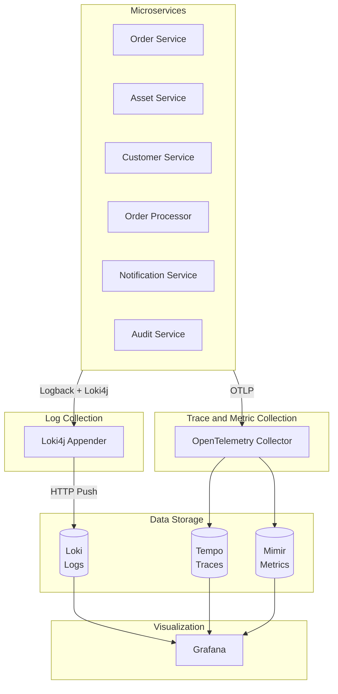

### Why Direct Loki4j?

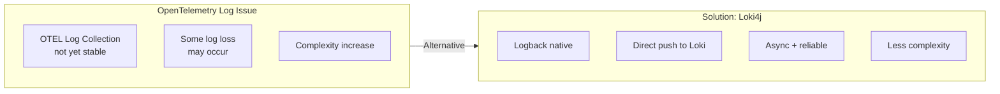

### Signal Paths

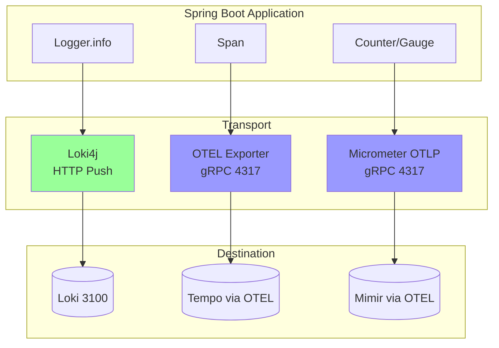

---

## Three Core Signals

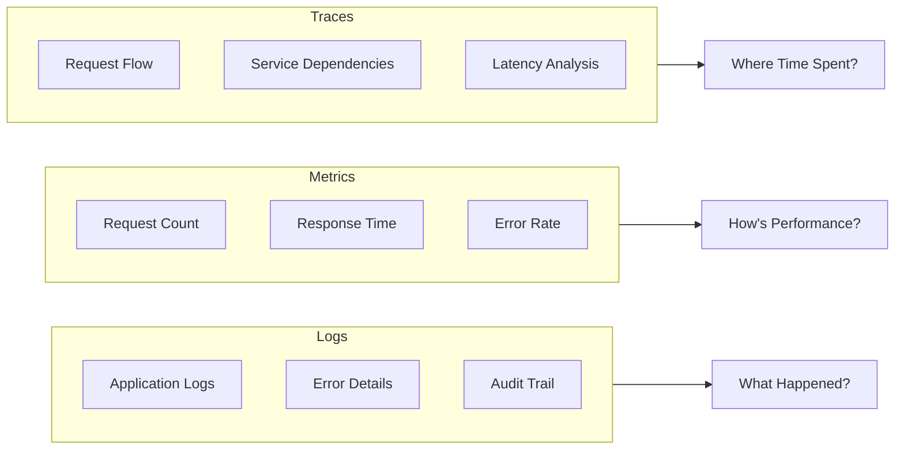

---

## Log Management (Loki)

### Log Flow

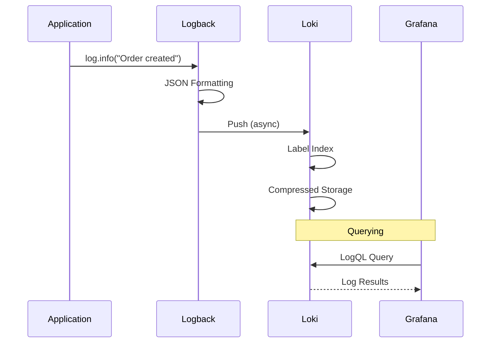

### Structured Log Format

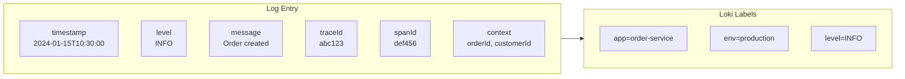

### Log Levels

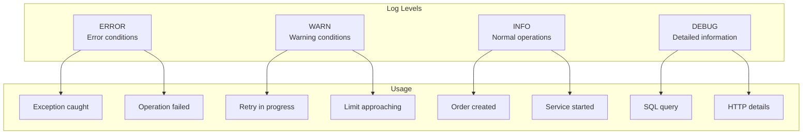

---

## Distributed Tracing (Tempo)

### Trace Structure

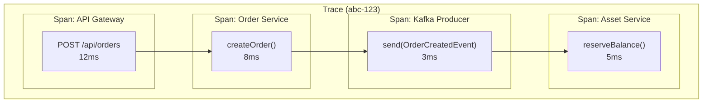

### Cross-Service Trace Propagation

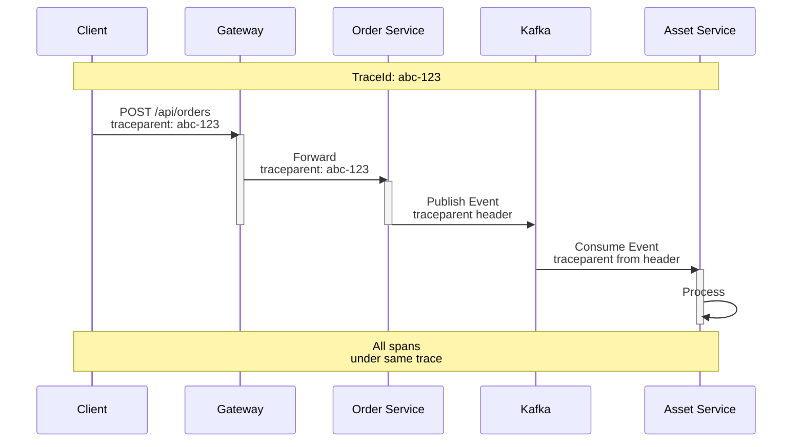

---

## Metrics (Mimir)

### Key Performance Indicators (KPI)

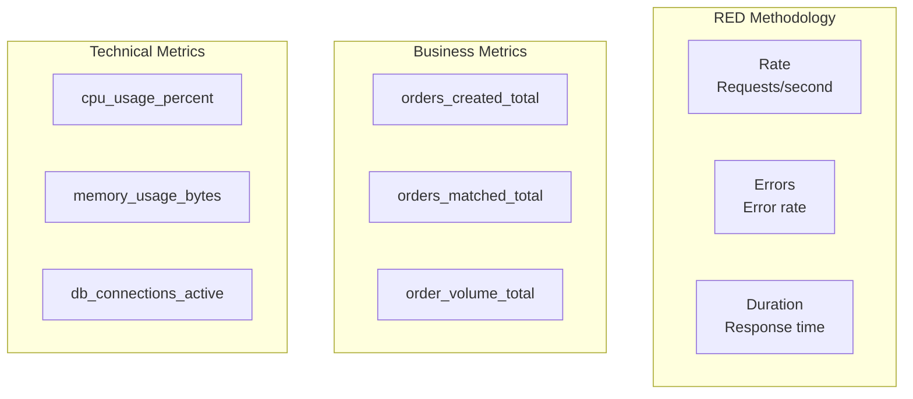

### Metric Types

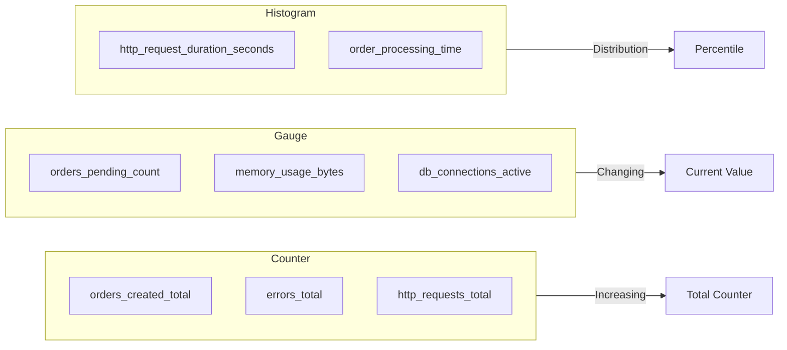

---

## Grafana Dashboards

### Business Metrics Dashboard

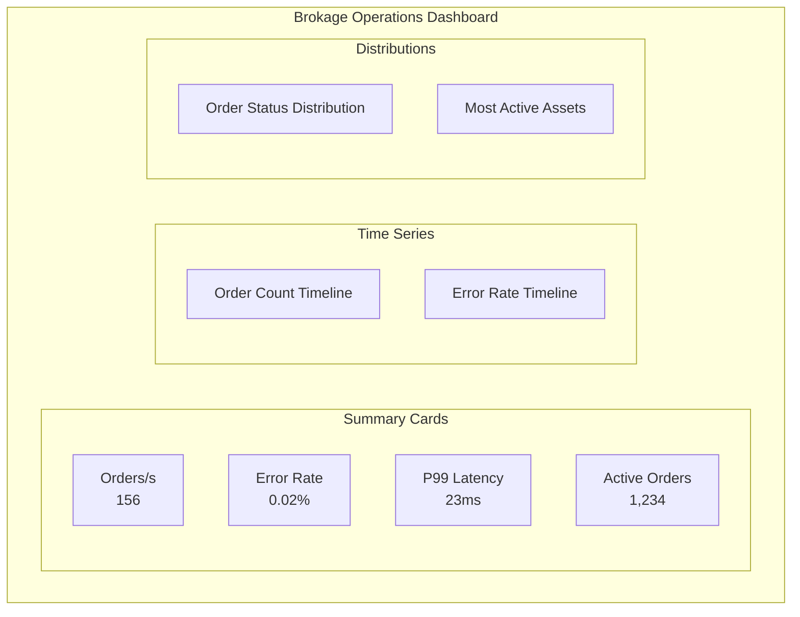

### Technical Dashboard

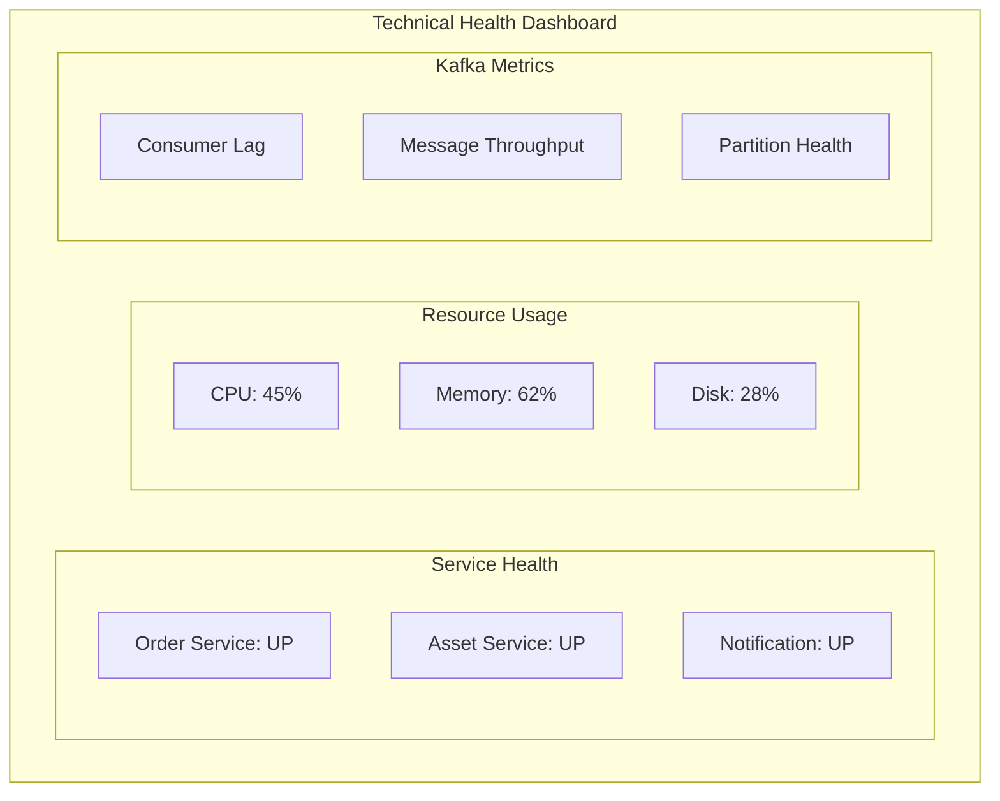

---

## Alerting

### Alert Rules

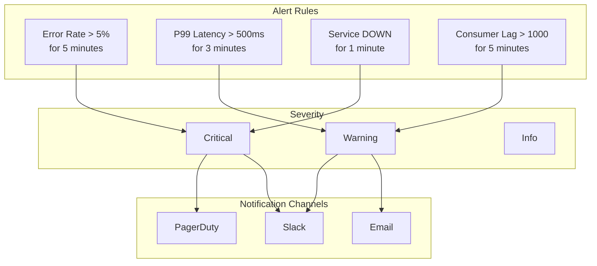

### Alert Flow

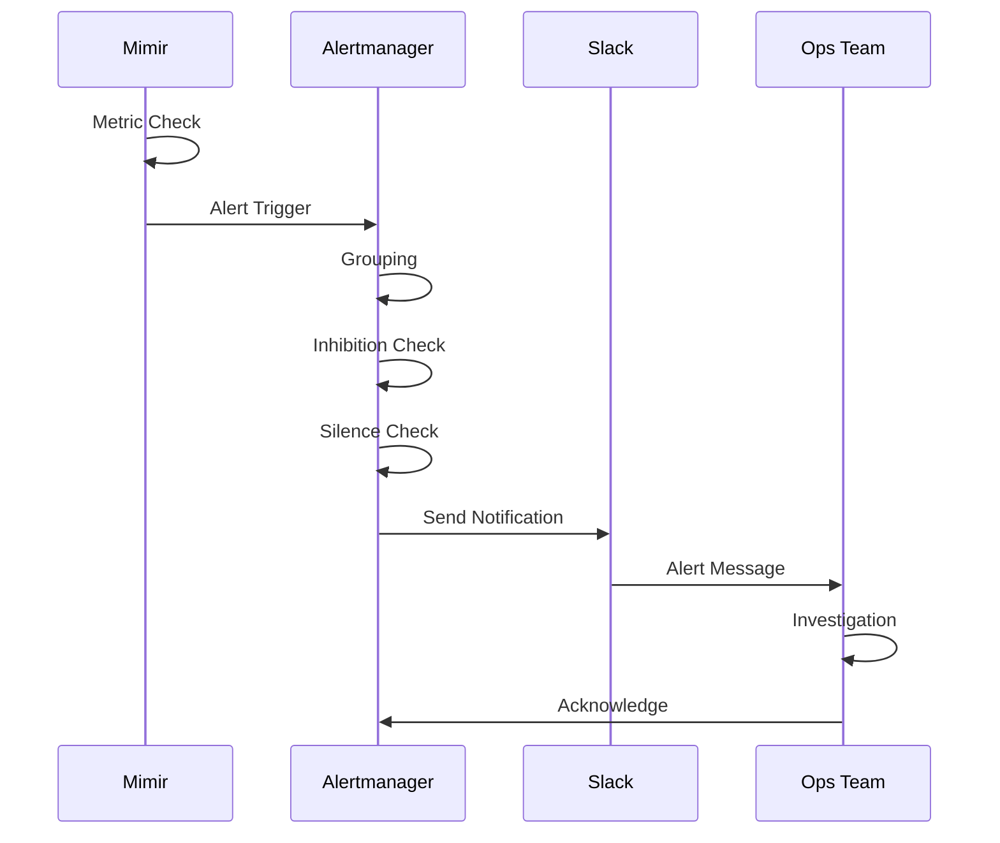

---

## SLI / SLO

### Service Level Indicators

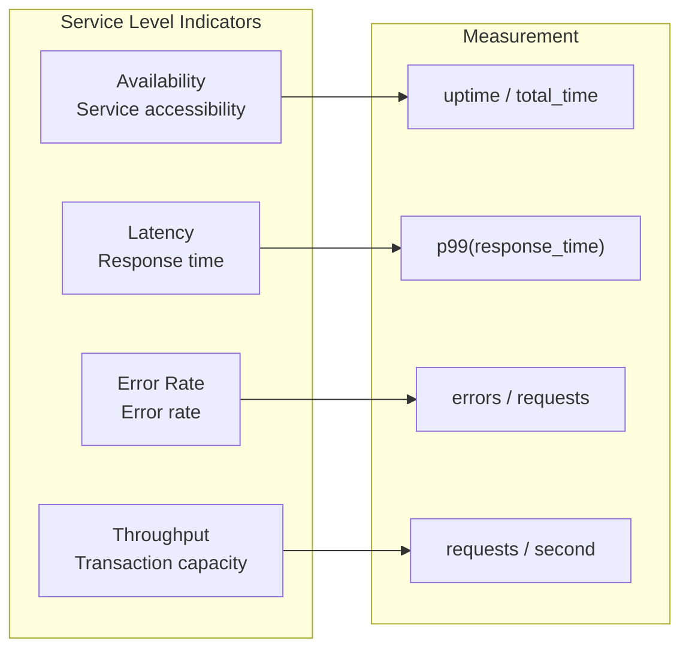

### Service Level Objectives

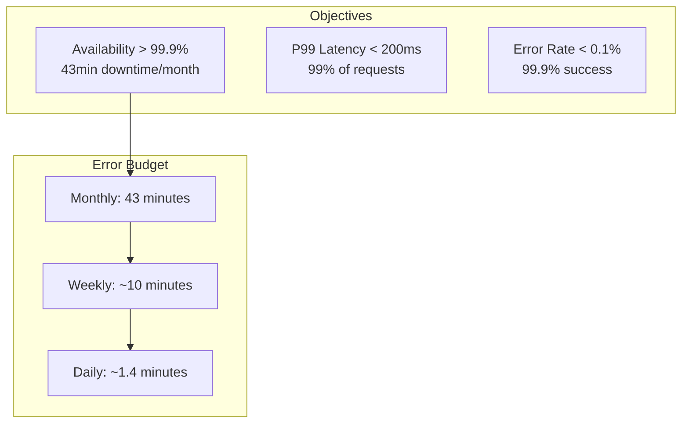

---

## Debugging Flow

### Problem Detection

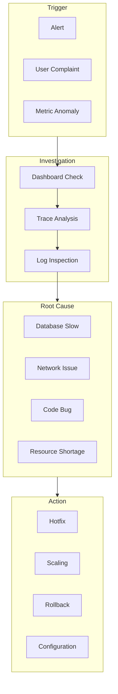

### Trace to Log Navigation

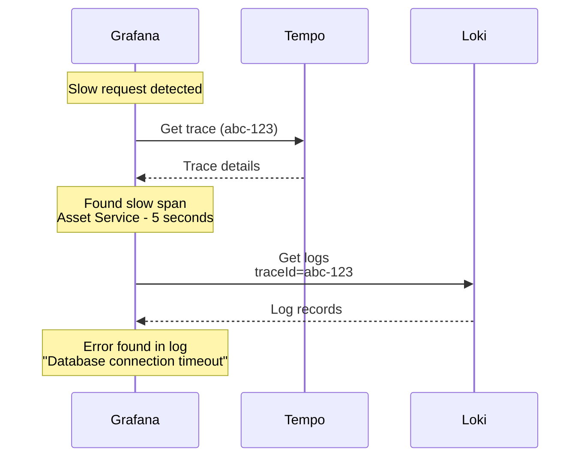

---

## LGTM All-in-One

Simplified configuration for interview:

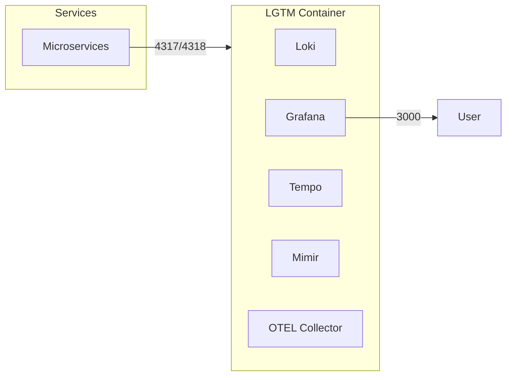

**Advantages:**
- Single container
- Quick setup
- Sufficient for interview

---

## Important Metrics

```mermaid
mindmap
    root((Monitoring))
        Business
            Order count
            Match rate
            Transaction volume
            Cancellation rate
        Technical
            CPU usage
            Memory usage
            Disk I/O
            Network
        Application
            Requests/second
            Error rate
            Response time
            Queue size
        Infrastructure
            Container health
            Pod count
            DB connections
            Kafka lag
```

---

## Conclusion

This documentation series covered the following topics:

1. **System Overview** - Architecture and concepts
2. **Microservice Architecture** - Service boundaries and communication
3. **Event-Driven Flows** - Kafka, Saga, Idempotency
4. **Database Design** - Polyglot persistence
5. **API Gateway and Security** - Traefik, Keycloak
6. **Monitoring and Observability** - LGTM Stack
