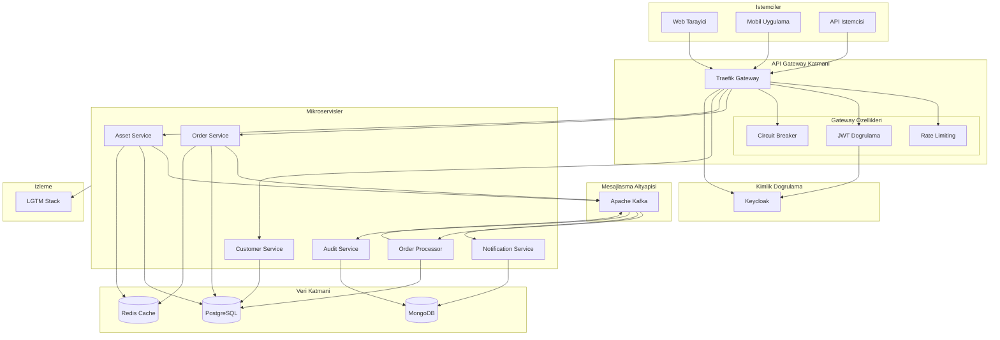
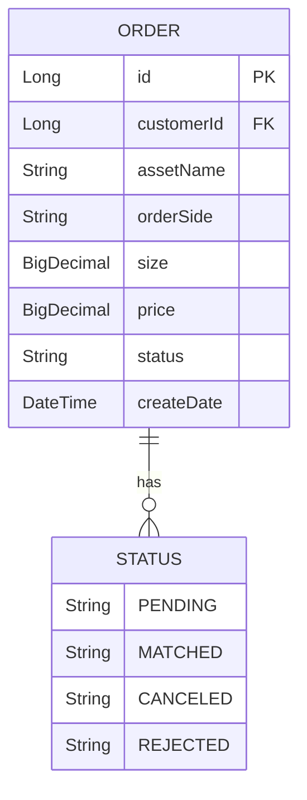
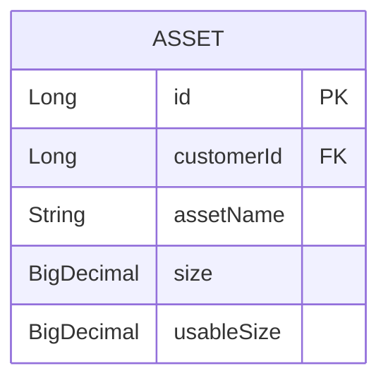
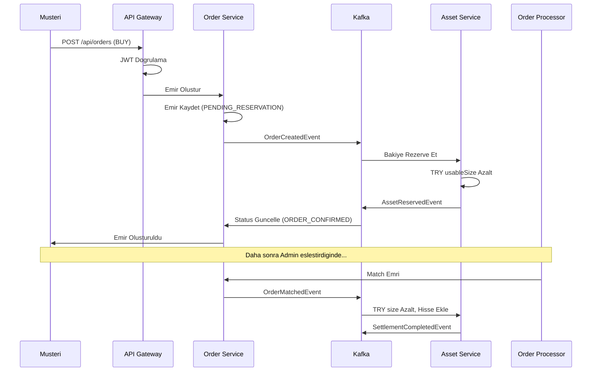
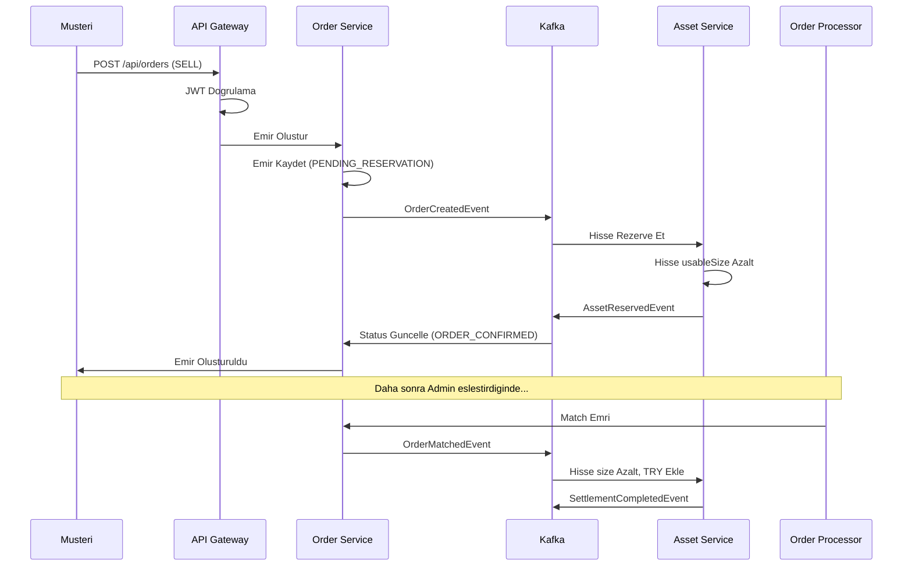
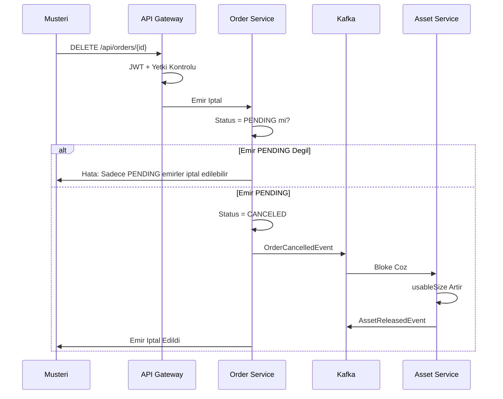
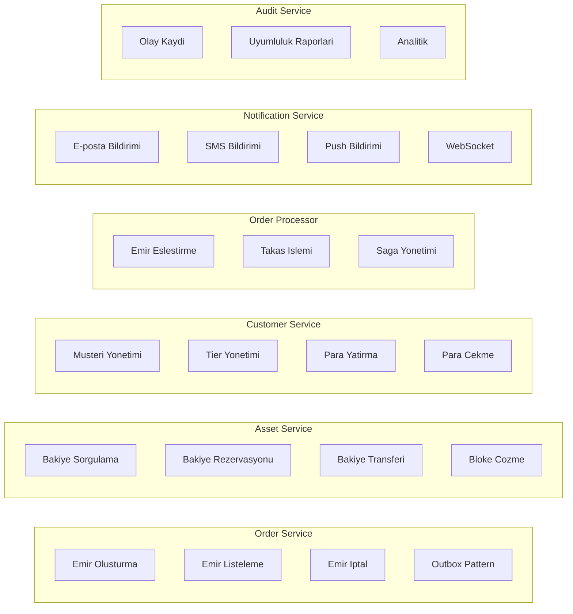
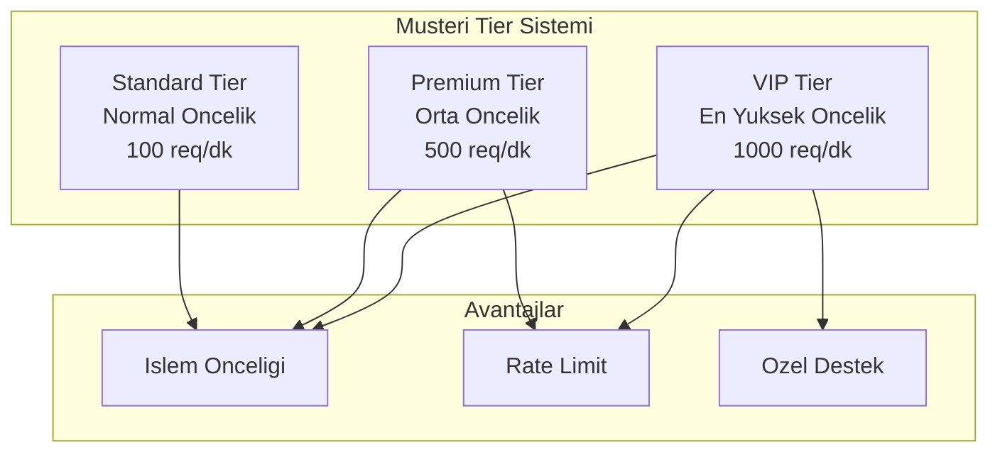
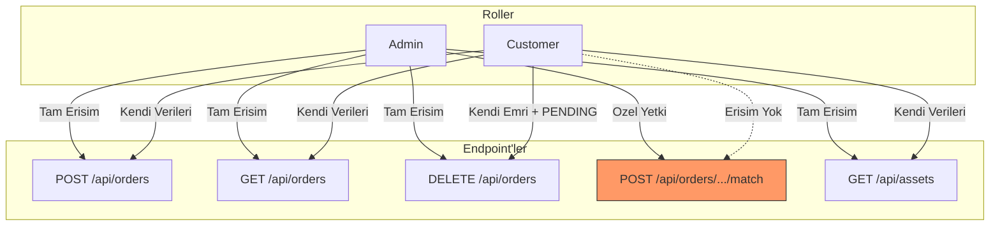
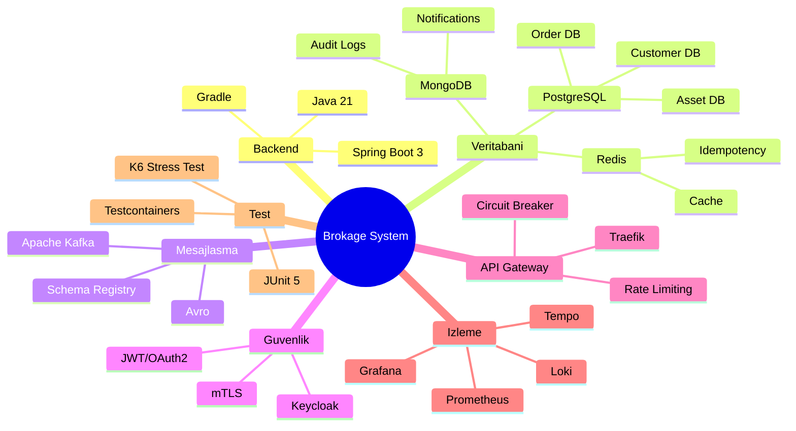

# Sistem Genel Bakis

## Proje Amaci

Bu proje, bir **araci kurum (brokerage firm)** icin backend API gelistirmektedir. Sistem, kurum calisanlarinin musteriler adina hisse senedi alim-satim emirleri vermesini ve yonetmesini saglar.

---

## Genel Mimari

---

## Temel Kavramlar

### Emir (Order) Nedir?

Bir musteri, hisse senedi almak veya satmak istediginde bir **emir** olusturur. Emir su bilgileri icerir:

### Varlik (Asset) Nedir?

Musterinin sahip oldugu degerler **varlik** olarak tutulur. TRY (Turk Lirasi) da bir varliktir.

**Onemli:** `size` toplam miktari, `usableSize` kullanilabilir (bloke edilmemis) miktari gosterir.

---

## Is Akis Ozeti

### Alim (BUY) Emri Akisi

### Satis (SELL) Emri Akisi

### Emir Iptal Akisi

---

## Servis Sorumlulukları

---

## Musteri Tier Sistemi (Task İsterlerinde yok ama neden bir ürün olarak sunmayalım diye kendim ekledim.)

Sistem, musterileri tier'lara ayirarak farkli hizmet seviyeleri sunar:

**Is Mantigi:** Emir eslestirilirken once tier'a, sonra fiyata, en son zamana gore siralama yapilir.

---

## Yetkilendirme Matrisi

---

## Teknoloji Yigini

---

## Sonraki Adimlar

Sistemin daha detayli mimarisini anlamak icin asagidaki dokumanlara bakabilirsiniz:

1. **[Mikroservis Mimarisi](02-mikroservis-mimarisi.md)** - Servislerin detayli yapisi
2. **[Event-Driven Akislar](03-event-driven-akislar.md)** - Kafka ve Saga pattern
3. **[Veritabani Tasarimi](04-veritabani-tasarimi.md)** - Polyglot persistence
4. **[API Gateway ve Guvenlik](05-api-gateway-guvenlik.md)** - Traefik ve Keycloak
5. **[Monitoring ve Observability](06-monitoring-observability.md)** - LGTM Stack
