# Mikroservis Mimarisi

## Genel Bakis

Sistem, event-driven mikroservis mimarisi uzerine insa edilmistir. Her servis kendi veritabanina sahiptir ve servisler arasi iletisim Kafka uzerinden asenkron mesajlasma ile saglanir.

---

## Servis Sinirlari

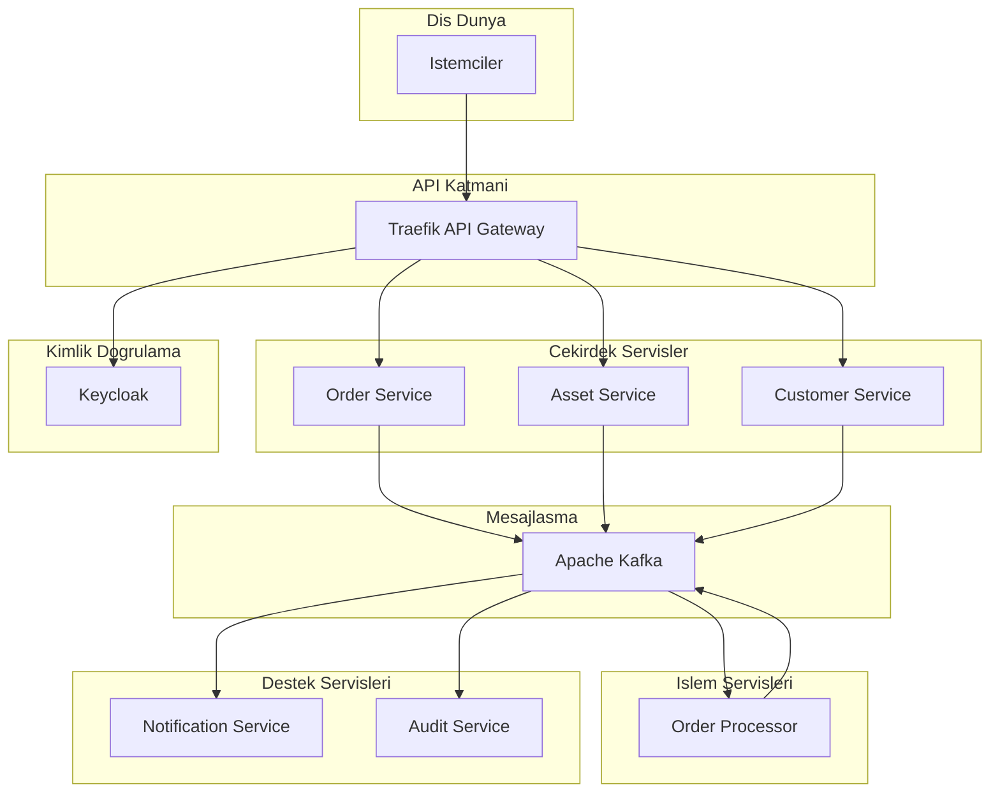

---

## Servis Detaylari

### Order Service

Emir yonetiminden sorumlu ana servistir.

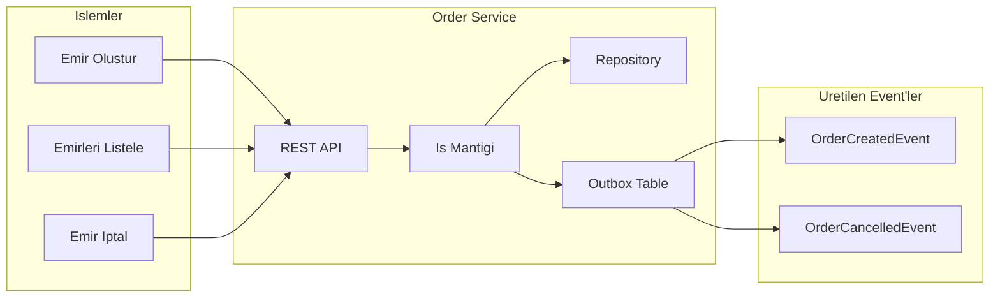

### Asset Service

Varlik ve bakiye yonetiminden sorumludur.

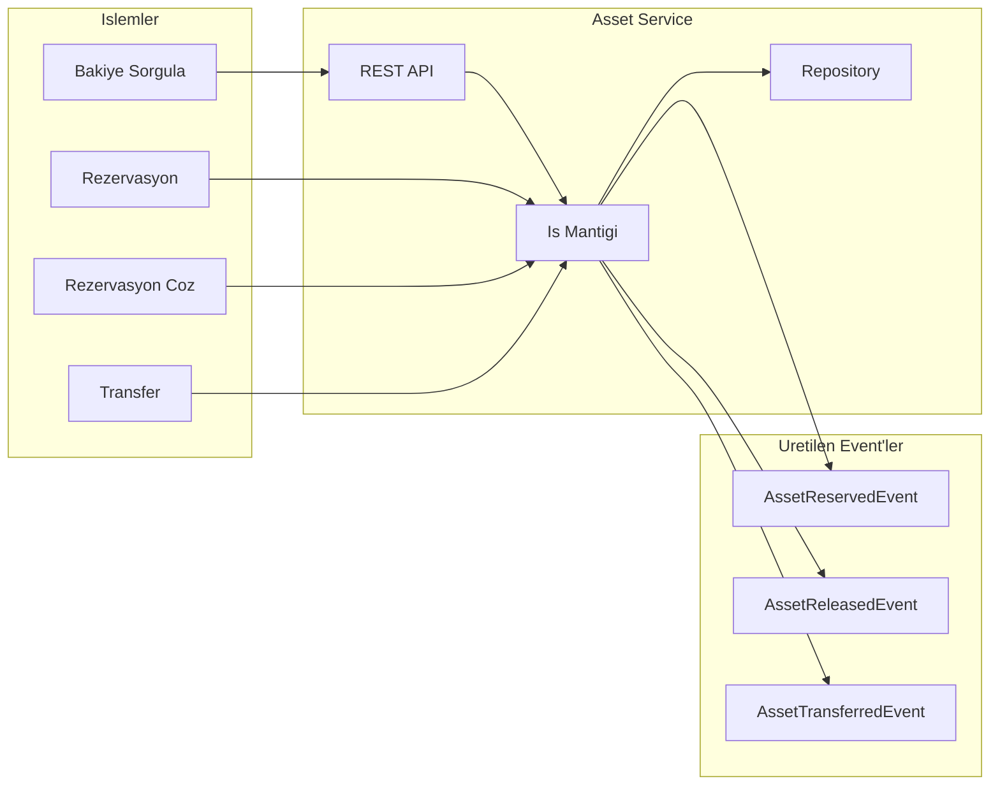

### Order Processor

Emir eslestirme ve saga yonetiminden sorumludur.

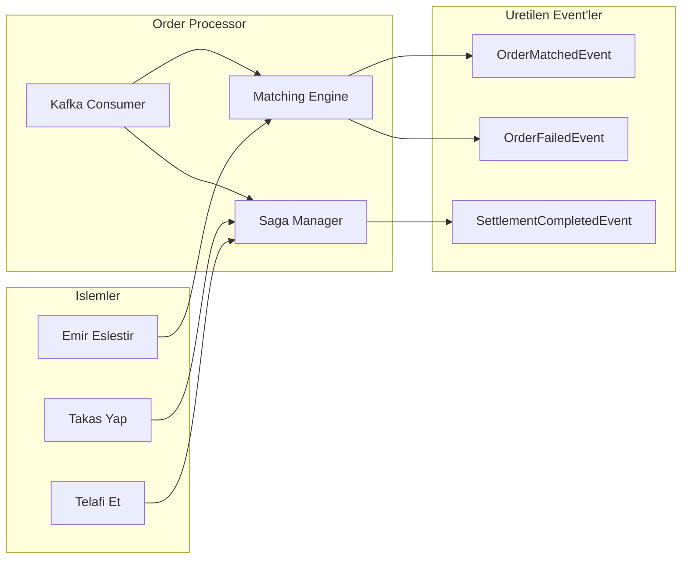

### Notification Service

Bildirim yonetimi ve dagitimini yapar.

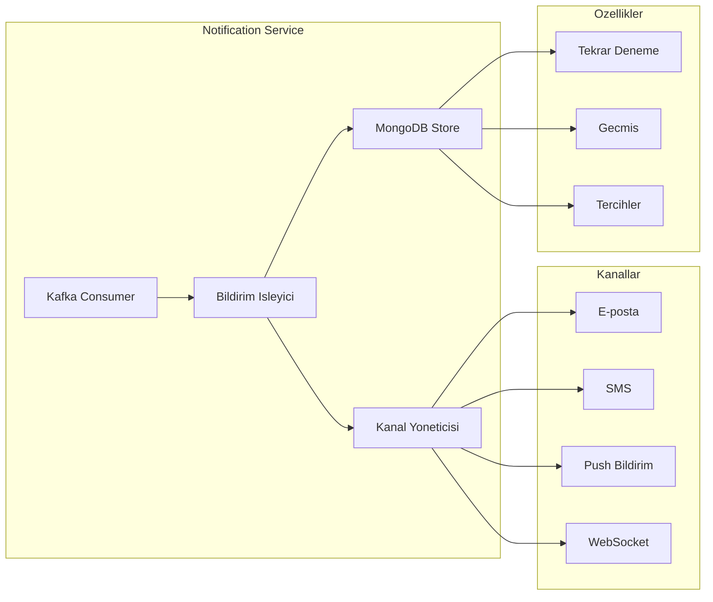

### Customer Service

Musteri ve tier yonetimini saglar.

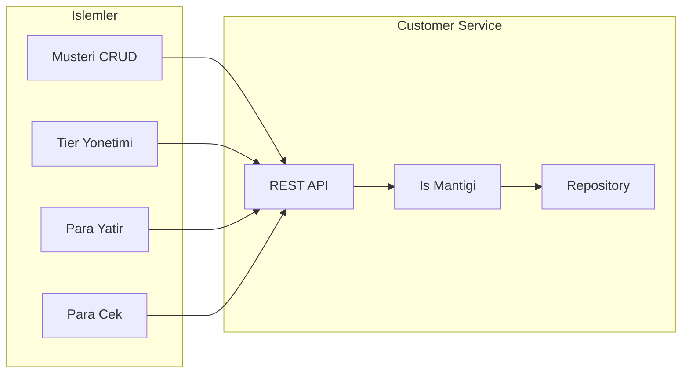

### Audit Service

Olay kaydi ve uyumluluk raporlamasi yapar.

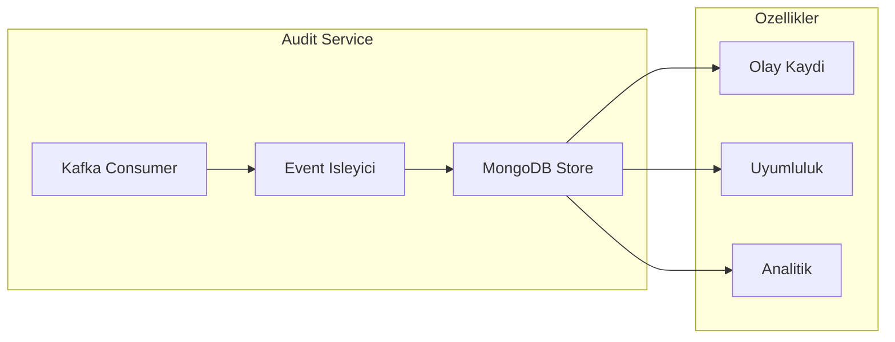

---

## Veritabani Izolasyonu

Her servis kendi veritabanina sahiptir (Database per Service pattern).

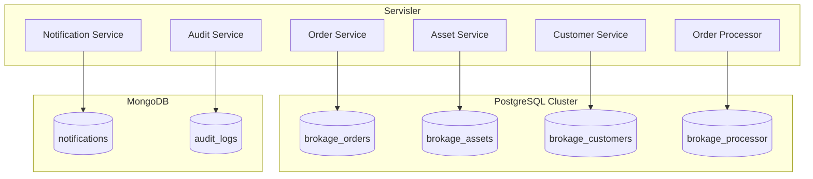

**Onemli Kural:** Servisler birbirlerinin veritabanlarina dogrudan erismez. Tum iletisim Kafka uzerinden event'ler araciligiyla yapilir.

---

## Servisler Arasi Iletisim

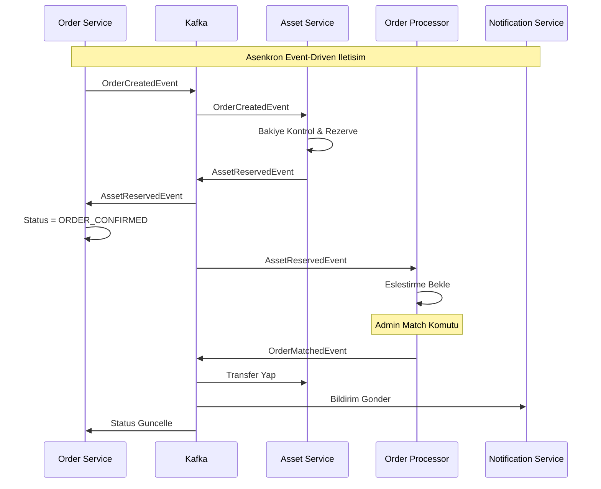

---

## Servis Bagimliliklari

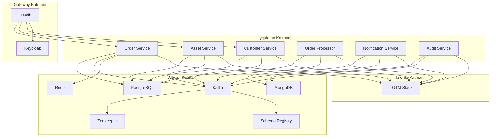

---

## Baslangic Sirasi

Servislerin baslama sirasi kritik onem tasir:

```mermaid
flowchart LR
    subgraph Phase1["Faz 1: Altyapi"]
        PG[PostgreSQL]
        MG[MongoDB]
        RD[Redis]
        ZK[Zookeeper]
    end

    subgraph Phase2["Faz 2: Mesajlasma"]
        KF[Kafka]
        SR[Schema Registry]
    end

    subgraph Phase3["Faz 3: Kimlik"]
        KC[Keycloak]
    end

    subgraph Phase4["Faz 4: Cekirdek Servisler"]
        AS[Asset Service]
        CS[Customer Service]
        OS[Order Service]
    end

    subgraph Phase5["Faz 5: Islem Servisleri"]
        OP[Order Processor]
    end

    subgraph Phase6["Faz 6: Destek Servisleri"]
        NS[Notification Service]
        AU[Audit Service]
    end

    subgraph Phase7["Faz 7: Gateway"]
        TR[Traefik]
        LGTM[LGTM]
    end

    Phase1 --> Phase2
    Phase2 --> Phase3
    Phase3 --> Phase4
    Phase4 --> Phase5
    Phase5 --> Phase6
    Phase6 --> Phase7
```

---

## Olceklendirme Stratejisi

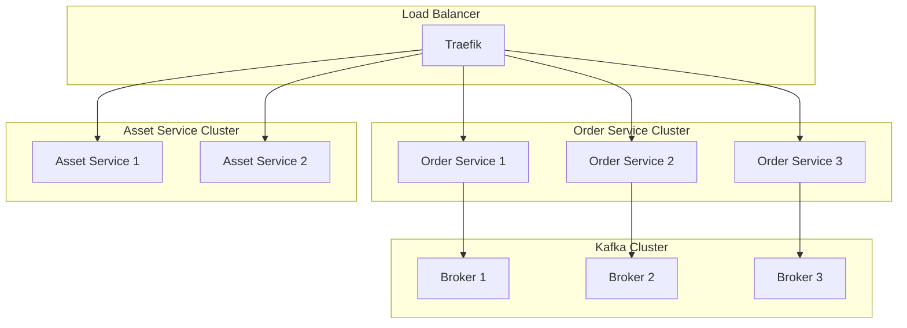

**Olceklendirme Kurallari:**
- Kafka partition sayisi = maksimum consumer sayisi
- Consumer group icindeki her consumer bir partition tuketir
- ayni customerId her zaman ayni partition'a gider (siralama garantisi)

---

## Sonraki Adimlar

Daha detayli bilgi icin:
- **[Event-Driven Akislar](03-event-driven-akislar.md)** - Kafka, Outbox, Saga
- **[Veritabani Tasarimi](04-veritabani-tasarimi.md)** - Polyglot persistence
