# Event-Driven Akislar

## Genel Bakis

Sistem, event-driven mimari uzerine insa edilmistir. Bu yaklasim servisler arasi gevek baglasim (loose coupling) saglar ve olceklenebilirlik ile hata toleransi acisindan onemli avantajlar sunar.

---

## Kafka Topic Mimarisi

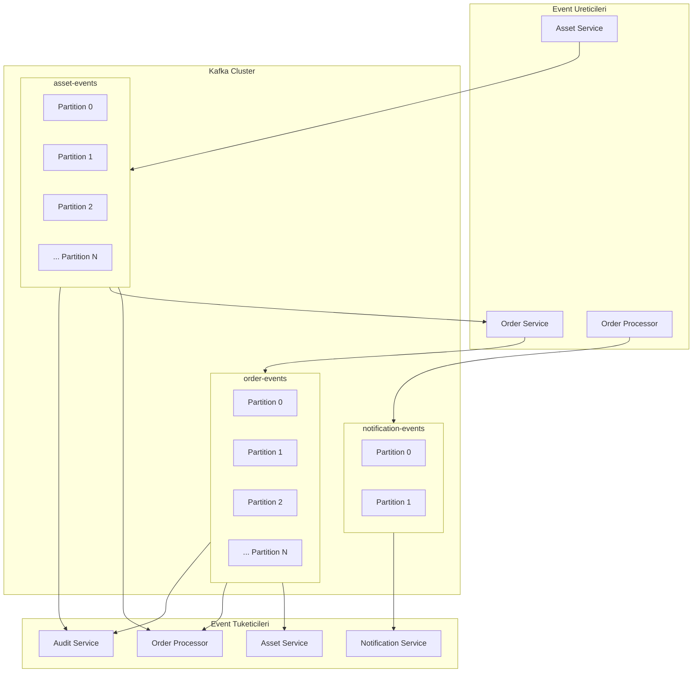
```mermaid
flowchart TB
    subgraph Producers["Event Ureticileri"]
        OS[Order Service]
        AS[Asset Service]
        OP[Order Processor]
    end

    subgraph Kafka["Kafka Cluster"]
        subgraph OrderEvents["order-events"]
            OP1[Partition 0]
            OP2[Partition 1]
            OP3[Partition 2]
            OPN[... Partition N]
        end

        subgraph AssetEvents["asset-events"]
            AP1[Partition 0]
            AP2[Partition 1]
            AP3[Partition 2]
            APN[... Partition N]
        end

        subgraph NotificationEvents["notification-events"]
            NP1[Partition 0]
            NP2[Partition 1]
        end
    end

    subgraph Consumers["Event Tuketicileri"]
        ASC[Asset Service]
        OPC[Order Processor]
        NSC[Notification Service]
        AUC[Audit Service]
    end

    OS --> OrderEvents
    AS --> AssetEvents
    OP --> NotificationEvents

    OrderEvents --> ASC
    OrderEvents --> OPC
    AssetEvents --> OPC
    AssetEvents --> OS
    NotificationEvents --> NSC
    OrderEvents --> AUC
    AssetEvents --> AUC
```

---

## Partition Stratejisi

Ayni musterinin emirlerinin sirayla islenmesi icin `customerId` partition key olarak kullanilir.

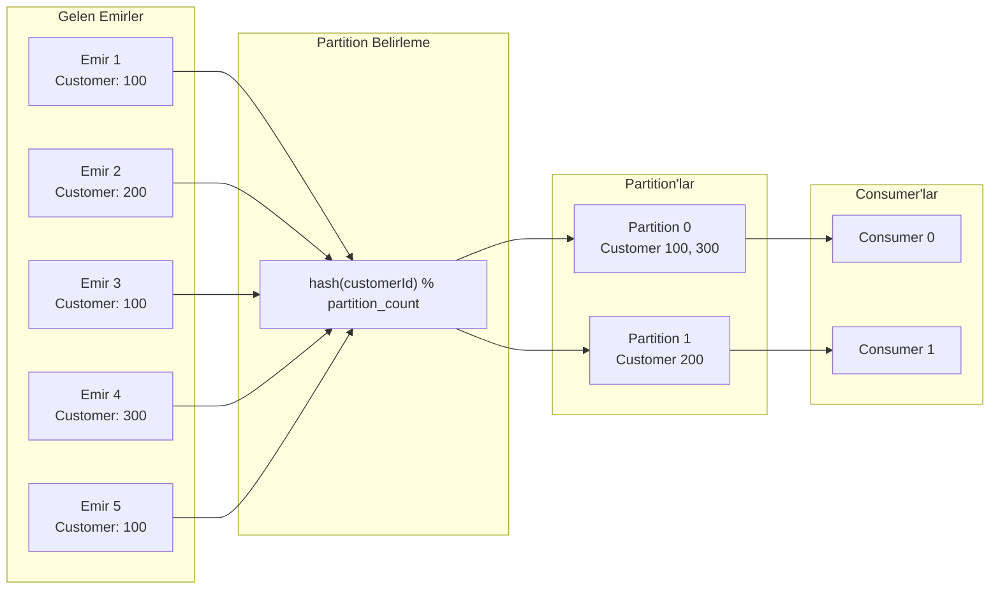
```mermaid
flowchart LR
    subgraph Orders["Gelen Emirler"]
        O1["Emir 1<br/>Customer: 100"]
        O2["Emir 2<br/>Customer: 200"]
        O3["Emir 3<br/>Customer: 100"]
        O4["Emir 4<br/>Customer: 300"]
        O5["Emir 5<br/>Customer: 100"]
    end

    subgraph Partitioner["Partition Belirleme"]
        HASH["hash(customerId) % partition_count"]
    end

    subgraph Partitions["Partition'lar"]
        P0["Partition 0<br/>Customer 100, 300"]
        P1["Partition 1<br/>Customer 200"]
    end

    subgraph Consumers["Consumer'lar"]
        C0["Consumer 0"]
        C1["Consumer 1"]
    end

    O1 --> HASH
    O2 --> HASH
    O3 --> HASH
    O4 --> HASH
    O5 --> HASH

    HASH --> P0
    HASH --> P1

    P0 --> C0
    P1 --> C1
```

**Avantajlari:**
- Ayni musteri emirleri sirayla islenir (FIFO garantisi)
- Race condition onlenir
- Yatay olcekleme mumkun

---

## Outbox Pattern

Veritabani islemleri ile event yayinlamasini atomik hale getirir.

### Problem

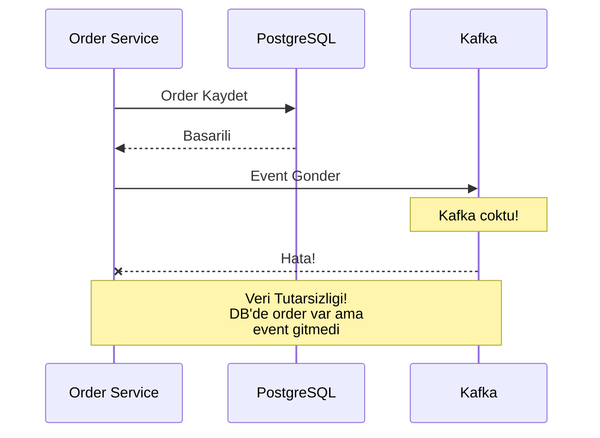
```mermaid
sequenceDiagram
    participant S as Order Service
    participant DB as PostgreSQL
    participant K as Kafka

    S->>DB: Order Kaydet
    DB-->>S: Basarili

    S->>K: Event Gonder
    Note over K: Kafka coktu!
    K--xS: Hata!

    Note over S,K: Veri Tutarsizligi!<br/>DB'de order var ama<br/>event gitmedi
```

### Cozum: Outbox Pattern

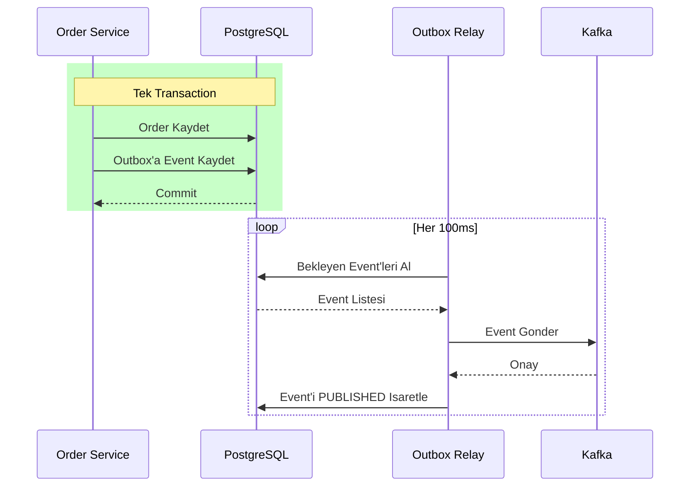
```mermaid
sequenceDiagram
    participant S as Order Service
    participant DB as PostgreSQL
    participant R as Outbox Relay
    participant K as Kafka

    rect rgb(200, 255, 200)
        Note over S,DB: Tek Transaction
        S->>DB: Order Kaydet
        S->>DB: Outbox'a Event Kaydet
        DB-->>S: Commit
    end

    loop Her 100ms
        R->>DB: Bekleyen Event'leri Al
        DB-->>R: Event Listesi
        R->>K: Event Gonder
        K-->>R: Onay
        R->>DB: Event'i PUBLISHED Isaretle
    end
```

### Outbox Akis Detayi

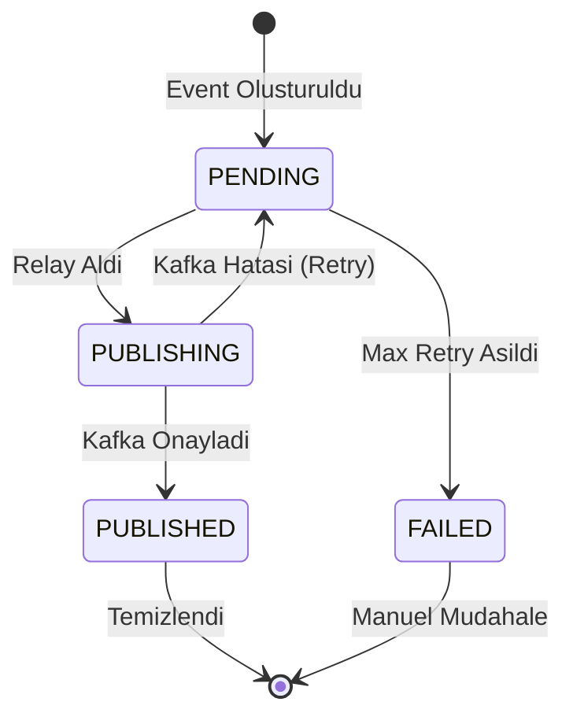
```mermaid
stateDiagram-v2
    [*] --> PENDING: Event Olusturuldu

    PENDING --> PUBLISHING: Relay Aldi
    PUBLISHING --> PUBLISHED: Kafka Onayladi
    PUBLISHING --> PENDING: Kafka Hatasi (Retry)

    PENDING --> FAILED: Max Retry Asildi

    PUBLISHED --> [*]: Temizlendi
    FAILED --> [*]: Manuel Mudahale
```

---

## Saga Pattern

Dagitik islemler icin choreography-based saga pattern kullanilir.

### Emir Olusturma Saga'si

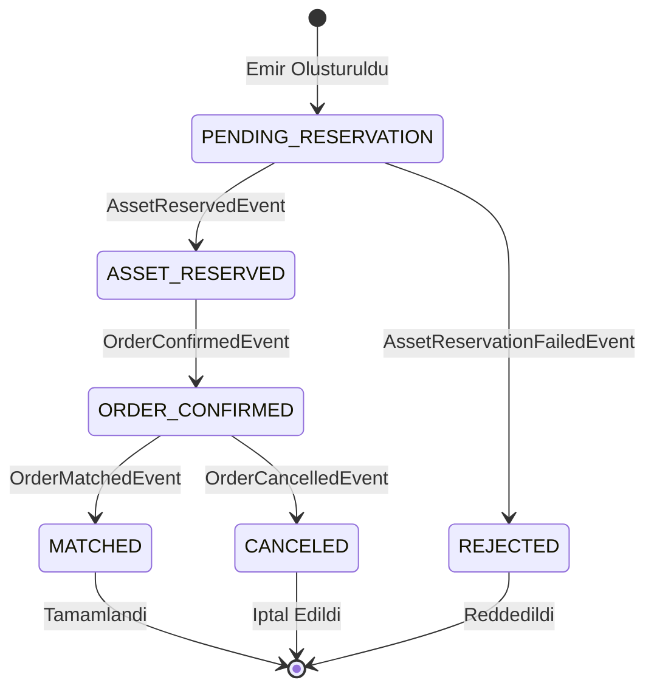
```mermaid
stateDiagram-v2
    [*] --> PENDING_RESERVATION: Emir Olusturuldu

    PENDING_RESERVATION --> ASSET_RESERVED: AssetReservedEvent
    PENDING_RESERVATION --> REJECTED: AssetReservationFailedEvent

    ASSET_RESERVED --> ORDER_CONFIRMED: OrderConfirmedEvent

    ORDER_CONFIRMED --> MATCHED: OrderMatchedEvent
    ORDER_CONFIRMED --> CANCELED: OrderCancelledEvent

    MATCHED --> [*]: Tamamlandi
    CANCELED --> [*]: Iptal Edildi
    REJECTED --> [*]: Reddedildi
```

### Basarili Senaryo

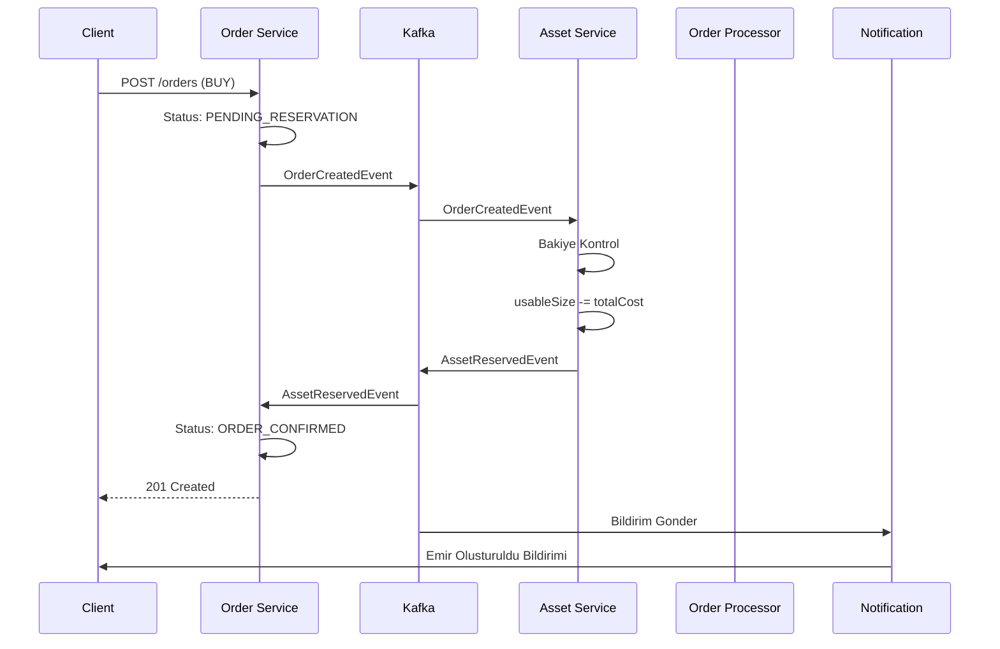
```mermaid
sequenceDiagram
    participant C as Client
    participant OS as Order Service
    participant K as Kafka
    participant AS as Asset Service
    participant OP as Order Processor
    participant NS as Notification

    C->>OS: POST /orders (BUY)
    OS->>OS: Status: PENDING_RESERVATION
    OS->>K: OrderCreatedEvent

    K->>AS: OrderCreatedEvent
    AS->>AS: Bakiye Kontrol
    AS->>AS: usableSize -= totalCost
    AS->>K: AssetReservedEvent

    K->>OS: AssetReservedEvent
    OS->>OS: Status: ORDER_CONFIRMED
    OS-->>C: 201 Created

    K->>NS: Bildirim Gonder
    NS->>C: Emir Olusturuldu Bildirimi
```

### Basarisiz Senaryo (Compensation)

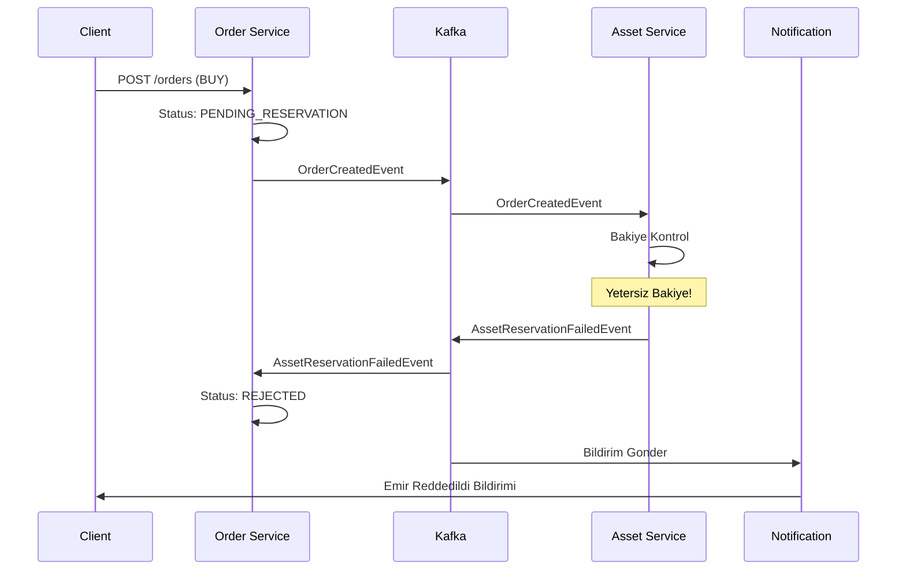
```mermaid
sequenceDiagram
    participant C as Client
    participant OS as Order Service
    participant K as Kafka
    participant AS as Asset Service
    participant NS as Notification

    C->>OS: POST /orders (BUY)
    OS->>OS: Status: PENDING_RESERVATION
    OS->>K: OrderCreatedEvent

    K->>AS: OrderCreatedEvent
    AS->>AS: Bakiye Kontrol

    Note over AS: Yetersiz Bakiye!

    AS->>K: AssetReservationFailedEvent

    K->>OS: AssetReservationFailedEvent
    OS->>OS: Status: REJECTED

    K->>NS: Bildirim Gonder
    NS->>C: Emir Reddedildi Bildirimi
```

---

## Idempotency (Tekrarsizlik)

Ayni islemin birden fazla kez yapilmasini onler.

### API Seviyesi Idempotency

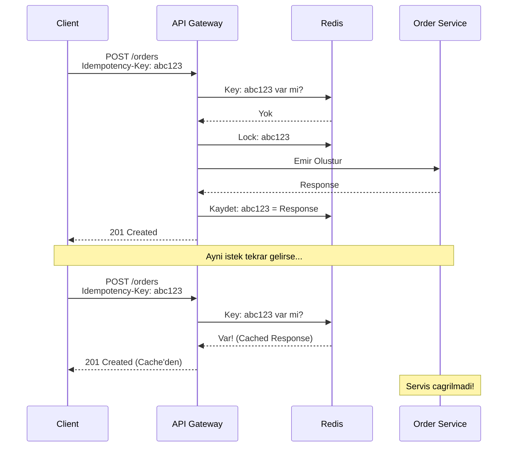
```mermaid
sequenceDiagram
    participant C as Client
    participant GW as API Gateway
    participant R as Redis
    participant S as Order Service

    C->>GW: POST /orders<br/>Idempotency-Key: abc123

    GW->>R: Key: abc123 var mi?
    R-->>GW: Yok

    GW->>R: Lock: abc123
    GW->>S: Emir Olustur
    S-->>GW: Response

    GW->>R: Kaydet: abc123 = Response
    GW-->>C: 201 Created

    Note over C,S: Ayni istek tekrar gelirse...

    C->>GW: POST /orders<br/>Idempotency-Key: abc123

    GW->>R: Key: abc123 var mi?
    R-->>GW: Var! (Cached Response)

    GW-->>C: 201 Created (Cache'den)

    Note over S: Servis cagrilmadi!
```

### Consumer Seviyesi Idempotency

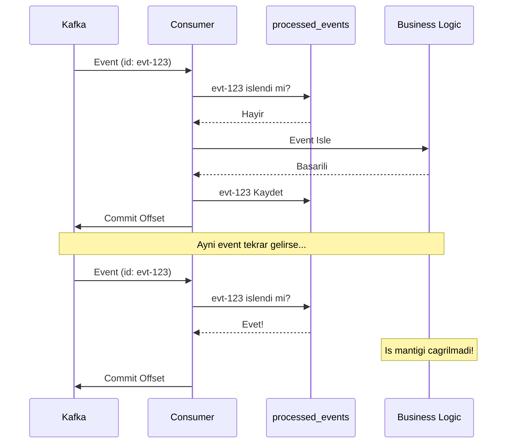
```mermaid
sequenceDiagram
    participant K as Kafka
    participant C as Consumer
    participant PE as processed_events
    participant BL as Business Logic

    K->>C: Event (id: evt-123)

    C->>PE: evt-123 islendi mi?
    PE-->>C: Hayir

    C->>BL: Event Isle
    BL-->>C: Basarili

    C->>PE: evt-123 Kaydet
    C->>K: Commit Offset

    Note over K,BL: Ayni event tekrar gelirse...

    K->>C: Event (id: evt-123)

    C->>PE: evt-123 islendi mi?
    PE-->>C: Evet!

    Note over BL: Is mantigi cagrilmadi!

    C->>K: Commit Offset
```

### 3 Katmanli Idempotency

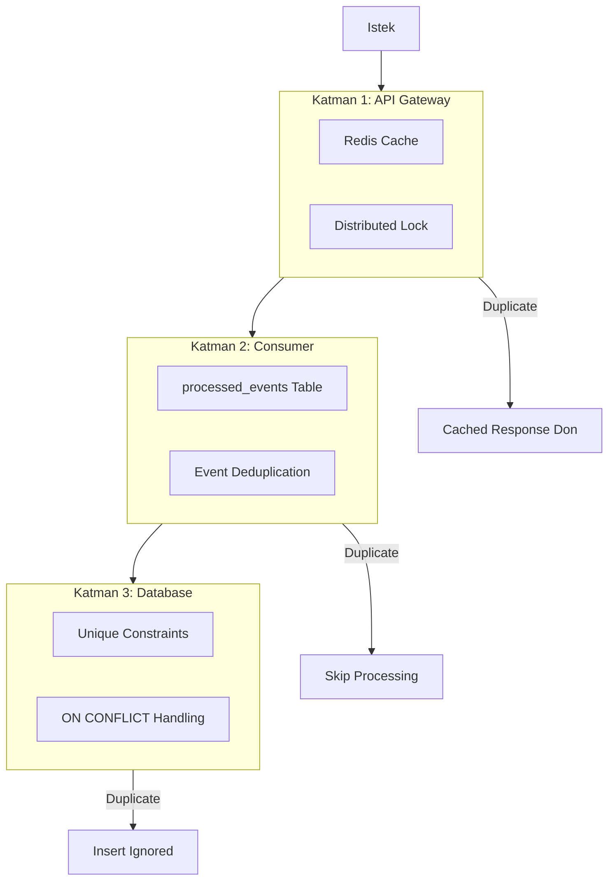
```mermaid
flowchart TB
    subgraph Layer1["Katman 1: API Gateway"]
        R1[Redis Cache]
        L1[Distributed Lock]
    end

    subgraph Layer2["Katman 2: Consumer"]
        PE[processed_events Table]
        DEDUP[Event Deduplication]
    end

    subgraph Layer3["Katman 3: Database"]
        UK[Unique Constraints]
        OC[ON CONFLICT Handling]
    end

    REQ[Istek] --> Layer1
    Layer1 --> Layer2
    Layer2 --> Layer3

    Layer1 -->|Duplicate| REJECT1[Cached Response Don]
    Layer2 -->|Duplicate| REJECT2[Skip Processing]
    Layer3 -->|Duplicate| REJECT3[Insert Ignored]
```

---

## Dead Letter Queue (DLQ)

Islenemeyen mesajlar icin guvensiz mekanizma.

### Retry Akisi

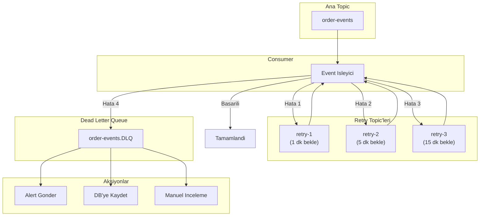
```mermaid
flowchart TB
    subgraph MainTopic["Ana Topic"]
        MT[order-events]
    end

    subgraph Consumer["Consumer"]
        C[Event Isleyici]
    end

    subgraph RetryTopics["Retry Topic'leri"]
        R1["retry-1<br/>(1 dk bekle)"]
        R2["retry-2<br/>(5 dk bekle)"]
        R3["retry-3<br/>(15 dk bekle)"]
    end

    subgraph DLQ["Dead Letter Queue"]
        D[order-events.DLQ]
    end

    subgraph Actions["Aksiyonlar"]
        ALERT[Alert Gonder]
        STORE[DB'ye Kaydet]
        REVIEW[Manuel Inceleme]
    end

    MT --> C

    C -->|Basarili| DONE[Tamamlandi]
    C -->|Hata 1| R1
    R1 --> C
    C -->|Hata 2| R2
    R2 --> C
    C -->|Hata 3| R3
    R3 --> C
    C -->|Hata 4| D

    D --> ALERT
    D --> STORE
    D --> REVIEW
```

### Exponential Backoff

```mermaid
gantt
    title Retry Zamanlama
    dateFormat X
    axisFormat %s

    section Retry
    Ilk Deneme     :0, 1
    Hata           :1, 2
    1. Retry (1dk) :60, 61
    Hata           :61, 62
    2. Retry (5dk) :360, 361
    Hata           :361, 362
    3. Retry (15dk):1260, 1261
    Hata           :1261, 1262
    DLQ            :1262, 1263
```

---

## Resilience Patterns

### Circuit Breaker

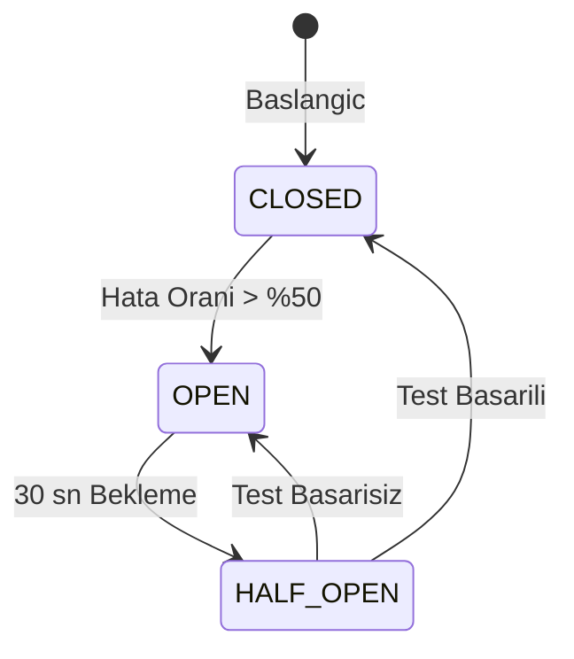
```mermaid
stateDiagram-v2
    [*] --> CLOSED: Baslangic

    CLOSED --> OPEN: Hata Orani > %50
    OPEN --> HALF_OPEN: 30 sn Bekleme
    HALF_OPEN --> CLOSED: Test Basarili
    HALF_OPEN --> OPEN: Test Basarisiz
```

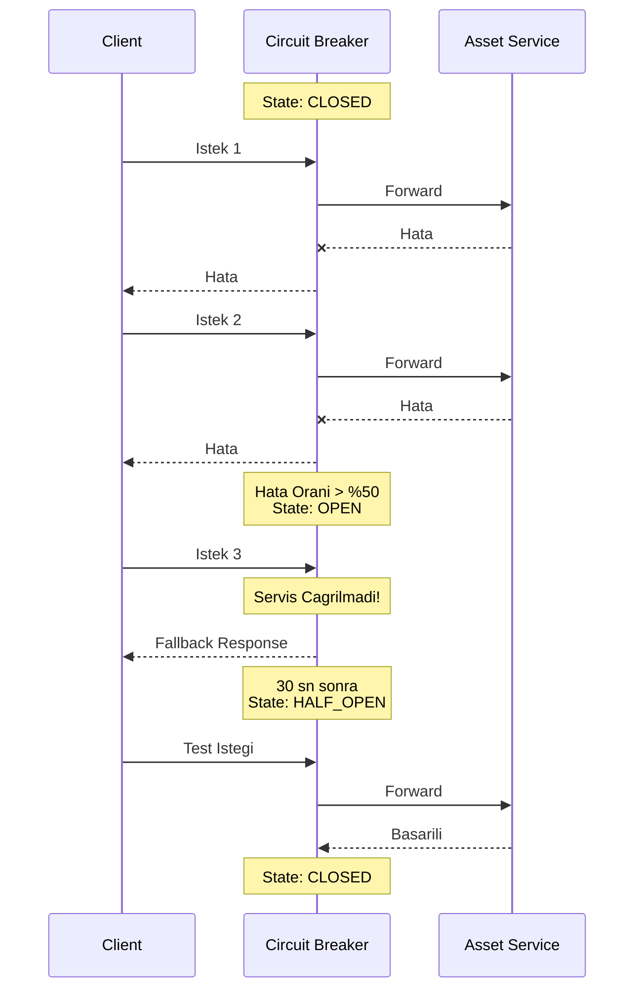
```mermaid
sequenceDiagram
    participant C as Client
    participant CB as Circuit Breaker
    participant S as Asset Service

    Note over CB: State: CLOSED

    C->>CB: Istek 1
    CB->>S: Forward
    S--xCB: Hata
    CB-->>C: Hata

    C->>CB: Istek 2
    CB->>S: Forward
    S--xCB: Hata
    CB-->>C: Hata

    Note over CB: Hata Orani > %50<br/>State: OPEN

    C->>CB: Istek 3
    Note over CB: Servis Cagrilmadi!
    CB-->>C: Fallback Response

    Note over CB: 30 sn sonra<br/>State: HALF_OPEN

    C->>CB: Test Istegi
    CB->>S: Forward
    S-->>CB: Basarili

    Note over CB: State: CLOSED
```

### Bulkhead

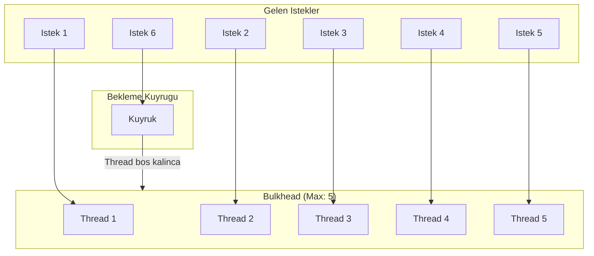
```mermaid
flowchart TB
    subgraph Requests["Gelen Istekler"]
        R1[Istek 1]
        R2[Istek 2]
        R3[Istek 3]
        R4[Istek 4]
        R5[Istek 5]
        R6[Istek 6]
    end

    subgraph Bulkhead["Bulkhead (Max: 5)"]
        T1[Thread 1]
        T2[Thread 2]
        T3[Thread 3]
        T4[Thread 4]
        T5[Thread 5]
    end

    subgraph Queue["Bekleme Kuyrugu"]
        Q[Kuyruk]
    end

    R1 --> T1
    R2 --> T2
    R3 --> T3
    R4 --> T4
    R5 --> T5
    R6 --> Q

    Q -->|Thread bos kalinca| Bulkhead
```

---

## Event Semasi (Avro)

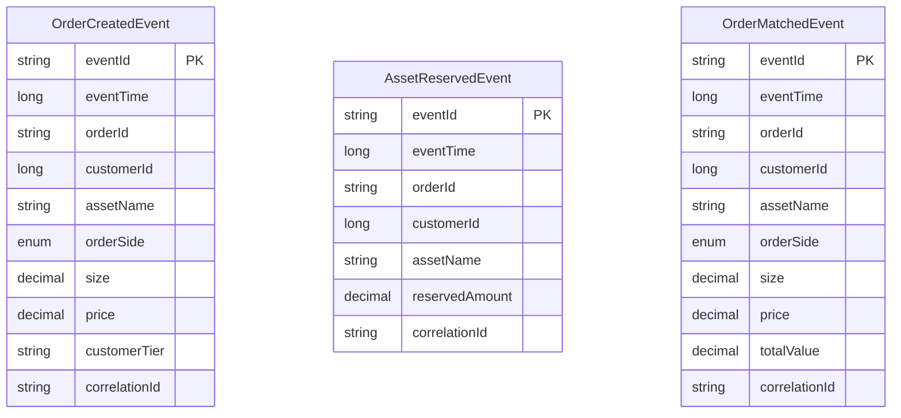
```mermaid
erDiagram
    OrderCreatedEvent {
        string eventId PK
        long eventTime
        string orderId
        long customerId
        string assetName
        enum orderSide
        decimal size
        decimal price
        string customerTier
        string correlationId
    }

    AssetReservedEvent {
        string eventId PK
        long eventTime
        string orderId
        long customerId
        string assetName
        decimal reservedAmount
        string correlationId
    }

    OrderMatchedEvent {
        string eventId PK
        long eventTime
        string orderId
        long customerId
        string assetName
        enum orderSide
        decimal size
        decimal price
        decimal totalValue
        string correlationId
    }
```

### Sema Evrimi Kurallari

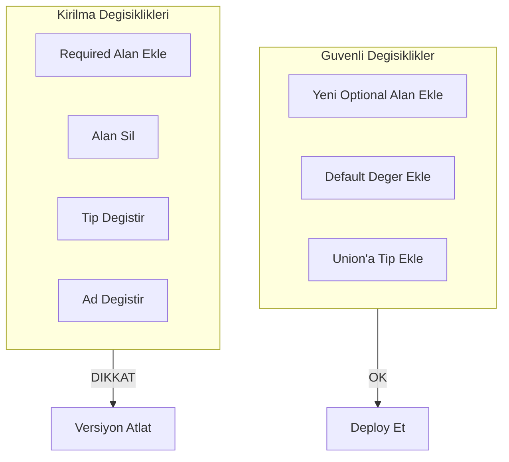
```mermaid
flowchart TB
    subgraph Safe["Guvenli Degisiklikler"]
        S1[Yeni Optional Alan Ekle]
        S2[Default Deger Ekle]
        S3[Union'a Tip Ekle]
    end

    subgraph Breaking["Kirilma Degisiklikleri"]
        B1[Required Alan Ekle]
        B2[Alan Sil]
        B3[Tip Degistir]
        B4[Ad Degistir]
    end

    Safe -->|OK| DEPLOY[Deploy Et]
    Breaking -->|DIKKAT| REVIEW[Versiyon Atlat]
```

---

## Distributed Tracing

Tum servisler arasinda istek takibi.

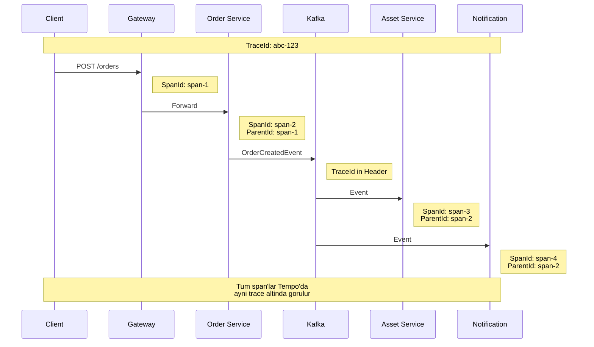
```mermaid
sequenceDiagram
    participant C as Client
    participant GW as Gateway
    participant OS as Order Service
    participant K as Kafka
    participant AS as Asset Service
    participant NS as Notification

    Note over C,NS: TraceId: abc-123

    C->>GW: POST /orders
    Note right of GW: SpanId: span-1

    GW->>OS: Forward
    Note right of OS: SpanId: span-2<br/>ParentId: span-1

    OS->>K: OrderCreatedEvent
    Note right of K: TraceId in Header

    K->>AS: Event
    Note right of AS: SpanId: span-3<br/>ParentId: span-2

    K->>NS: Event
    Note right of NS: SpanId: span-4<br/>ParentId: span-2

    Note over C,NS: Tum span'lar Tempo'da<br/>ayni trace altinda gorulur
```

---

## Sonraki Adimlar

- **[Veritabani Tasarimi](04-veritabani-tasarimi.md)** - Polyglot persistence detaylari
- **[API Gateway ve Guvenlik](05-api-gateway-guvenlik.md)** - Traefik ve Keycloak
