# Veritabani Tasarimi

## Genel Bakis

Sistem **Polyglot Persistence** yaklasimini kullanir. Iliskisel veriler PostgreSQL'de, dokumansal veriler MongoDB'de saklanir. Her mikroservis kendi veritabanina sahiptir.

---

## Veritabani Stratejisi

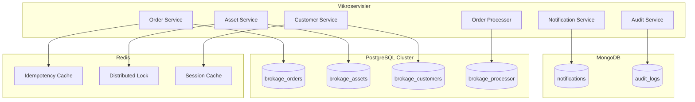

---

## Neden Polyglot Persistence?

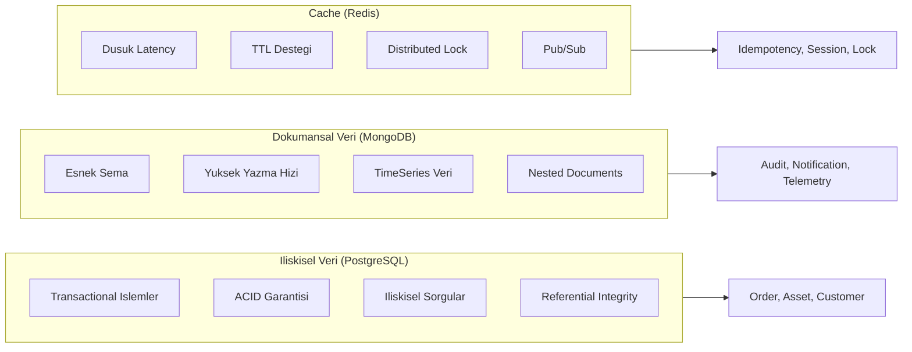

---

## PostgreSQL Semalari

### Order Veritabani (brokage_orders)

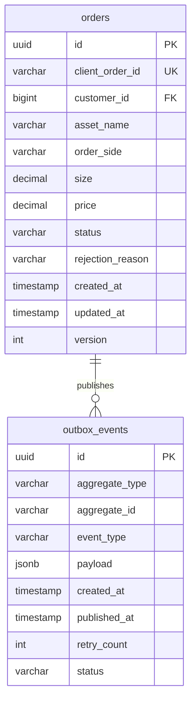

### Asset Veritabani (brokage_assets)

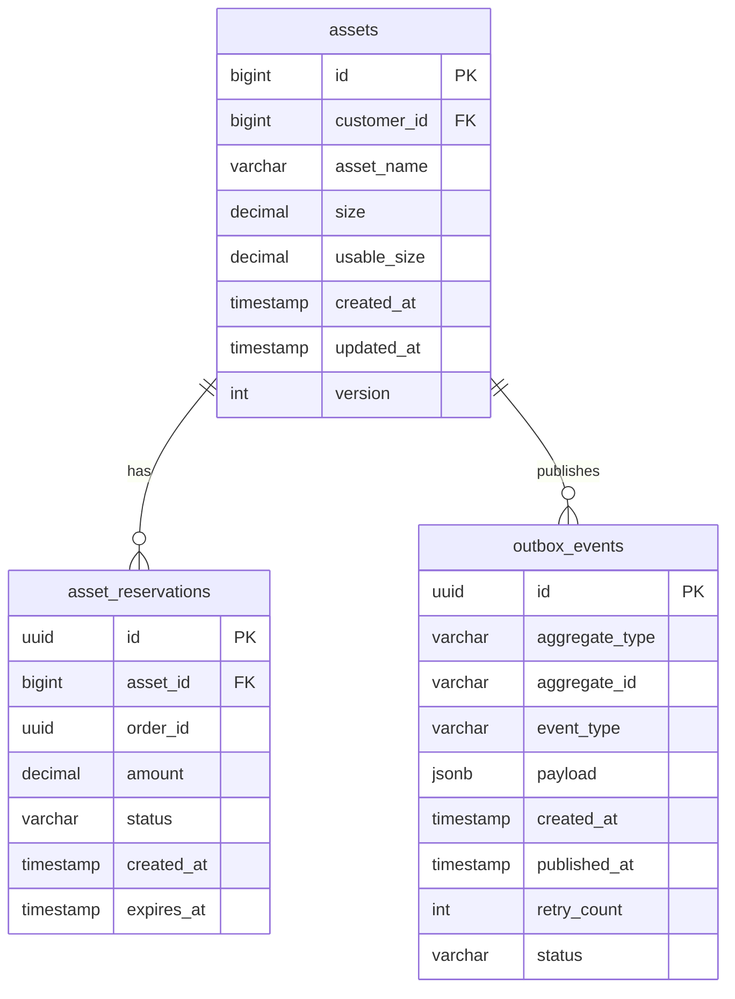

### Customer Veritabani (brokage_customers)

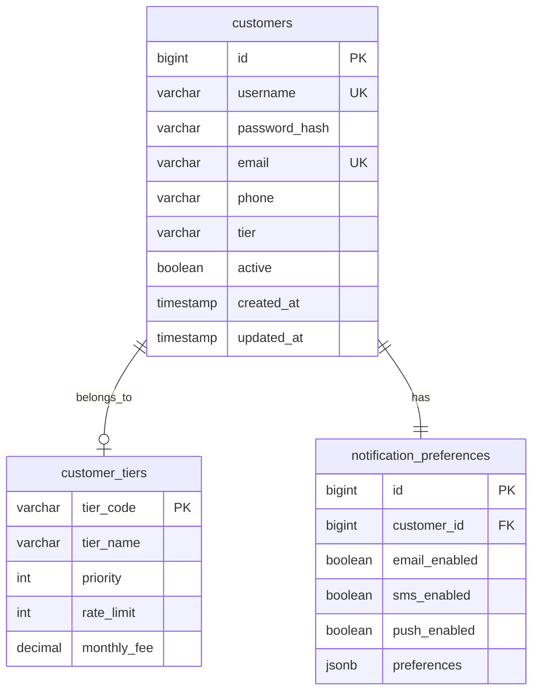

### Processor Veritabani (brokage_processor)

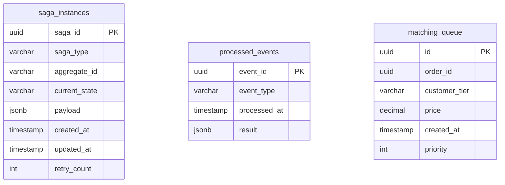

---

## MongoDB Semalari

### Notification Koleksiyonu

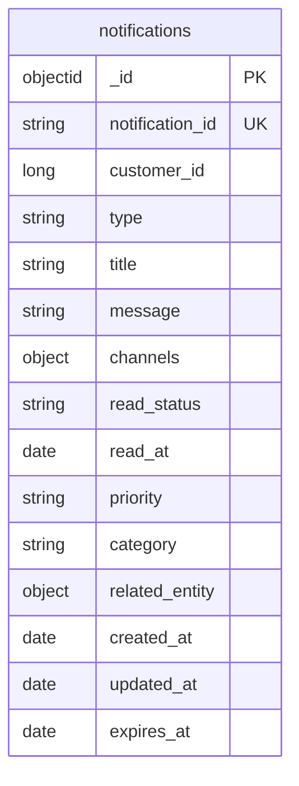

**Channels Yapisi:**

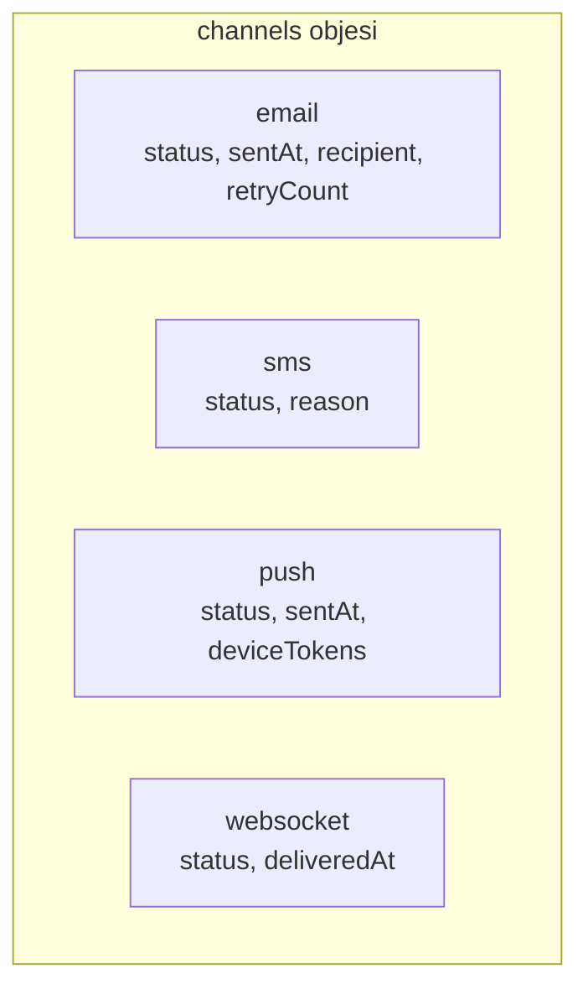

### Audit Logs Koleksiyonu

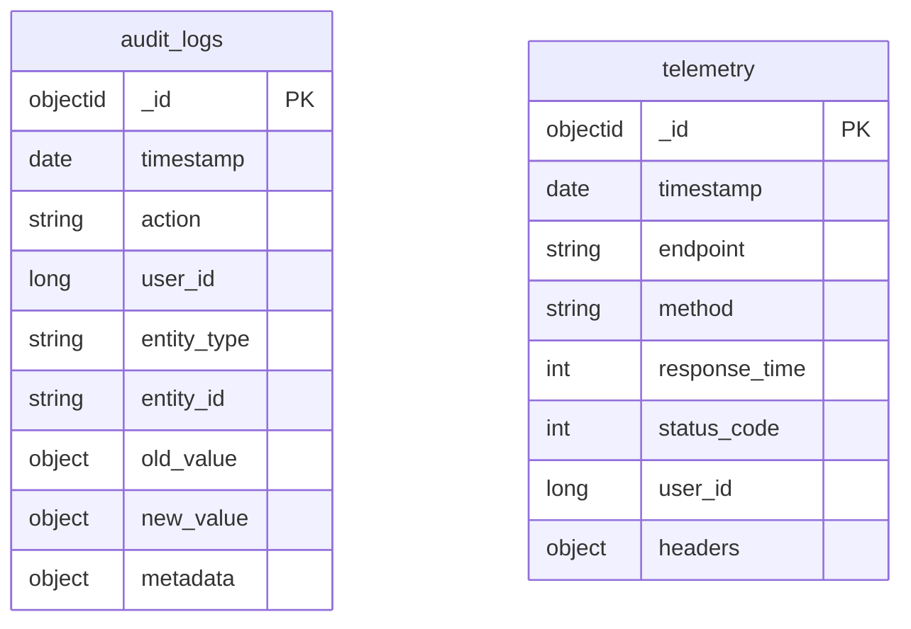

---

## Iliskiler ve Veri Akisi

### Servisler Arasi Veri Iliskisi

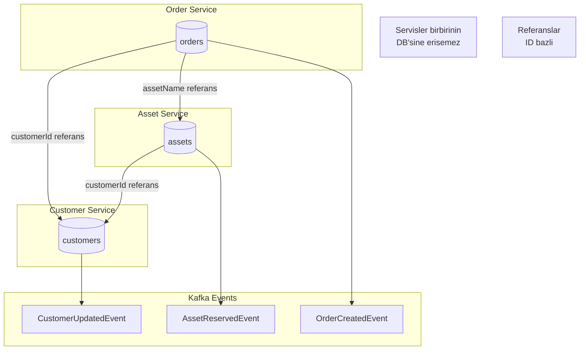

**Onemli Kural:** Servisler arasinda dogrudan veritabani erisimi yoktur. Tum veri paylasimi event'ler uzerinden yapilir.

---

## Indexler ve Performans

### PostgreSQL Indexleri

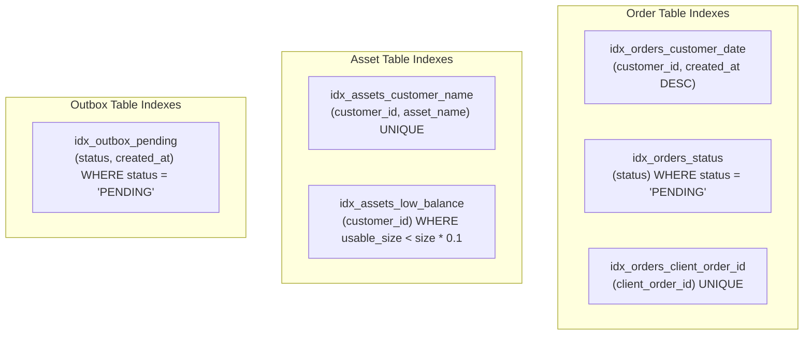

### MongoDB Indexleri

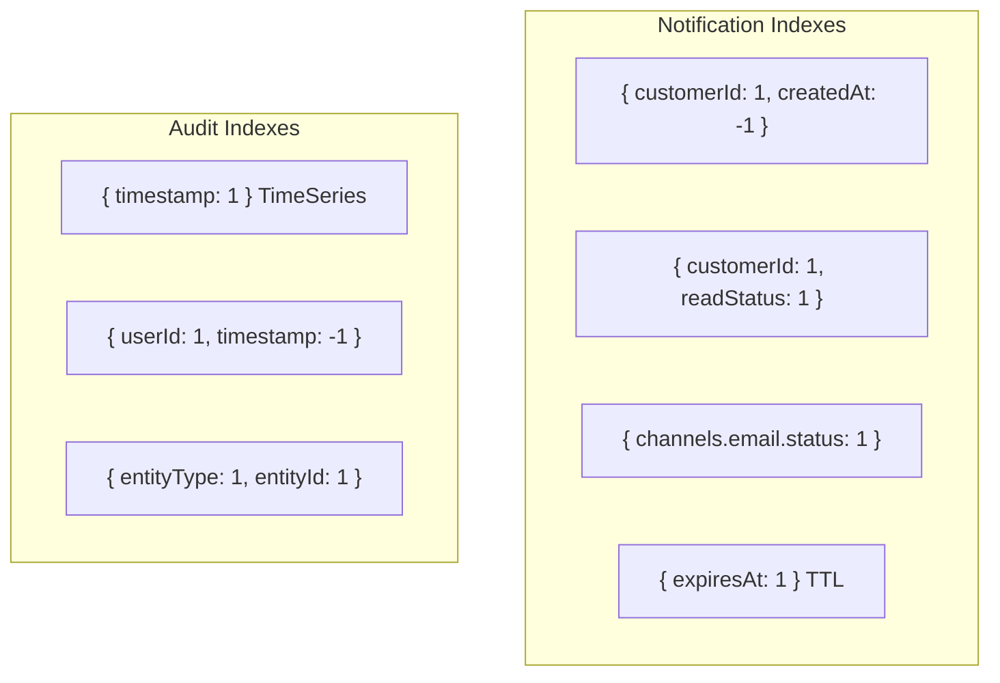

---

## Profil Bazli Yapilandirma

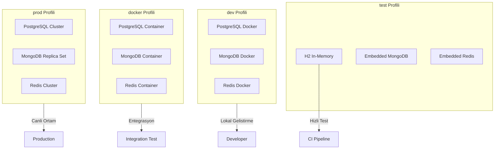

---

## Optimistic Locking

Esazmanli guncelleme cakismalarini onlemek icin version field kullanilir.

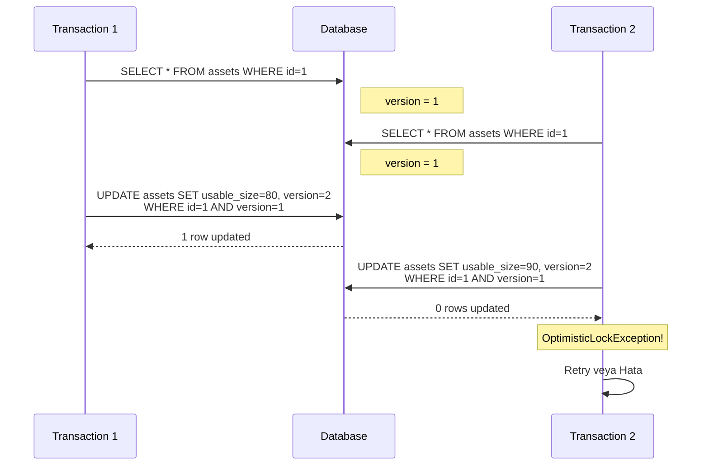

---

## Veri Yasam Dongusu

### Order Yasam Dongusu

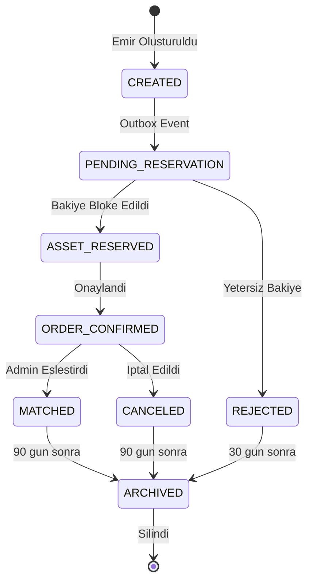

### Audit Log Yasam Dongusu

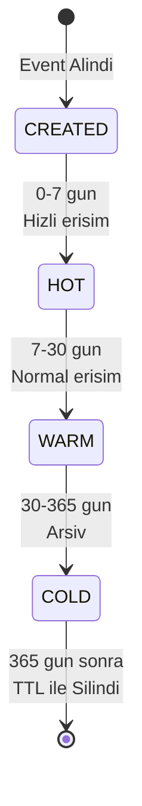

---

## Yedekleme Stratejisi

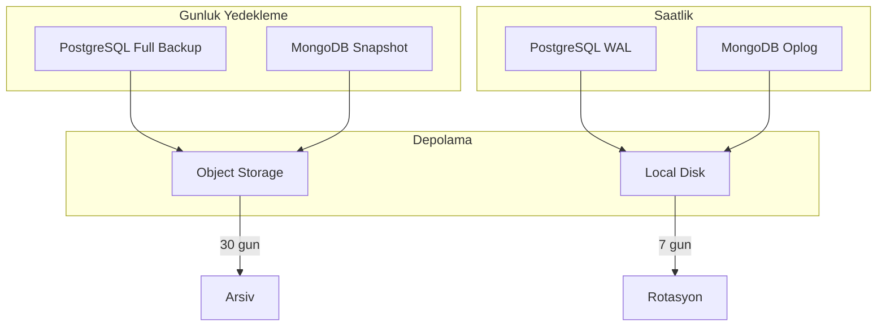

---

## Sonraki Adimlar

- **[API Gateway ve Guvenlik](05-api-gateway-guvenlik.md)** - Traefik ve Keycloak
- **[Monitoring ve Observability](06-monitoring-observability.md)** - LGTM Stack
