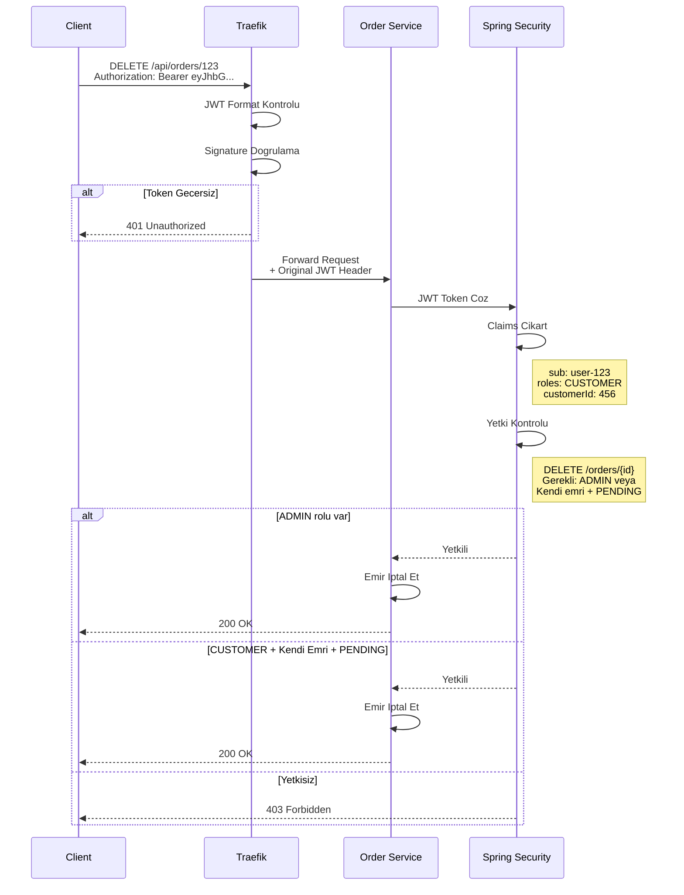

# API Gateway ve Guvenlik

## Genel Bakis

Sistem, API Gateway olarak **Traefik** kullanir. Kimlik dogrulama ve yetkilendirme icin **Keycloak** entegre edilmistir.

---

## API Gateway Mimarisi


---

## Guvenlik Middleware'leri

### Rate Limiting

Asiri istekleri engelleyerek servisleri korur.


**Limit Turleri:**


### Tier Bazli Rate Limiting

Musteri tier'lari uygulama katmaninda farkli rate limit'lere sahiptir:


**Implementasyon:**
- Gateway temel rate limiting uygular (100 req/sn global)
- Uygulama katmani (`TierRateLimitFilter`) tier-bazli limit uygular
- Tier, JWT `customer_tier` claim'inden alinir
- Rate limit basliklari yanita eklenir

### Security Headers


### CORS (Cross-Origin Resource Sharing)


### Circuit Breaker


---

## Kimlik Dogrulama

### JWT Akisi - Login


### JWT Akisi - API Erisimi (Role-Based)



### Match Islemi - ADMIN ve BROKER


### JWT Token Yapisi


### Yetki Kontrolu - DB + Redis Cache


### Redis Cache Yapisi


### Cache Invalidation


### 3 Seviyeli Yetkilendirme Modeli


### Broker - Musteri Iliskisi (Many-to-Many)


### Ortak Musteri Senaryosu


### Veritabani Iliskisi


### Keycloak Rol Atamasi


### Yetkilendirme Karar Akisi


### Endpoint Yetki Matrisi - 3 Seviye

```mermaid
flowchart TB
    subgraph Legend["Roller"]
        direction LR
        L1["ADMIN"]
        L2["BROKER"]
        L3["CUSTOMER"]
    end

    subgraph Matrix["Yetki Matrisi"]
        subgraph Orders["Emir Islemleri"]
            O1["POST /orders"]
            O2["GET /orders"]
            O3["DELETE /orders/id"]
            O4["POST /orders/id/match"]
        end

        subgraph Assets["Varlik Islemleri"]
            A1["GET /assets"]
            A2["POST /deposit"]
            A3["POST /withdraw"]
        end
    end

    subgraph AdminScope["ADMIN Yetkisi"]
        AD1[Tum musteriler icin emir]
        AD2[Tum emirleri gor]
        AD3[Tum emirleri iptal]
        AD4[Eslestirme yetkisi]
        AD5[Tum varliklari gor]
        AD6[Para yatir - tum musteriler]
        AD7[Para cek - tum musteriler]
    end

    subgraph BrokerScope["BROKER Yetkisi"]
        BR1[Alt musteriler icin emir]
        BR2[Alt musteri emirleri]
        BR3[Alt musteri emirlerini iptal]
        BR4[Alt musteri emirlerini eslestir]
        BR5[Alt musteri varliklari]
        BR6[Alt musteriye yatir]
        BR7[Erisim Yok]
    end

    subgraph CustomerScope["CUSTOMER Yetkisi"]
        CU1[Sadece kendisi icin]
        CU2[Sadece kendi emirleri]
        CU3[Kendi emri + PENDING]
        CU4[Erisim Yok]
        CU5[Sadece kendi varliklari]
        CU6[Erisim Yok]
        CU7[Kendi hesabindan cek]
    end

    style BR4 fill:#9f9
    style BR7 fill:#f99
    style CU4 fill:#f99
    style CU6 fill:#f99
    style AD4 fill:#9f9
```

### Broker Yetki Kontrolu Detay

```mermaid
sequenceDiagram
    participant B as Broker Ahmet
    participant T as Traefik
    participant S as Order Service
    participant DB as Database

    B->>T: GET /api/orders?customerId=201<br/>JWT: brokerId=101

    T->>S: Forward Request

    S->>DB: SELECT * FROM broker_customers<br/>WHERE brokerId=101
    DB-->>S: customerIds: 201, 202

    S->>S: 201 in managedCustomers?

    alt Evet - Alt Musterisi
        S->>DB: SELECT * FROM orders<br/>WHERE customerId=201
        DB-->>S: Orders
        S-->>B: 200 OK - Orders
    else Hayir - Baska Musteri
        S-->>B: 403 Forbidden<br/>Bu musteriye erisim yetkiniz yok
    end
```

---

## Yonlendirme Kurallari

```mermaid
flowchart TB
    subgraph Gateway["Traefik Gateway"]
        subgraph Rules["Yonlendirme Kurallari"]
            R1["api.brokage.local - orders"]
            R2["api.brokage.local - assets"]
            R3["api.brokage.local - customers"]
            R4["api.brokage.local - notifications"]
            R5["api.brokage.local - ws"]
            R6["auth.brokage.local"]
            R7["monitor.brokage.local"]
        end
    end

    subgraph Services["Hedef Servisler"]
        S1["order-service 8080"]
        S2["asset-service 8080"]
        S3["customer-service 8080"]
        S4["notification-service 8080"]
        S5["notification-service 8080 WS"]
        S6["keycloak 8080"]
        S7["grafana 3000"]
    end

    R1 --> S1
    R2 --> S2
    R3 --> S3
    R4 --> S4
    R5 --> S5
    R6 --> S6
    R7 --> S7
```

---

## Saglik Kontrolu

```mermaid
sequenceDiagram
    participant T as Traefik
    participant S1 as Order Service
    participant S2 as Asset Service
    participant LB as Load Balancer

    loop Her 10 saniye
        T->>S1: GET /actuator/health
        S1-->>T: 200 OK

        T->>S2: GET /actuator/health
        S2-->>T: 200 OK
    end

    Note over T,LB: Servis Sagliksiz Olursa

    T->>S1: GET /actuator/health
    S1-->>T: 503 Service Unavailable

    T->>LB: S1'i havuzdan cikar

    Note over S1: Duzeltme sonrasi

    T->>S1: GET /actuator/health
    S1-->>T: 200 OK

    T->>LB: S1'i havuza ekle
```

---

## Yuk Dengeleme

```mermaid
flowchart TB
    subgraph Traefik["Traefik Load Balancer"]
        LB[Round Robin]
    end

    subgraph OrderCluster["Order Service Cluster"]
        OS1[Order Service 1]
        OS2[Order Service 2]
        OS3[Order Service 3]
    end

    subgraph Health["Saglik Durumu"]
        H1[Saglikli]
        H2[Saglikli]
        H3[Sagliksiz]
    end

    LB --> OS1
    LB --> OS2
    LB -.-> OS3

    OS1 --> H1
    OS2 --> H2
    OS3 --> H3

    style OS3 fill:#f99
    style H3 fill:#f99
```

---

## HTTPS ve TLS

```mermaid
flowchart LR
    subgraph Client["Istemci"]
        BROWSER[Tarayici]
    end

    subgraph TLS["TLS Sonlandirma"]
        TRAEFIK["Traefik 443"]
        CERT["Lets Encrypt"]
    end

    subgraph Internal["Ic Ag"]
        SERVICES["Servisler 8080"]
    end

    BROWSER -->|HTTPS| TRAEFIK
    TRAEFIK -->|Sertifika| CERT
    TRAEFIK -->|HTTP| SERVICES

    Note1["Dis: Sifrelenmis<br/>Ic: Duz HTTP"]
```

---

## Guvenlik Katmanlari

```mermaid
flowchart TB
    subgraph Layer1["Ag Katmani"]
        FIREWALL[Firewall]
        WAF[Web Application Firewall]
        DDOS[DDoS Korumasi]
    end

    subgraph Layer2["Gateway Katmani"]
        RL[Rate Limiting]
        IP[IP Filtreleme]
        TLS[TLS/HTTPS]
    end

    subgraph Layer3["Uygulama Katmani"]
        AUTH[JWT Authentication]
        AUTHZ[Authorization]
        VALID[Input Validation]
    end

    subgraph Layer4["Veri Katmani"]
        ENC[Sifreleme]
        AUDIT[Audit Logging]
        MASK[Data Masking]
    end

    Layer1 --> Layer2
    Layer2 --> Layer3
    Layer3 --> Layer4
```

---

## Middleware Zinciri

Istek isleme sirasi:

```mermaid
flowchart LR
    REQ[Istek] --> RL
    RL[Rate Limit] --> SEC
    SEC[Security Headers] --> CORS
    CORS[CORS] --> JWT
    JWT[JWT Auth] --> CB
    CB[Circuit Breaker] --> SVC
    SVC[Servis] --> RES[Yanit]

    style RL fill:#ff9
    style SEC fill:#9f9
    style CORS fill:#99f
    style JWT fill:#f9f
    style CB fill:#f99
```

---

## Hata Yonetimi

```mermaid
flowchart TB
    subgraph Errors["Hata Turleri"]
        E401[401 Unauthorized]
        E403[403 Forbidden]
        E429[429 Too Many Requests]
        E500[500 Internal Error]
        E503[503 Service Unavailable]
    end

    subgraph Causes["Nedenler"]
        C1[Gecersiz Token]
        C2[Yetersiz Yetki]
        C3[Rate Limit Asildi]
        C4[Sunucu Hatasi]
        C5[Circuit Open]
    end

    subgraph Actions["Aksiyonlar"]
        A1[Yeniden Login]
        A2[Yetki Kontrolu]
        A3[Bekleme]
        A4[Retry]
        A5[Fallback]
    end

    E401 --> C1
    E403 --> C2
    E429 --> C3
    E500 --> C4
    E503 --> C5

    C1 --> A1
    C2 --> A2
    C3 --> A3
    C4 --> A4
    C5 --> A5
```

---

## Sonraki Adimlar

- **[Monitoring ve Observability](06-monitoring-observability.md)** - LGTM Stack
