# Monitoring ve Observability

## Genel Bakis

Sistem, **LGTM Stack** (Loki, Grafana, Tempo, Mimir) kullanarak kapsamli izleme ve gozlemlenebilirlik saglar.

**Onemli:** OpenTelemetry log collection sorunlu oldugu icin loglar **Loki4j** ile direkt Loki'ye gonderilir.

---

## Observability Stack


### Neden Loki4j Direkt?


### Sinyal Yollari


---

## Uc Temel Sinyal


---

## Log Yonetimi (Loki)

### Log Akisi


### Yapilandirilmis Log Formati


### Log Seviyeleri

```mermaid
flowchart TB
    subgraph Levels["Log Seviyeleri"]
        ERROR["ERROR<br/>Hata durumları"]
        WARN["WARN<br/>Dikkat gerektiren"]
        INFO["INFO<br/>Normal islemler"]
        DEBUG["DEBUG<br/>Detayli bilgi"]
    end

    subgraph Usage["Kullanim"]
        E1[Exception yakalandi]
        E2[Islem basarisiz]
        W1[Retry yapiliyor]
        W2[Limit yaklasti]
        I1[Emir olusturuldu]
        I2[Servis basladi]
        D1[SQL sorgusu]
        D2[HTTP detaylari]
    end

    ERROR --> E1
    ERROR --> E2
    WARN --> W1
    WARN --> W2
    INFO --> I1
    INFO --> I2
    DEBUG --> D1
    DEBUG --> D2
```



---

## Distributed Tracing (Tempo)

### Trace Yapisi


### Servisler Arasi Trace Propagation


---

## Metrikler (Mimir)

### Anahtar Performans Gostergeleri (KPI)


### Metrik Tipleri


---

## Grafana Dashboard'lari

### Is Metrikleri Dashboard


### Teknik Dashboard


---

## Alerting

### Alert Kurallari


### Alert Akisi


---

## SLI / SLO

### Service Level Indicators


### Service Level Objectives


---

## Hata Ayiklama Akisi

### Problem Tespit


### Trace'den Log'a Gecis


---

## LGTM All-in-One

Interview icin basitlesilmis yapilandirma:


**Avantajlari:**
- Tek container
- Hizli kurulum
- Interview icin yeterli

---

## Onemli Metrikler

```mermaid
mindmap
    root((Monitoring))
        Business
            Emir sayisi
            Eslestirme orani
            Islem hacmi
            Iptal orani
        Technical
            CPU kullanimi
            Memory kullanimi
            Disk I/O
            Network
        Application
            Istek/saniye
            Hata orani
            Yanit suresi
            Kuyruk boyutu
        Infrastructure
            Container sagligi
            Pod sayisi
            DB baglantilari
            Kafka lag
```

---

## Sonuc

Bu dokuman serisinde asagidaki konular ele alindi:

1. **Sistem Genel Bakis** - Mimari ve kavramlar
2. **Mikroservis Mimarisi** - Servis sinirlari ve iletisim
3. **Event-Driven Akislar** - Kafka, Saga, Idempotency
4. **Veritabani Tasarimi** - Polyglot persistence
5. **API Gateway ve Guvenlik** - Traefik, Keycloak
6. **Monitoring ve Observability** - LGTM Stack

 
